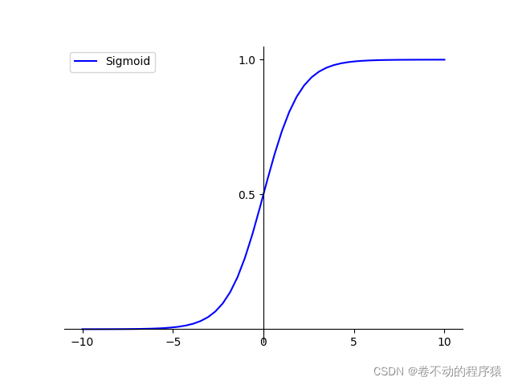
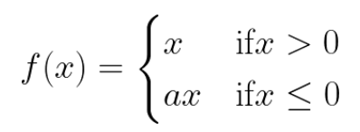
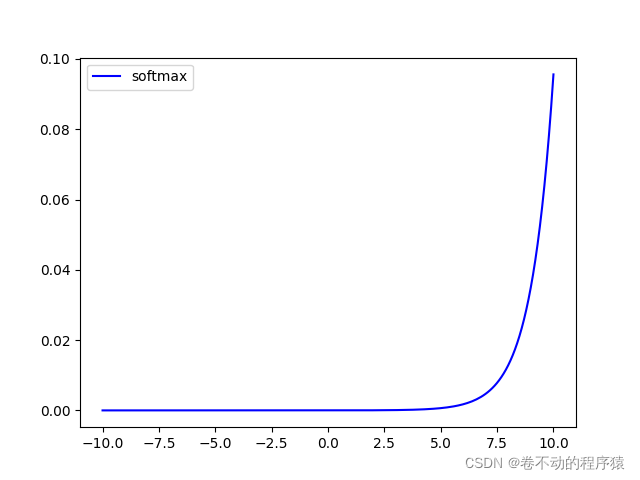
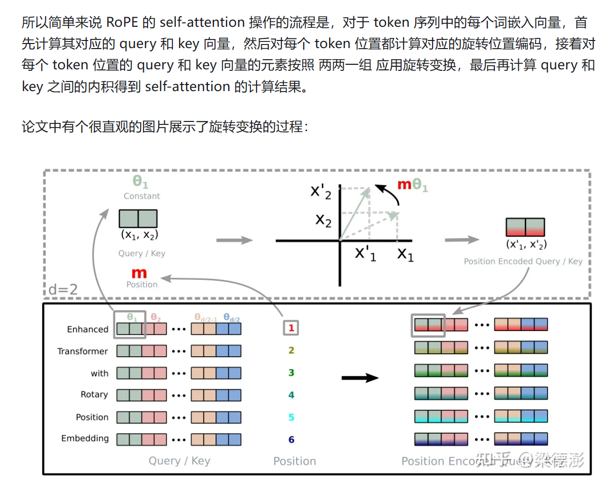

# LSTM

提出原因：当需要预测词间隔较远时，rnn的记忆会失效，例如名词+which修饰语句+动词。
LSTM和RNN的整体架构是一样的，但是 中间的模块的结构不同。相比于一般的RNN，LSTM的“循环单元”有四个网络结构，相互影响：


相较于只有tanh结构的rnn，新加入了三个门。为什么叫“门gate”呢？因为像sigmoid的输出，在0~1之间，而注意到sigmoid的输出都是进行点乘。这样，如果sigmoid的输出是0，也就意味着和它相乘的那个输入变成了0，也就像是这个输入不被通过。这里有三个门，分别是 forget gate，input gate和output gate。input gate用于控制有多少的输入可以被加入到cell中；output gate用于控制新的cell中的内容有多少可以被输出；forget gate用于控制旧的cell中的内容有多少可以保存。至于门到底是打开，还是关闭，这就是网络自己学习到的。

#### 2.2.1 遗忘门

LSTM的第一步是决定需要从cell状态中扔掉什么样的信息。由“遗忘门（forget gate）”的sigmoid层决定。输入 $h_{t-1}$ 和 $x_t$ ，输出一个0和1之间的数。1代表“完全保留这个值”，而0代表“完全扔掉这个值”。
比如对于一个基于上文预测最后一个词的语言模型。cell的状态可能包含当前主语的信息，来预测下一个准确的词。而当我们得到一个新的主语的时候，我们会想要遗忘旧的主题的记忆，应用新的主语的信息来预测准确的词。


#### 2.2.2 输入门

第二步是决定我们需要在cell state里存储什么样的信息。这个问题有两个部分。第一，一个sigmoid层调用“输入门（input gate）”以决定哪些数据是需要更新的。然后，一个tanh层为新的候选值创建一个向量 $\widetilde{C_t}$ ，这些值能够加入state中。下一步，我们要将这两个部分合并以创建对state的更新。比如还是语言模型，可以表示为想要把新的语言主题的信息加入到cell state中，以替代我们要遗忘的旧的记忆信息。


#### 2.2.3 更新cell

在决定需要遗忘和需要加入的记忆之后，就可以更新旧的cell state $C_{t-1}$ 到新的cell state $C_{t}$ 了。在这一步，我们把旧的state $C_{t-1}$ 与 $f_t$ 相乘，遗忘我们先前决定遗忘的东西，然后我们加上 $i_t*\widetilde{C_{t}}$ ，这可以理解为新的记忆信息，当然，这里体现了新的输入对状态值的更新度是有限制的，我们可以把 $i_t$ 当成一个权重。


#### 2.2.4 输出门

最后，我们需要决定要输出的东西。这个输出基于我们的cell state，但会是一个过滤后的值。首先，我们运行一个sigmoid层，这个也就是输出门（output gate），以决定cell state中的那个部分是我们将要输出的。然后把cell state放进tanh（将数值压到-1和1之间），最后将它与sigmoid门的输出相乘，这样就只输出了我们想要的部分了。


**相比与simple RNN，由于LSTM中，状态S是通过累加的方式来计算的，这样的话，就不是一直复合函数的形式了，它的的导数也不是乘积的形式。不存在导数一直是小数从而导致梯度消失的问题。**

使用Keras搭建多层LSTM网络还是比较方便的，我们只需要使用Sequential()进行堆叠即可，一般来说LSTM模块的层数越多 **（一般不超过3层，再多训练的时候就比较难收敛）**，对高级别的时间表示的学习能力越强；同时，最后会加一层普通的神经网路层用于输出结果的降维。lstm层间可以插入dropout层来防止过拟合。

# Bi-LSTM

BiLSTM是Bi-directional Long Short-Term Memory的缩写，是由前向LSTM与后向LSTM组合而成。两者在自然语言处理任务中都常被用来建模上下文信息。
例如输入词向量序列为 ${h_1,h_2,h_3}$ ，将该序列与其反向序列 ${h_3,h_2,h_1}$ 分别输入两个LSTM网络，得到$\{[O_{h1},O_{h3}],[O_{h2},O_{h2}],[O_{h3},O_{h1}]\}$，即为 {H_1,H_2,H_3} ，再通过线性层。

### 与lstm对比

BiLSTM（双向长短时记忆网络）相比于LSTM（长短时记忆网络）的优点和缺点如下：

优点：

1. 双向性：BiLSTM可以同时从前向和后向进行计算，可以更好地捕捉序列中的[信息](https://geek.csdn.net/educolumn/4b7516410bb8585d5db30bb2e9a69b47?spm=1055.2569.3001.10083)，提高了模型的准确性。
2. 更准确的预测：BiLSTM可以利用[上下文](https://geek.csdn.net/educolumn/396550aabaa0961ca124e1fe124ebc0f?spm=1055.2569.3001.10083)信息，更准确地预测下一个单词或标签。
3. 更好的特征表示：BiLSTM可以利用[上下文](https://geek.csdn.net/educolumn/396550aabaa0961ca124e1fe124ebc0f?spm=1055.2569.3001.10083)信息，提取更好的特征表示，从而提高模型的鲁棒性和泛化能力。

缺点：

1. 计算量大：由于BiLSTM需要同时进行前向和后向计算，因此计算量比LSTM更大。
2. 参数多：由于BiLSTM需要两个LSTM单元，因此参数数量比LSTM多，需要更多的计算资源和更长的训练[时间](https://geek.csdn.net/educolumn/3fb26f40673739b3a46094a10b56bc3a?spm=1055.2569.3001.10083)。
3. 容易过拟合：由于BiLSTM的参数数量较多，容易过拟合，需要进行正则化等[技术](https://geek.csdn.net/educolumn/4949e93ca0a4345b3197d58843b74d65?spm=1055.2569.3001.10083)来避免过拟合。

# 可变长度输入

填充至最长输入长度。

* torch.nn.utils.rnn.pad_sequence()

0填充。

* torch.nn.utils.rnn.pack_padded_sequence()

它的输出有两部分，分别是 data 和 batch_sizes，第一部分为原来的数据按照 time step 重新排列，而 padding 的部分，直接空过了。batch_sizes则是每次实际读入的数据量，也就是说，RNN **把一个 mini-batch sequence 又重新划分为了很多小的 batch，每个小 batch 为所有 sequence 在当前 time step 对应的值，如果某 sequence 在当前 time step 已经没有值了，那么，就不再读入填充的 0，而是降低 batch_size。**

避免把填充0也纳入计算

* torch.nn.utils.rnn.pad_packed_sequence()

pad_packed_sequence 执行的是 pack_padded_sequence 的逆操作，执行下面的代码，观察输出。

# 过长文本输入

1. 截断：头尾截断，中间截断等
2. 子序列划分：合理地划分子序列，并将不同的子序列分别训练，最终作为原始序列的一部分特征。
3. 与AE结合：可以使用autoencoder将长序列表示成为一个较短的序列，经过训练之后再用decoder解码称为需要的输出形式
4. 随机采样子序列：例如按句号进行划分，随机采样句子重组，一方面也可以数据增强
5. 截断反向传播：只采用后面几个timestep作反向传播

# 激活函数大全

### Sigmoid 函数

Sigmoid函数也叫Logistic函数，用于隐层神经元输出，取值范围为(0,1)，它可以将一个实数映射到(0,1)的区间，可以用来做二分类。在特征相差比较复杂或是相差不是特别大时效果比较好。sigmoid是一个十分常见的激活函数，函数的表达式如下：




优点：连续的导函数，所以这种特性可以在反向传播时拥有较好的性能，不会引起梯度不连续或者是跳跃现象。

缺点：在输入的绝对值非常大的情况下，这时候梯度会非常接近于0，这也就是梯度消失现象；sigmoid恒大于0，非零中心化的输出会使得其后一层的神经元的输入发生偏置偏移（Bias Shift），并进一步使得梯度下降的收敛速度变慢。

sigmoid求导：$\sigma'(x)=\sigma(x)(1-\sigma(x))$

### Tanh/双曲线正切激活函数

Tanh 激活函数又叫作双曲正切激活函数（hyperbolic tangent activation function）。与 Sigmoid 函数类似，Tanh 函数也使用真值，但 Tanh 函数将其压缩至-1 到 1 的区间内。与 Sigmoid 不同，Tanh 函数的输出以零为中心，因为区间在-1 到 1 之间。函数表达式如下：


tanh(x) = 2Sigmoid(2x)-1

有正有负，弥补了sigmoid的偏移问题，Tanh 函数也会有梯度消失的问题

### ReLU激活函数

ReLU（Rectified Linear Unit）激活函数是一种在深度学习中广泛使用的非线性激活函数。它的定义很简单，通常用数学公式表示为：


优点：当输入为正时，导数为1，一定程度上改善了梯度消失问题，加速梯度下降的收敛速度；计算速度快得多。

缺点：反向传播负数太多的话，容易梯度消失

### Leaky ReLU。

公式如下图所示：


其中γ是一个很小的数，如0.1，0.01。

### Parametric ReLU激活函数

（1）Parametric ReLU（PReLU）激活函数是一种修正线性单元（ReLU）的变种，它允许神经网络学习激活函数的参数，而不是使用固定的斜率。通常，标准的ReLU激活函数在输入大于零时输出输入值，而在输入小于或等于零时输出零。PReLU引入了一个可学习的参数，将斜率变为可变。其中公式如图：



其中，a是一个可以通过训练学习的参数。这意味着对于非负的输入，输出与输入一样，而对于负的输入，输出是输入的负数乘以学习到的参数a。

### ELU函数

**ELU**激活函数的数学表达式为：


与Leaky ReLU和PRelu激活函数不同的是，ELU激活函数的负半轴是一个指数函数而不是一条直线

优点：ELU试图将激活函数的输出均值接近于零，使正常梯度更接近于单位自然梯度，从而加快学习速度

缺点：计算指数，效率低

### Swish函数

Swish激活函数的数学表达式为：


Swish激活函数**无界性**有助于防止慢速训练期间，梯度逐渐接近 0 并导致饱和；同时，**有界性**也是有优势的，因为有界激活函数可以具有很强的正则化(防止过拟合， 进而增强泛化能力)，并且较大的负输入问题也能解决

Swish激活函数在 `x=0`附近更为平滑，而非单调的特性增强了输入数据和要学习的权重的表达能力。

### GELU

$$
f(x) = x * sigmoid(1.702x)
$$

在swish基础上得到的经验值。

### Softmax函数

Softmax激活函数的数学表达式为：




Softmax函数常在神经网络输出层充当激活函数，将输出层的值通过激活函数映射到0-1区间，将神经元输出构造成概率分布，用于多分类问题中，Softmax激活函数映射值越大，则真实类别可能性越大

# 损失函数大全

#### **欧氏距离损失（Euclidean Distance Loss）** ：

* **概念** ：衡量模型输出值与真实值之间的欧氏距离。
* **数学公式** ：


**代码实现：**

```python
def euclidean_distance_loss(y_true, y_pred):
    return np.sqrt(np.sum(np.square(y_pred - y_true)))
```

#### **MSE LOSS**

在欧氏距离基础上做了mean

```python
def euclidean_distance_loss(y_true, y_pred):
    return np.mean(np.sqrt(np.sum(np.square(y_pred - y_true))))
```

#### **曼哈顿距离损失（Manhattan Distance Loss）** ：

* **概念** ：衡量模型输出值与真实值之间的曼哈顿距离，也称为 L1范数距离。
* **数学公式** ：


**代码实现：**

```python
def manhattan_distance_loss(y_true, y_pred):
    return np.sum(np.abs(y_pred - y_true))
```

#### **切比雪夫距离损失（Chebyshev Distance Loss）** ：

* **概念** ：衡量模型输出值与真实值之间的切比雪夫距离，即两个向量各维度差的最大值。
* **数学公式** ：


**代码实现：**

```python
def chebyshev_distance_loss(y_true, y_pred):
    return np.max(np.abs(y_pred - y_true))
```

#### **余弦相似度损失（Cosine Similarity Loss）** ：

* **概念** ：衡量模型输出值与真实值之间的余弦相似度。
* **数学公式** ：


**代码实现：**

```python
def cosine_similarity_loss(y_true, y_pred):
    dot_product = np.dot(y_pred, y_true)
    norm_pred = np.linalg.norm(y_pred)
    norm_true = np.linalg.norm(y_true)
    return 1 - (dot_product / (norm_pred * norm_true))
```

#### **Jaccard 距离损失（Jaccard Distance Loss）** ：

* **概念** ：用于度量集合之间的相似性，通常用于聚类或分类问题。
* **数学公式** ：


**代码实现：**

```python
def jaccard_distance_loss(y_true, y_pred):
    intersection = np.sum(np.minimum(y_true, y_pred))
    union = np.sum(np.maximum(y_true, y_pred))
    return 1 - intersection / union
```

#### **交叉熵损失（Cross-Entropy Loss）**

概念定义：用于衡量模型输出的概率分布与真实概率分布之间的差异。
数学公式：
其中，是真实概率分布的第个元素，是模型输出的第 个类别的概率。

**实现代码:**

```python
def cross_entropy_loss(y_true, y_pred):
    return -np.sum(y_true * np.log(y_pred))
```

**Softmax 损失函数：**
   适用于多分类任务，将模型的原始输出转换为类别概率分布。
   数学公式：
   适用场景：多分类问题，输出为一个概率分布向量，经过 Softmax 函数处理。

**Sigmoid 交叉熵损失函数：**
   适用于二分类任务，将模型的原始输出通过 Sigmoid 函数转换为概率值。
   数学公式：![\text{SigmoidCrossEntropyLoss} = -\frac{1}{N} \sum_{i=1}^{N} [y_i \log(\hat{y}_i) + (1 - y_i) \log(1 - \hat{y}_i)]](https://latex.csdn.net/eq?%5Ctext%7BSigmoidCrossEntropyLoss%7D%20%3D%20-%5Cfrac%7B1%7D%7BN%7D%20%5Csum_%7Bi%3D1%7D%5E%7BN%7D%20%5By_i%20%5Clog%28%5Chat%7By%7D_i%29%20+%20%281%20-%20y_i%29%20%5Clog%281%20-%20%5Chat%7By%7D_i%29%5D)
   适用场景：二分类问题，输出为单个标量，经过 Sigmoid 函数处理。

**Focal Loss（支持二分类和多分类）：**

虽然BCE解决了正负样本不平衡问题（引入权重因子α），但并没有区分简单还是难分样本。当易区分负样本超级多时，整个训练过程将会围绕着易区分负样本进行，进而淹没正样本，造成大损失。所以这里引入了一个调制因子γ ，用来聚焦难分样本。γ=0,[0,5]时回归普通CE。
   用于处理类别不平衡和困难样本的问题，在多目标检测任务中表现良好。
   数学公式：![\text{FocalLoss} = -\frac{1}{N} \sum_{i=1}^{N} [ (1 - \hat{y}_i)^\gamma y_i \log(\hat{y}_i) + \hat{y}_i^\gamma (1 - y_i) \log(1 - \hat{y}_i) ]](https://latex.csdn.net/eq?%5Ctext%7BFocalLoss%7D%20%3D%20-%5Cfrac%7B1%7D%7BN%7D%20%5Csum_%7Bi%3D1%7D%5E%7BN%7D%20%5B%20%281%20-%20%5Chat%7By%7D_i%29%5E%5Cgamma%20y_i%20%5Clog%28%5Chat%7By%7D_i%29%20+%20%5Chat%7By%7D_i%5E%5Cgamma%20%281%20-%20y_i%29%20%5Clog%281%20-%20%5Chat%7By%7D_i%29%20%5D)
   适用场景：处理类别不平衡问题的多分类任务。

实现代码：

```python
def forward(self,preds,labels):
		"""
		preds:softmax输出结果
		labels:真实值
		"""
		eps=1e-7
		y_pred =preds.view((preds.size()[0],preds.size()[1],-1)) #B*C*H*W->B*C*(H*W)

		target=labels.view(y_pred.size()) #B*C*H*W->B*C*(H*W)

		ce=-1*torch.log(y_pred+eps)*target
		floss=torch.pow((1-y_pred),self.gamma)*ce
		floss=torch.mul(floss,self.weight)
		floss=torch.sum(floss,dim=1)
		return torch.mean(floss)

```

#### KL 散度损失（Kullback-Leibler Divergence Loss）

  概念定义：用于衡量两个概率分布之间的差异。
  数学公式：
  其中 P和 Q 是两个概率分布，P(i)和Q(i) 分别是它们的第 i个元素。
实现代码:

```python
def kl_divergence_loss(P, Q):
    return np.sum(P * np.log(P / Q))

# 示例
P = np.array([0.5, 0.3, 0.2])
Q = np.array([0.4, 0.4, 0.2])
print(kl_divergence_loss(P, Q))
```

#### **JS（Jensen-Shannon）散度**

JS散度是一种用于度量两个概率分布之间的相似性的度量。它是 KL（Kullback-Leibler）散度的对称版本，也可以看作是两个概率分布的平均交叉熵与其平均分布之间交叉熵的均值。

给定两个概率分布P和Q，JS 散度的数学公式如下：


其中M为两个概率分布的平均分布

实现代码：

```python
def kl_divergence(p, q):
    return np.sum(p * np.log(p / q))def js_divergence(p, q):
def js_divergence(p, q):  
    m = 0.5 * (p + q)
    return 0.5 * (kl_divergence(p, m) + kl_divergence(q, m))
```

# 示例

p = np.array([0.3, 0.5, 0.2])
q = np.array([0.1, 0.6, 0.3])

print("JS 散度:", js_divergence(p, q))

# 旋转位置编码



# 分布式训练

#### 数据分布式

**数据分布式，即是将数据 **x x**x 进行切分，将模型 **w w**w 复制到每个设备上，从而实使用相同的模型在不同设备上处理不同数据的计算，实现模型的分布式训练。** 基于数据并行处理上述矩阵乘法前向推理的过程如下图所示。


为梯度更新不一致的问题，就需要对各个设备上的**梯度**进行**AllReduce**处理。具体而言，每个设备均基于分配到其上的数据进行梯度计算，得到 **g r a d i grad_i**g**r**a**d**i，然后将这些梯度进行求和，再将求和后的结果分发给各个设备，如下图所示 ^[2]^ 。


然而，上述过程只是给出了理论/逻辑层面的设计，在具体实现中上述梯度更新实现的最简单方式是PS（Parameter Server）模式。在这种实现下，有一个server设备用来存放和同步模型参数，有多个worker设备来计算梯度（就像上图的计算方式），所有的worker设备将梯度发送给server设备进行求和取平均，然后再由server设备将更新后的模型参数同步给worker设备。

### DistributedDataParallel

DDP(DistributedDataParallel)：实现数据并行方式的分布式训练，采用的是ring-all-reduce模式。它将 **模型复制到每个 GPU 上 ，同时复制了每个dataloader** ，并且当 `loss.backward()` 被调用进行反向传播的时候，所有这些模型副本的梯度将被同步地平均/下降 (reduce)。这确保每个设备在执行优化器步骤后具有相同的权重。

* 多进程
* 支持多机多卡
* 训练速度较DP快，ring-all-reduce模式下，所有worker只和自己相邻的两个worker进行通信


多机多卡下的ddp：

1. 每个节点的每个 GPU 拥有自己独立的进程
2. 每个 GPU 只能看到整体数据集的一个子集，并且一直只能看到那个子集
3. 每个进程都会初始化模型
4. 每个进程执行完整的 forward 和 backward 过程
5. 梯度会在所有进程里做同步和取平均
6. 每个进程都会更新自己的 optimizer

### accelearte使用例子

#### 3.1 单机多卡

下面是以 **单机多卡** （1机器共2卡）的 `config.yaml`例子，这里是我根据 `accelerate config` 生成后的config文件：

```text
compute_environment: LOCAL_MACHINE
distributed_type: MULTI_GPU
downcast_bf16: 'no'
gpu_ids: all
mixed_precision: 'no'
num_machines: 1
num_processes: 2
rdzv_backend: static
same_network: false
tpu_env: []
tpu_use_cluster: false
tpu_use_sudo: false
use_cpu: false
```

#### 3.2 多机多卡

下面是以 **多机多卡** （2机器共4卡）的 `config.yaml`例子，这里是我根据 `accelerate config` 生成后的config文件：

```text
compute_environment: LOCAL_MACHINE
distributed_type: MULTI_GPU
downcast_bf16: 'no'
gpu_ids: all
machine_rank: 0
main_process_ip: 主机器的ip
main_process_port: 端口号
main_training_function: main
mixed_precision: 'no'
num_machines: 2
num_processes: 4
rdzv_backend: static
same_network: false
tpu_env: []
tpu_use_cluster: false
tpu_use_sudo: false
use_cpu: false
```

#### 简单例子

单机多卡

```python
  import torch
  import torch.nn.functional as F
  from datasets import load_dataset
+ from accelerate import Accelerator

- device = 'cpu'
+ accelerator = Accelerator()

- model = torch.nn.Transformer().to(device)
+ model = torch.nn.Transformer()
  optimizer = torch.optim.Adam(model.parameters())

  dataset = load_dataset('my_dataset')
  data = torch.utils.data.DataLoader(dataset, shuffle=True)

+ model, optimizer, data = accelerator.prepare(model, optimizer, data)

  model.train()
  for epoch in range(10):
      for source, targets in data:
-         source = source.to(device)
-         targets = targets.to(device)

          optimizer.zero_grad()

          output = model(source)
          loss = F.cross_entropy(output, targets)

-         loss.backward()
+         accelerator.backward(loss)

          optimizer.step()
```

运行脚本

```text
accelerate launch path_to_script.py --args_for_the_script
```
