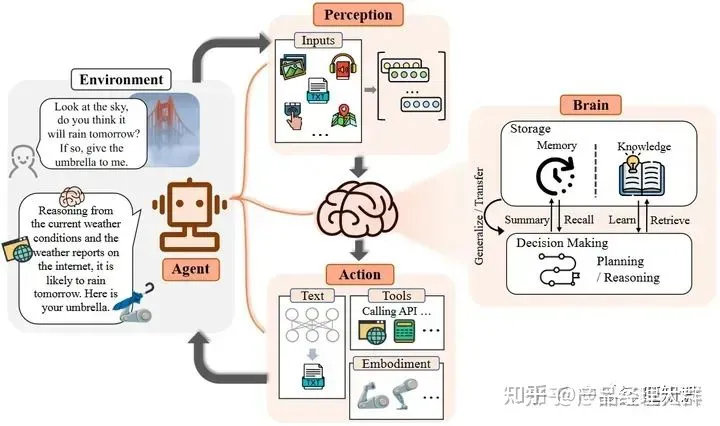

# LLM-based-Agent

LLM-based Agent的概念框架，由大脑、感知、行动三个部分组成。作为控制器，大脑模块承担记忆、思考和决策等基本任务；感知模块负责感知和处理来自外部环境的多模态信息；行动模块负责使用工具执行任务并影响周围环境。

最重要的特点：能够在用户输入不明确的情况下，提取用户需要，发掘用户隐藏需求，自动确定用户需求所属的任务，并调用相应工具去完成任务，最后得到符合用户需求的输出。

# Langchain

## 文本分割

Langchain提供了多种文本分割器，包括CharacterTextSplitter(),MarkdownHeaderTextSplitter(),RecursiveCharacterTextSplitter()等。

* **CharacterTextSplitter按字符拆分** ：这是最简单的方法。它根据字符（默认为 "\n\n"）进行拆分，并通过字符数来衡量块的长度。可以通过separator参数来自定义分割符号；
* **（常用）RecursiveCharacterTextSplitter**：递归按字符切分，它由一个字符列表参数化。它尝试按顺序在它们上进行切割，直到块变得足够小。默认列表是 ["\n\n", "\n", " ", ""]。这样做的效果是尽可能保持所有段落（然后句子，然后单词）在一起，因为它们在语义上通常是最相关的文本片段。
* **MarkdownTextSplitter**：将文本沿Markdown标题、代码块或水平线分割。它是递归字符分割器的简单子类，具有Markdown特定的分隔符。
* **NLTKTextSplitter**：使用NLTK根据分词器进行分割。

> NLTK（www.nltk.org）是在处理预料库、分类文本、分析语言结构等多项操作中最长遇到的包。涵盖了分词、词性标注(Part-Of-Speech tag, POS-tag)、命名实体识别(Named Entity Recognition, NER)、句法分析(Syntactic Parse)等各项 NLP 领域的功能。

* **PythonCodeTextSplitter**：可以将文本按Python类和方法定义进行拆分，它是RecursiveCharacterSplitter的一个简单子类，具有Python特定的分隔符。
* **SpacyTextSplitter**：NLTK 的另一种替代方案是使用 Spacy。
* **TokenTextSplitter**：对于openai的模型来说，按照token标记进行分割。

## 向量化及向量数据库

使用langchain.embeddings库，可以加载openai的embedding模型或是huggingface的，支持加载本地模型。
