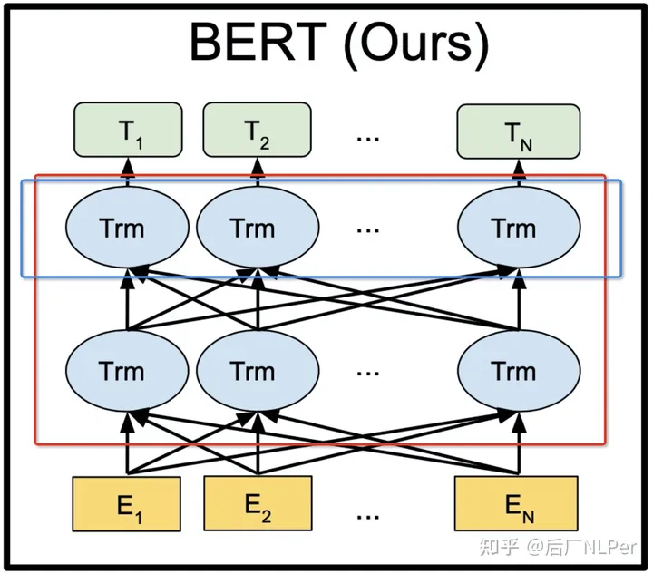
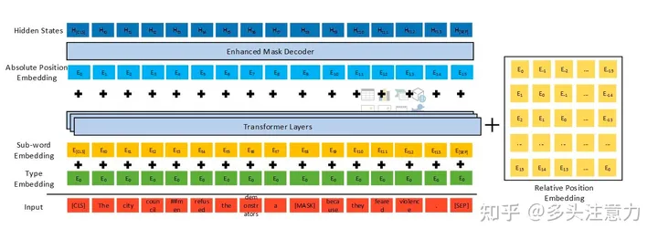
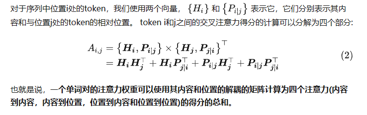
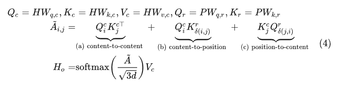
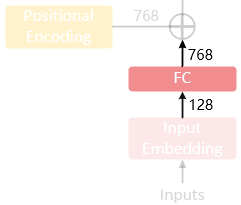
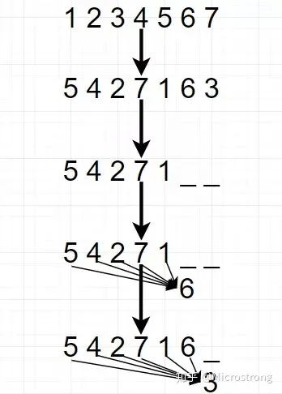
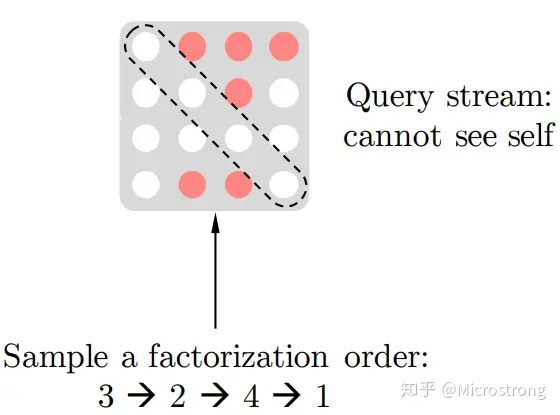
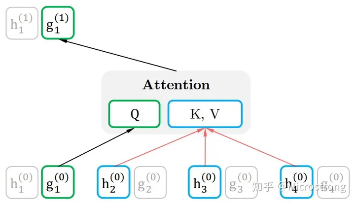
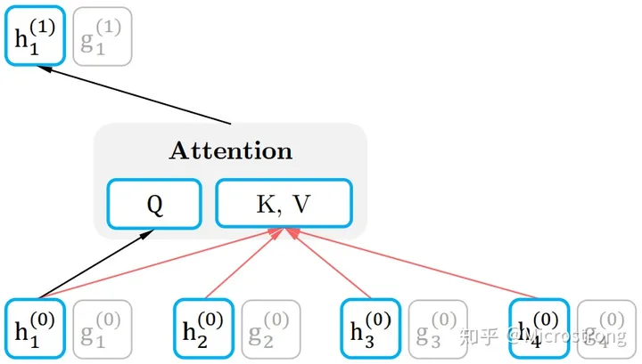
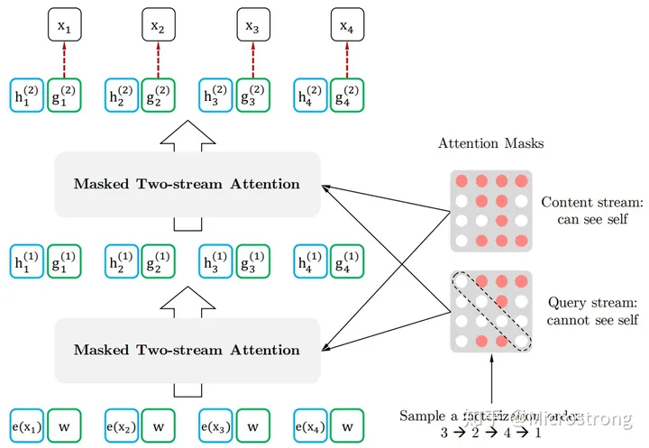

# BERT及其变体

## BERT

**双向Transformer，只使用Transformer的encoder block**
以往的预训练模型的结构会受到单向语言模型（从左到右或者从右到左）的限制，因而也限制了模型的表征能力，使其只能获取单方向的上下文信息。

核心预训练任务：1.为了解决双向模型shotcut的问题，bert采用mask操作让模型来“单词填空”，避免了信息泄露。同时，为了避免模型过度集中在masked word上，mask操作还有分80%mask，10%nochange，10%random word。2.上下句预测。

而BERT利用MLM进行预训练并且采用深层的双向Transformer组件（单向的Transformer一般被称为Transformer decoder，其每一个token（符号）只会attend到目前往左的token。而双向的Transformer则被称为Transformer encoder，其每一个token会attend到所有的token。）来构建整个模型，因此最终生成能融合左右上下文信息的深层双向语言表征。
**Bert的主体结构是由多个Transformer encoder layer的堆叠。**

 
BERT的输入为每一个token对应的表征（图中的粉红色块就是token，黄色块就是token对应的表征），并且单词字典是采用WordPiece算法来进行构建的。为了完成具体的分类任务，除了单词的token之外，作者还在输入的每一个序列开头都插入特定的分类token（[CLS]），该分类token对应的最后一个Transformer层输出被用来起到聚集整个序列表征信息的作用。
由于BERT是一个预训练模型，其必须要适应各种各样的自然语言任务，因此模型所输入的序列必须有能力包含一句话（文本情感分类，序列标注任务）或者两句话以上（文本摘要，自然语言推断，问答任务）。那么如何令模型有能力去分辨哪个范围是属于句子A，哪个范围是属于句子B呢？BERT采用了两种方法去解决：

1）在序列tokens中把分割token（[SEP]）插入到每个句子后，以分开不同的句子tokens。

2）为每一个token表征都添加一个可学习的分割embedding来指示其属于句子A还是句子B。

因此最后模型的输入序列tokens为下图（如果输入序列只包含一个句子的话，则没有[SEP]及之后的token）：

上面提到了BERT的输入为每一个token对应的表征，实际上该表征是由三部分组成的，分别是对应的token（词嵌入表示），分割（属于哪个句子的信息）和位置（整个序列中的位置信息） embeddings。与Transformer的位置嵌入不同的是，bert的嵌入表示都是可学习的。

介绍完BERT的输入，实际上BERT的输出也就呼之欲出了，因为Transformer的特点就是有多少个输入就有多少个对应的输出，如下图：

C为分类token（[CLS]）对应最后一个Transformer的输出，Ti则代表其他token对应最后一个Transformer的输出。对于一些token级别的任务（如，序列标注和问答任务），就把Ti输入到额外的输出层中进行预测。对于一些句子级别的任务（如，自然语言推断和情感分类任务），就把C输入到额外的输出层中，这里也就解释了为什么要在每一个token序列前都要插入特定的分类。
**BERT 可以用来干什么？**
BERT 可以用于问答系统，情感分析，垃圾邮件过滤，命名实体识别，文档聚类等任务中，作为这些任务的基础设施即语言模型。BERT最重要的是实现了NLP领域的一个通用模型。

## RoBERTa

RoBERTa模型是对BERT模型的精调，它细致分析了BERT模型的超参数，并对模型做了微小的改动，来提升模型的表征能力。

为了改进训练过程，RoBERTa：

（1）移除Next Sentence Prediction (NSP) 任务

（2）引入**动态掩码（dynamic mask）：即在每个批次数据**喂进模型的时候执行MASK操作

## DeBERTa

### 1.0版本

1.0版本在BERT的基础上有三个主要的改进点：

1. 更加解耦的self attention，上图中右边黄色部分；这里的解耦是将位置信息和内容信息分别/交叉做attention。其中，第四项不受关注。

   

   
2. 考虑绝对位置的MLM任务，上图中Enhanced Mask Decoder；**解耦注意力机制已经考虑了上下文词的内容和相对位置，但没有考虑这些词的绝对位置** ，这在很多情况下对于预测至关重要。给定一个句子“a new store opened beside the new mall”，并用“store”和“mall”两个词mask以进行预测。**两者都以相同的相对位置在new单词之后。 为了解决这个限制，模型需要考虑绝对位置，作为相对位置的补充信息。** **在DeBERTa中，我们在所有Transformer层之后将绝对位置信息合并** ，然后在softmax层之前进行mask token预测。
3. 预训练时引入对抗训练。DeBERTa预训练里面引入的对抗训练叫SiFT。他攻击的对象不是word embedding，而是embedding之后的layer norm。

### 2.0 版本

1. 更换tokenizer，将词典扩大了。从1.0版的50k扩成了128k。这个扩大无疑大大增加了模型的capacity。
2. 在第一个transformer block后加入卷积。**这个技巧在token classification、span prediction任务里经常用到。**
3. 共享位置和内容的变换矩阵
4. 把相对位置编码换成了log bucket（？），各个尺寸模型的bucket数都是256

### 3.0 版本

在模型层面并没有修改，而是将预训练任务由掩码语言模型（MLM）换成了ELECTRA一样类似GAN的Replaced token detect任务

> 首先使用一个生成器预测句中被mask掉的token，接下来使用预测的token替代句中的 `[MASK]`标记，然后使用一个判别器区分句中的每个token是原始的还是替换后的。

## ALBERT

ALBERT在保持性能的基础上，大大减少了模型的参数，使得实用变得更加方便，是经典的BERT变体之一。

ALBERT做了如下改进：

**1.跨层参数共享**

我们只学习第一个块的参数，并在剩下的11个层中**重用**该块，而不是为12个层中每个层都学习不同的参数。我们可以只共享feed-forward层的参数/只共享注意力参数/共享所有的参数。并**去掉 Dropout 层。**

**2.句子顺序预测 (SOP)**

ALBERT推测NSP是无效的，因为与掩码语言建模相比，它并不是一项困难的任务。在单个任务中，它混合了 **主题预测** (*topic *prediction) 和 **连贯性预测** (*coherence *prediction)。NSP的负样本是取的两篇不同文章里的句子，这两个句子可能完全不相关，那么我只要判断出它们不相关，就能确定这不是一个next sentence了。也就是说，单单只凭借topic prediction就能够完成NSP任务，而完全没有学习到coherence prediction。

因此，ALBERT提出了另一个任务" **句子顺序预测** "。关键思想是:

* 从同一个文档中取两个连续的段落作为一个正样本
* 交换这两个段落的顺序，并使用它作为一个负样本

**3、嵌入参数分解(对Embedding部分进行矩阵分解)**

ALBERT通过将大的词汇表embedding矩阵**分解成两个小矩阵**来解决这个问题。这将隐藏层的大小与词汇表嵌入的大小分开。减少wordembeding的维度。

4.**预训练用长句**

BERT 在预训练的时候，为了加速，前 90% 的 steps 用长度为 128 的句子，而后 10% 的 steps 用长度为 512 的句子，来训练位置编码。

ALBERT 则是反过来，90%-512，10%-128。

**5.遮挡多个连续词**

ALBERT 借鉴 SpanBERT 中的方法，改进了 BERT 的 MLM 任务，每次不随机遮一个词，而是随机遮连续的多个词。

## XLNet

XLNet是一种广义的自回归(auto-regressive)预训练方法。

**AR 语言模型：**

* **缺点：** 它只能利用单向语义而 **不能同时利用上下文信息** 。 ELMO 通过双向都做AR 模型，然后进行拼接，但从结果来看，效果并不是太好。
* **优点：** 对生成模型友好，天然符合生成式任务的生成过程。这也是为什么 GPT 能够编故事的原因。

**AE 语言模型：**

* **缺点： **由于训练中采用了 [MASK] 标记，导致 **预训练与微调阶段不一致的问题** 。BERT独立性假设问题，即没有对**被遮掩（Mask）的 token 之间的关系**进行学习。 此外对于生成式问题， AE 模型也显得捉襟见肘。
* **优点：** 能够很好的编码上下文语义信息（即考虑句子的双向信息）， 在自然语言理解相关的下游任务上表现突出。

只要在 AR中再加入一个步骤，就能够完美地将AR与AE的优点统一起来：**Permutation Language Model** （PLM）

### PLM思想

具体实现方式是，通过随机取一句话的一种排列，然后将末尾一定量的词给“遮掩”（和 BERT 里的直接替换 “[MASK]” 有些不同）掉，最后用 AR 的方式来按照这种排列依次预测被“遮掩”掉的词。

论文中 Permutation 具体的实现方式是通过直接对 Transformer 的 **Attention Mask** 进行操作。

比如说序号依次为 1234 的句子，先随机取一种排列3241。于是根据这个排列我们就做出类似上图的 Attention Mask。先看第1行，因为在新的排列方式中 1 在最后一个，根据从左到右 AR 方式，1 就能看到 234 全部，于是第一行的 234 位置是红色的（没有遮盖掉，会用到），以此类推。第2行，因为 2 在新排列是第二个，只能看到 3，于是 3 位置是红色。第 3 行，因为 3 在第一个，看不到其他位置，所以全部遮盖掉...

### XLNet实现

为了实现 Permutation 加上 AR 预测过程，首先我们会发现，打乱顺序后位置信息非常重要，同时对每个位置来说，需要预测的是内容信息（对应位置的词），于是输入就不能包含内容信息，不然模型学不到东西，只需要直接从输入复制到输出就好了。

于是这里就造成了位置信息与内容信息的割裂，因此在 BERT 这样的位置信息加内容信息输入 Self-Attention (自注意力) 的流（Stream）之外，作者还增加了另一个 **只有位置信息作为 Self-Attention 中 query 输入的流** 。文中将前者称为  **Content Stream** ，而后者称为  **Query Stream** 。这样就能利用 Query Stream 在对需要预测位置进行预测的同时，又不会泄露当前位置的内容信息。

**Query Stream**：用两组隐状态（hidden states） g 和 ℎ 。其中 g 只有位置信息，作为 Self-Attention 里的 Q。 ℎ 包含内容信息，则作为 K 和 V。图中为了便于说明，只将当前位置之外的 h 作为 K 和 V，但实际上实现中应该是所有时序上的 h 都作为 K 和 V，最后再交给上图中的 Query stream 的 Attention Mask 来完成位置的遮盖。

**Content Stream**：

组合：

一最下面一样的w ，和Relative Positional Encoding 有关。

## SpanBert

改变了预训练任务：**replace span（小段替换）法** ，可以把它当作是把上面 Mask 法中相邻 [M] 都合成了一个特殊符，每一小段替换一个特殊符，提高计算效率；

<pre class="vditor-reset" placeholder="" contenteditable="true" spellcheck="false">
 
</pre
