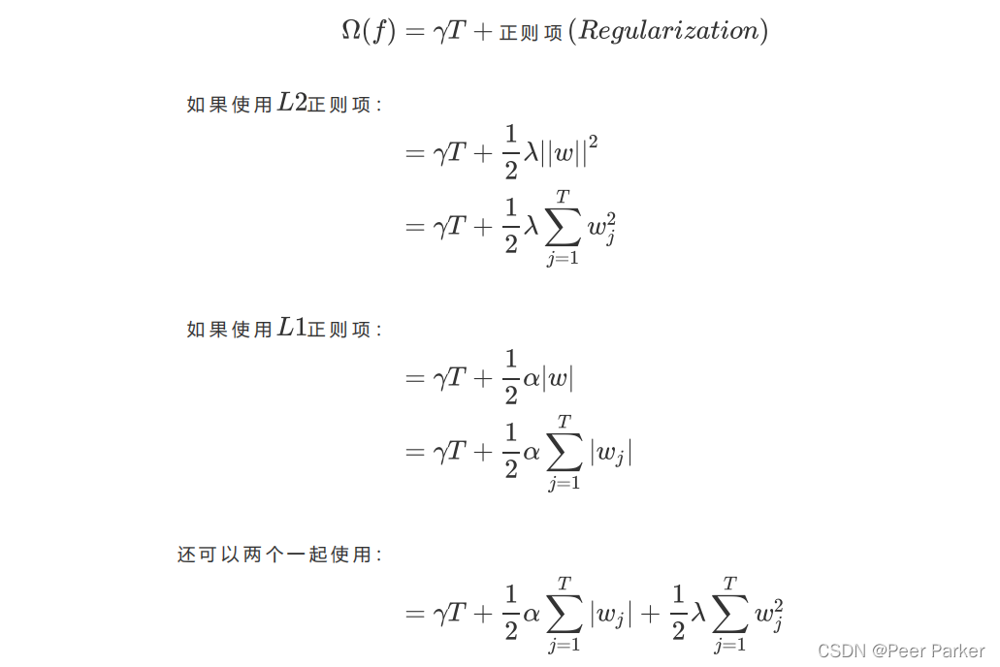
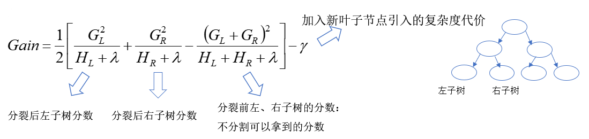
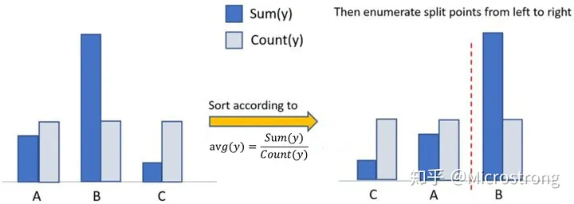
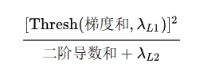

# CART

* 决策树由决策结点、分支和叶子结点组成。
  1.决策结点表示在样本的一个属性上进行的划分；
  2.分支表示对于决策结点进行划分的输出；
  3.叶结点代表经过分支到达的类。
* 往往使用启发式算法来进行决策树的构造，例如，使用贪婪算法对每个结点构造部分最优决策树。
* 对于一个决策树的构建，最重要的部分就在于其分支处理，即确定在每个决策结点处的分支属性。分支属性的选取即对决策节点上选择哪一个属性来对数据集进行划分，要求每个分支中样本的类别纯度尽可能高，而且不要产生样本数量太少的分支。

ID3：信息增益准则；缺点：只能处理离散数据

C45：信息增益率；优点：有剪枝，缺点：算法效率低下，且只能用于分类，不能用于回归。

CART：使用基尼系数，能够做回归任务；对于连续特征，不断地作二分离散；

# GBDT

梯度提升决策树

boosting思想下的对残差的加性集成学习方法

由k个CART树组成，每一个CART树都是对前面k-1个树的加和的偏差的修正。

利用梯度更新时只用了1阶导数，没有正则项；

### 随机森林和GBDT的区别：

1. 随机森林采用的bagging思想，而GBDT采用的boosting思想。这两种方法都是Bootstrap思想的应用，Bootstrap是一种有放回的抽样方法思想。虽然都是有放回的抽样，但二者的区别在于：Bagging采用有放回的均匀取样，而Boosting根据错误率来取样（Boosting初始化时对每一个训练样例赋相等的权重1／n，然后用该算法对训练集训练t轮，每次训练后，对训练失败的样例赋以较大的权重），因此Boosting的分类精度要优于Bagging。Bagging的训练集的选择是随机的，各训练集之间相互独立，弱分类器可并行，而Boosting的训练集的选择与前一轮的学习结果有关，是串行的。
2. 组成随机森林的树可以是分类树，也可以是回归树；而GBDT只能由回归树组成。
3. 组成随机森林的树可以并行生成；而GBDT只能是串行生成。
4. 对于最终的输出结果而言，随机森林采用多数投票等；而GBDT则是将所有结果累加起来，或者加权累加起来。
5. 随机森林对异常值不敏感；GBDT对异常值非常敏感。
6. 随机森林对训练集一视同仁；GBDT是基于权值的弱分类器的集成。
7. 随机森林是通过减少模型方差提高性能；GBDT是通过减少模型偏差提高性能。

# XGboost

#### 1. 简单介绍一下XGBoost

首先需要说一说GBDT，它是一种基于boosting增强策略的加法模型，训练的时候采用前向分布算法进行贪婪的学习，每次迭代都学习一棵CART树来拟合之前 t-1 棵树的预测结果与训练样本真实值的残差。

XGBoost对GBDT进行了一系列优化，比如损失函数进行了二阶泰勒展开、目标函数加入正则项、支持并行和默认缺失值处理等，在可扩展性和训练速度上有了巨大的提升，但其核心思想没有大的变化。

#### 2. XGBoost与GBDT有什么不同？

 **（1）基分类器** ：XGBoost的基分类器不仅支持CART决策树，还支持线性分类器，此时XGBoost相当于带L1和L2正则化项的Logistic回归（分类问题）或者线性回归（回归问题）。

 **（2）导数信息** ：XGBoost对损失函数做了二阶泰勒展开，GBDT只用了一阶导数信息，并且XGBoost还支持自定义损失函数，只要损失函数一阶、二阶可导。

 **（3）正则项** ：XGBoost的目标函数加了正则项， 相当于预剪枝，使得学习出来的模型更加不容易过拟合。

 **（4）列抽样** ：XGBoost支持列采样，与随机森林类似，用于防止过拟合。

 **（5）缺失值处理** ：对树中的每个非叶子结点，XGBoost可以自动学习出它的默认分裂方向。如果某个样本该特征值缺失，会将其划入默认分支。

 **（6）并行化** ：注意不是tree维度的并行，而是特征维度的并行。XGBoost预先将每个特征按特征值排好序，存储为块结构，分裂结点时可以采用多线程并行查找每个特征的最佳分割点，极大提升训练速度。

#### XGBoost的正则项

T是叶子数量。γ加入新叶子节点的复杂度代价。下面这整个函数都是正则函数项。

#### 3.XGBoost为什么使用泰勒二阶展开？

 **（1）精准性** ：相对于GBDT的一阶泰勒展开，XGBoost采用二阶泰勒展开，可以更为精准的逼近真实的损失函数

 **（2）可扩展性** ：损失函数支持自定义，只需要新的损失函数二阶可导。

> 二阶泰勒展开优势
>
> xgboost是以MSE为基础推导出来的，xgboost的目标函数展开就是一阶项（残差）+二阶项的形式，而其他类似logloss这样的目标函数不能表示成这种形式。为了后续推导的统一，将目标函数进行二阶泰勒展开，就可以直接自定义损失函数了，只要二阶可导即可，增强了模型的扩展性。
>
> 二阶信息能够让梯度收敛的更快更准确，类似牛顿法比SGD收敛更快。一阶信息描述梯度变化方向，二阶信息可以描述梯度变化方向是如何变化的。

#### 4.XGBoost为什么可以并行训练？

（1） **XGBoost的并行，并不是说每棵树可以并行训练** ，XGB本质上仍然采用boosting思想，每棵树训练前需要等前面的树训练完成才能开始训练。

（2） **XGBoost的并行，指的是特征维度的并行** ：在训练之前，每个特征按特征值对样本进行预排序，并存储为Block结构，在后面查找特征分割点时可以重复使用，而且特征已经被存储为一个个block结构，那么在寻找每个特征的最佳分割点时，可以利用多线程对每个block并行计算。

#### XGBboost的增长策略：

XGBoost 采用 Level-wise 的增长策略，该策略遍历一次数据可以同时分裂同一层的叶子，容易进行多线程优化，也好控制模型复杂度，不容易过拟合。但实际上Level-wise是一种低效的算法，因为它不加区分的对待同一层的叶子，实际上很多叶子的分裂增益较低，没必要进行搜索和分裂，因此带来了很多没必要的计算开销。

#### XGBoost的防止过拟合策略：

XGBoost还提出了两种防止过拟合的方法：Shrinkage and Column Subsampling。Shrinkage方法就是在每次迭代中对树的每个叶子结点的分数乘上一个缩减权重η，这可以使得每一棵树的影响力不会太大，留下更大的空间给后面生成的树去优化模型。Column Subsampling类似于随机森林中的选取部分特征进行建树。其可分为两种，一种是按层随机采样，在对同一层内每个结点分裂之前，先随机选择一部分特征，然后只需要遍历这部分的特征，来确定最优的分割点。另一种是随机选择特征，则建树前随机选择一部分特征然后分裂就只遍历这些特征。一般情况下前者效果更好。

#### 5.XGBoost为什么快？

 **（1）分块并行** ：训练前每个特征按特征值进行排序并存储为Block结构，后面查找特征分割点时重复使用，并且支持并行查找每个特征的分割点

 **（2）候选分位点** ：每个特征采用常数个分位点作为候选分割点

 **（3）CPU cache 命中优化** ： 使用缓存预取的方法，对每个线程分配一个连续的buffer，读取每个block中样本的梯度信息并存入连续的Buffer中。

 **（4）Block 处理优化** ：Block预先放入内存；Block按列进行解压缩；将Block划分到不同硬盘来提高吞吐

#### 6.XGBoost防止过拟合的方法

 **（1）目标函数添加正则项** ：叶子节点个数+叶子节点权重的L2正则化

 **（2）列抽样** ：训练的时候只用一部分特征（不考虑剩余的block块即可），借鉴RF

 **（3）子采样** ：每轮计算可以不使用全部样本，使算法更加保守

 **（4）shrinkage** : 可以叫学习率或步长，为了给后面的训练留出更多的学习空间

#### 7.XGBoost如何处理缺失值

XGBoost模型的一个优点就是允许特征存在缺失值。对缺失值的处理方式如下：

（1）在 **特征k上寻找最佳 split point 时，不会对该列特征 missing 的样本进行遍历** ，而只对该列特征值为 non-missing 的样本上对应的特征值进行遍历，通过这个技巧 **来减少了为稀疏离散特征寻找 split point 的时间开销** 。

（2）在**逻辑实现**上，为了保证完备性，会将该特征值missing的样本分别分配到左叶子结点和右叶子结点，两种情形都计算一遍后，选择分裂后增益最大的那个方向（左分支或是右分支），作为预测时特征值缺失样本的默认分支方向。

（3） **如果在训练中没有缺失值而在预测中出现缺失** ，那么会自动将缺失值的划分方向放到右子结点。

#### 8.XGBoost中叶子结点的权重如何计算出来

XGBoost目标函数最终推导形式如下，利用一元二次函数求最值的知识，当目标函数达到最小值Obj*时，每个叶子结点的权重为wj*。

具体公式如下：

#### 9. XGBoost中的一棵树的停止生长条件

（1）当新引入的一次分裂所带来的增益Gain<0时，放弃当前的分裂。这是训练损失和模型结构复杂度的博弈过程。

（2）当树达到最大深度时，停止建树，因为树的深度太深容易出现过拟合，这里需要设置一个超参数max_depth。

（3）当引入一次分裂后，重新计算新生成的左、右两个叶子结点的样本权重和。 **如果任一个叶子结点的样本权重低于某一个阈值，也会放弃此次分裂** 。这涉及到一个超参数:最小样本权重和，是指如果一个叶子节点包含的样本数量太少也会放弃分裂，防止树分的太细。

#### 10. RF和GBDT的区别

**相同点：**

* 都是由多棵树组成，最终的结果都是由多棵树一起决定。

**不同点：**

* **集成学习** ：RF属于bagging思想，而GBDT是boosting思想
* **偏差-方差权衡** ：RF不断的降低模型的方差，而GBDT不断的降低模型的偏差
* **训练样本** ：RF每次迭代的样本是从全部训练集中有放回抽样形成的，而GBDT每次使用全部样本
* **并行性** ：RF的树可以并行生成，而GBDT只能顺序生成(需要等上一棵树完全生成)
* **最终结果** ：RF最终是多棵树进行多数表决（回归问题是取平均），而GBDT是加权融合
* **数据敏感性** ：RF对异常值不敏感，而GBDT对异常值比较敏感
* **泛化能力** ：RF不易过拟合，而GBDT容易过拟合

#### 11. XGBoost如何处理不平衡数据

对于不平衡的数据集，例如用户的购买行为，肯定是极其不平衡的，这对XGBoost的训练有很大的影响，XGBoost有两种自带的方法来解决：

第一种，如果你在意AUC，采用AUC来评估模型的性能，那你可以通过设置scale_pos_weight来平衡正样本和负样本的权重。例如，当正负样本比例为1:10时，scale_pos_weight可以取10；

第二种，如果你在意概率(预测得分的合理性)，你不能重新平衡数据集(会破坏数据的真实分布)，应该设置max_delta_step为一个有限数字来帮助收敛（基模型为LR时有效）。

论文中的原话：“For common cases such as ads clickthrough log, the dataset is extremely imbalanced. This can affect the training of xgboost model, and there are two ways to improve it.If you care only about the ranking order (AUC) of your prediction      Balance the positive and negative weights, via scale_pos_weight      Use AUC for evaluation.If you care about predicting the right probability. In such a case, you cannot re-balance the dataset. In such a case, set parameter max_delta_step to a finite number (say 1) will help convergence.”

那么，源码到底是怎么利用**scale_pos_weight**来平衡样本的呢，是调节权重还是过采样呢？请看源码：

`if (info.labels[i] == 1.0f)  w *= param_.scale_pos_weight`

可以看出，应该是增大了少数样本的权重。

除此之外，还可以通过上采样、下采样、SMOTE算法或者自定义代价函数的方式解决正负样本不平衡的问题。

#### 12. 比较LR和GBDT，说说什么情景下GBDT不如LR

先说说LR和GBDT的区别：

* LR是线性模型，可解释性强，很容易并行化，但学习能力有限，需要大量的人工特征工程
* GBDT是非线性模型，具有天然的特征组合优势，特征表达能力强，但是树与树之间无法并行训练，而且树模型很容易过拟合；

当在高维稀疏特征的场景下，LR的效果一般会比GBDT好。线性模型会比非线性模型好的原因了：**带正则化的线性模型比较不容易对稀疏特征过拟合。**

#### 13. XGBoost和LightGBM的区别

（1）树生长策略：XGB采用 `level-wise`的分裂策略，LGB采用 `leaf-wise`的分裂策略。XGB对每一层所有节点做无差别分裂，但是可能有些节点增益非常小，对结果影响不大，带来不必要的开销。Leaf-wise是在所有叶子节点中选取分裂收益最大的节点进行的，但是很容易出现过拟合问题，所以需要对最大深度做限制 。

（2）分割点查找算法：XGB使用特征预排序算法，LGB使用基于直方图的切分点算法，其优势如下：

* 减少内存占用，比如离散为256个bin时，只需要用8位整形就可以保存一个样本被映射为哪个bin(这个bin可以说就是转换后的特征)，对比预排序的exact greedy算法来说（用int_32来存储索引+ 用float_32保存特征值），可以节省7/8的空间。
* 计算效率提高，预排序的Exact greedy对每个特征都需要遍历一遍数据，并计算增益，复杂度为𝑂(#𝑓𝑒𝑎𝑡𝑢𝑟𝑒×#𝑑𝑎𝑡𝑎)。而直方图算法在建立完直方图后，只需要对每个特征遍历直方图即可，复杂度为𝑂(#𝑓𝑒𝑎𝑡𝑢𝑟𝑒×#𝑏𝑖𝑛𝑠)。
* LGB还可以使用直方图做差加速，一个节点的直方图可以通过父节点的直方图减去兄弟节点的直方图得到，从而加速计算

> 但实际上xgboost的近似直方图算法也类似于lightgbm这里的直方图算法，为什么xgboost的近似算法比lightgbm还是慢很多呢？
>
> xgboost在每一层都动态构建直方图， 因为xgboost的直方图算法不是针对某个特定的feature，而是所有feature共享一个直方图(每个样本的权重是二阶导)，所以每一层都要重新构建直方图，而lightgbm中对每个特征都有一个直方图，所以构建一次直方图就够了。

（3）支持离散变量：无法直接输入类别型变量，因此需要事先对类别型变量进行编码（例如独热编码），而LightGBM可以直接处理类别型变量。

（4）缓存命中率：XGB使用Block结构的一个缺点是取梯度的时候，是通过索引来获取的，而这些梯度的获取顺序是按照特征的大小顺序的，这将导致非连续的内存访问，可能使得CPU cache缓存命中率低，从而影响算法效率。而LGB是基于直方图分裂特征的，梯度信息都存储在一个个bin中，所以访问梯度是连续的，缓存命中率高。

（5）LightGBM 与 XGboost 的并行策略不同：

* **特征并行** ：LGB特征并行的前提是每个worker留有一份完整的数据集，但是每个worker仅在特征子集上进行最佳切分点的寻找；worker之间需要相互通信，通过比对损失来确定最佳切分点；然后将这个最佳切分点的位置进行全局广播，每个worker进行切分即可。XGB的特征并行与LGB的最大不同在于XGB每个worker节点中仅有部分的列数据，也就是垂直切分，每个worker寻找局部最佳切分点，worker之间相互通信，然后在具有最佳切分点的worker上进行节点分裂，再由这个节点广播一下被切分到左右节点的样本索引号，其他worker才能开始分裂。二者的区别就导致了LGB中worker间通信成本明显降低，只需通信一个特征分裂点即可，而XGB中要广播样本索引。
* **数据并行** ：当数据量很大，特征相对较少时，可采用数据并行策略。LGB中先对数据水平切分，每个worker上的数据先建立起局部的直方图，然后合并成全局的直方图，采用直方图相减的方式，先计算样本量少的节点的样本索引，然后直接相减得到另一子节点的样本索引，这个直方图算法使得worker间的通信成本降低一倍，因为只用通信以此样本量少的节点。XGB中的数据并行也是水平切分，然后单个worker建立局部直方图，再合并为全局，不同在于根据全局直方图进行各个worker上的节点分裂时会单独计算子节点的样本索引，因此效率贼慢，每个worker间的通信量也就变得很大。
* **投票并行（LGB）** ：当数据量和维度都很大时，选用投票并行，该方法是数据并行的一个改进。数据并行中的合并直方图的代价相对较大，尤其是当特征维度很大时。大致思想是：每个worker首先会找到本地的一些优秀的特征，然后进行全局投票，根据投票结果，选择top的特征进行直方图的合并，再寻求全局的最优分割点。

### 14. XGBoost如何处理缺失值

XGBoost模型的一个优点就是允许特征存在缺失值。对缺失值的处理方式如下：

* 在特征k上寻找最佳 split point 时，不会对该列特征 missing 的样本进行遍历，而只对该列特征值为 non-missing 的样本上对应的特征值进行遍历，通过这个技巧来减少了为稀疏离散特征寻找 split point 的时间开销。
* 在逻辑实现上，为了保证完备性，会将该特征值missing的样本分别分配到左叶子结点和右叶子结点，两种情形都计算一遍后，选择分裂后增益最大的那个方向（左分支或是右分支），作为预测时特征值缺失样本的默认分支方向。
* 如果在训练中没有缺失值而在预测中出现缺失，那么会自动将缺失值的划分方向放到右子结点。

### 15. one-hot向量不适合？

对于决策树来说并不推荐使用 one-hot 编码，尤其当类别特征中类别个数很多的情况下，会存在以下问题：

1. 会产生样本切分不平衡问题，导致切分增益非常小（即浪费了这个特征）。使用 one-hot编码，意味着在每一个决策节点上只能使用one vs rest（例如是不是狗，是不是猫等）的切分方式。例如，动物类别切分后，会产生是否狗，是否猫等一系列特征，这一系列特征上只有少量样本为 1，大量样本为 0，这时候切分样本会产生不平衡，这意味着切分增益也会很小。较小的那个切分样本集，它占总样本的比例太小，无论增益多大，乘以该比例之后几乎可以忽略；较大的那个拆分样本集，它几乎就是原始的样本集，增益几乎为零。比较直观的理解就是不平衡的切分和不切分没有区别。
2. 会影响决策树的学习。因为就算可以对这个类别特征进行切分，独热编码也会把数据切分到很多零散的小空间上，如下图左边所示。而决策树学习时利用的是统计信息，在这些数据量小的空间上，统计信息不准确，学习效果会变差。但如果使用下图右边的切分方法，数据会被切分到两个比较大的空间，进一步的学习也会更好。下图右边叶子节点的含义是X=A或者X=C放到左孩子，其余放到右孩子。

# 剪枝

1.预剪枝：提前限制深度、叶子结点个数、叶子结点样本个数等；

2.后剪枝：通过一定衡量标准来判定：

REP错误率降低剪枝：从叶子结点向上，依次将决策树的所有子树用其样本中最多的类替换，使用一个测试集进行测试，**记录下对于决策树的每棵子树剪枝前后的误差数之差，选取误差数减少最少的子树进行剪枝，将其用子样本集中最多的类替换 。** 按此步骤自底向上，遍历决策树的所有子树，当发现没有可替换的子树时，即每棵子树剪枝后的误差数都会增多，则剪枝结束。

PEP悲观剪枝：与REP相比，PEP不再需要构建一个单独的测试集。对误分率增加了一个修正因子。
CCP代价复杂度剪枝： 定义了代价与复杂度的概念，代价是指在剪枝过程中因为子树被替换而增加的错分样本，复杂度表示剪枝后减少的叶结点数。

# 缺失值？(三个阶段：划分节点时--训练模型时--预测时)

1. 在选择分裂属性的时候，训练样本存在缺失值，如何处理？假如你使用ID3算法，那么选择分类属性时，就要计算所有属性的熵增(信息增益，Gain)。假设10个样本，属性是a,b,c。在计算a属性熵时发现，第10个样本的a属性缺失，那么就把第10个样本去掉，前9个样本组成新的样本集，在新样本集上按正常方法计算a属性的熵增。然后结果乘0.9（新样本占raw样本的比例），就是a属性最终的熵。
2. 分类属性选择完成，对训练样本分类，发现属性缺失怎么办？比如该节点是根据a属性划分，但是待分类样本a属性缺失，怎么办呢？假设a属性离散，有1,2两种取值，那么就把该样本分配到两个子节点中去，但是权重由1变为相应离散值个数占样本的比例。然后计算错误率的时候，注意，不是每个样本都是权重为1，存在分数。
3. 训练完成，给测试集样本分类，有缺失值怎么办？这时候，就不能按比例分配了，因为你必须给该样本一个确定的label，而不是薛定谔的label。这时候根据投票来确定，或者填充缺失值。

# 手动调参参考

#### 调参步骤

首先需初始化一些基本变量，如：`max_depth = 5, min_child_weight = 1, gamma = 0, subsample, colsample_bytree = 0.8, scale_pos_weight = 1`，确定learning rate和estimator的数量 lr可先用0.1，用 `xgboost.cv()`来寻找最优的estimators。

* `max_depth, min_child_weight`: 首先将这两个参数设置为较大的数，通过迭代方式不断修正，缩小范围。max_depth每棵子树的最大深度，check from range(3,10,2)。min_child_weight子节点的权重阈值，check from range(1,6,2)。 如果一个结点分裂后，它的所有子节点的权重之和都大于该阈值，该叶子节点才可以划分。
* `gamma`: 最小划分损失min_split_loss，check from 0.1 to 0.5，对于一个叶子节点，当对它采取划分之后，损失函数的降低值的阈值。如果大于该阈值，则该叶子节点值得继续划分。如果小于该阈值，则该叶子节点不值得继续划分。
* `subsample, colsample_bytree`: subsample是对训练的采样比例，colsample_bytree是对特征的采样比例，both check from 0.6 to 0.9
* 正则化参数。alpha 是L1正则化系数，try 1e-5, 1e-2, 0.1, 1, 100。lambda 是L2正则化系数
* 降低学习率：降低学习率的同时增加树的数量，通常最后设置学习率为0.01~0.1

# xgboost的缺点

这种构建决策树的算法基本思想是：首先，对所有特征都按照特征的数值进行预排序。其次，在遍历分割点的时候用O(#data)的代价找到一个特征上的最好分割点。最后，在找到一个特征的最好分割点后，将数据分裂成左右子节点。

这样的预排序算法的优点是能精确地找到分割点。但是缺点也很明显：

首先，空间消耗大。这样的算法需要保存数据的特征值，还保存了特征排序的结果（例如，为了后续快速的计算分割点，保存了排序后的索引），这就需要消耗训练数据两倍的内存。

其次，时间上也有较大的开销，在遍历每一个分割点的时候，都需要进行分裂增益的计算，消耗的代价大。

最后，对cache优化不友好。在预排序后，特征对梯度的访问是一种随机访问，并且不同的特征访问的顺序不一样，无法对cache进行优化。同时，在每一层长树的时候，需要随机访问一个行索引到叶子索引的数组，并且不同特征访问的顺序也不一样，也会造成较大的cache miss。

# **LightGBM的优化**

为了避免上述XGBoost的缺陷，并且能够在不损害准确率的条件下加快GBDT模型的训练速度，lightGBM在传统的GBDT算法上进行了如下优化：

* 基于Histogram的决策树算法。
* 单边梯度采样 Gradient-based One-Side Sampling(GOSS)：使用GOSS可以减少大量只具有小梯度的数据实例，这样在计算信息增益的时候只利用剩下的具有高梯度的数据就可以了，相比XGBoost遍历所有特征值节省了不少时间和空间上的开销。
* 互斥特征捆绑 Exclusive Feature Bundling(EFB)：使用EFB可以将许多互斥的特征绑定为一个特征，这样达到了降维的目的。
* 带深度限制的Leaf-wise的叶子生长策略：大多数GBDT工具使用低效的按层生长 (level-wise) 的决策树生长策略，因为它不加区分的对待同一层的叶子，带来了很多没必要的开销。实际上很多叶子的分裂增益较低，没必要进行搜索和分裂。LightGBM使用了带有深度限制的按叶子生长 (leaf-wise) 算法。
* 直接支持类别特征(Categorical Feature)
* 支持高效并行
* Cache命中率优化

# LightGBM算法

## **（1）直方图算法**

直方图算法简单理解为：首先确定对于每一个特征需要多少个箱子（bin）并为每一个箱子分配一个整数；然后将浮点数的范围均分成若干区间，区间个数与箱子个数相等，将属于该箱子的样本数据更新为箱子的值；最后用直方图（#bins）表示。

优势：

* 占用空间小，可以用8位整型代替32位浮点。
* 计算代价小，xgboost需要计算所有数据的分裂效益，而lgbm只需要计算k个箱子的分裂效益

**直方图做差加速**：一个叶子的直方图可以由它的父亲节点的直方图与它兄弟的直方图做差得到。LightGBM还可以先计算直方图小的叶子节点，然后利用直方图做差来获得直方图大的叶子节点，这样就可以用非常微小的代价得到它兄弟叶子的直方图。

## （2）leaf-wise增长

LightGBM采用Leaf-wise的增长策略，该策略每次从当前所有叶子中，找到分裂增益最大的一个叶子，然后分裂，如此循环。

因此同Level-wise相比，Leaf-wise的优点是：在分裂次数相同的情况下，Leaf-wise可以降低更多的误差，得到更好的精度；

Leaf-wise的缺点是：可能会长出比较深的决策树，产生过拟合。因此LightGBM会在Leaf-wise之上增加了一个最大深度的限制，在保证高效率的同时防止过拟合。

## **（3）单边梯度采样算法**

简单来说就是在计算出梯度后，按loss的绝对值进行降序排序，取最大的a%，和剩下部分里的b%来进行梯度更新，并且那b%还需要乘以一个权重系数：$\frac{1-a}{b}$。

这样子能够关注前面loss大的部分进行更新，加快更新效率。

## **（4）互斥特征捆绑算法**

选择特征：

1. 统计特征值中的非零值，这与特征间的冲突值有关系，0越多互斥性就越高；
2. 根据0的数量进行降序排序，数量越大，与其它特征的冲突越大；
3. 遍历每个特征，将它分配给现有特征包，或者新建一个特征包，使得总体冲突最小。

区间偏置：

如果判定捆绑在一起的特征的直方图区间不统一，会增加一个偏置bias来使其统一。

## **（5）直接支持类别特征**

LightGBM优化了对类别特征的支持，可以直接输入类别特征，不需要额外的0/1展开。LightGBM采用 many-vs-many 的切分方式将类别特征分为两个子集，实现类别特征的最优切分。

在枚举分割点之前，先把对每个类别的直方图按照对应的所有label的均值进行排序；然后按照排序的结果依次枚举最优分割点。

## 参数

#### **boosting / boost / boosting_type**

用于指定弱学习器的类型，默认值为 ‘gbdt’，表示使用基于树的模型进行计算。还可以选择为 ‘gblinear’ 表示使用线性模型作为弱学习器。

可选的参数值有：

* ‘gbdt’，使用梯度提升树
* ‘rf’，使用随机森林
* ‘dart’，不太了解，官方解释为 Dropouts meet Multiple Additive Regression Trees
* ‘goss’，使用单边梯度抽样算法，速度很快，但是可能欠拟合。

**推荐设置为 'gbdt’**

#### **objective / application**

用于指定学习任务及相应的学习目标，常用的可选参数值如下：

* “regression”，使用L2正则项的回归模型（默认值）。
* “regression_l1”，使用L1正则项的回归模型。
* “mape”，平均绝对百分比误差。
* “binary”，二分类。
* “multiclass”，多分类。

#### **num_class**

用于设置多分类问题的类别个数。

#### **min_child_samples**

叶节点样本的最少数量，默认值20，用于防止过拟合。

#### **learning_rate / eta**

LightGBM 不完全信任每个弱学习器学到的残差值，为此需要给每个弱学习器拟合的残差值都乘上取值范围在(0, 1] 的 eta，设置较小的 eta 就可以多学习几个弱学习器来弥补不足的残差。

**推荐的候选值为：[0.01, 0.015, 0.025, 0.05, 0.1]**

#### **max_depth**

指定树的最大深度，默认值为-1，表示不做限制，合理的设置可以防止过拟合。

 **推荐的数值为：[3, 5, 6, 7, 9, 12, 15, 17, 25]** 。

#### **num_leaves**

指定叶子的个数，默认值为31，此参数的数值应该小于 **2 m a x _ d e p t h 2^{max\_depth}**2**m**a**x**_**d**e**p**t**h**。

#### **feature_fraction / colsample_bytree**

构建弱学习器时，对特征随机采样的比例，默认值为1。

**推荐的候选值为：[0.6, 0.7, 0.8, 0.9, 1]**

#### **bagging_fraction / subsample**

默认值1，指定采样出 subsample * n_samples 个样本用于训练弱学习器。注意这里的子采样和随机森林不一样，随机森林使用的是放回抽样，而这里是不放回抽样。 取值在(0, 1)之间，设置为1表示使用所有数据训练弱学习器。如果取值小于1，则只有一部分样本会去做GBDT的决策树拟合。选择小于1的比例可以减少方差，即防止过拟合，但是会增加样本拟合的偏差，因此取值不能太低。

> 注意： bagging_freq 设置为非0值时才生效。

**推荐的候选值为：[0.6, 0.7, 0.8, 0.9, 1]**

#### **bagging_freq / subsample_freq**

数值型，默认值0，表示禁用样本采样。如果设置为整数 z ，则每迭代 k 次执行一次采样。

#### **lambda_l1**

L1正则化权重项，增加此值将使模型更加保守。

**推荐的候选值为：[0, 0.01~0.1, 1]**

#### **lambda_l2**

L2正则化权重项，增加此值将使模型更加保守。

**推荐的候选值为：[0, 0.1, 0.5, 1]**

* 正则化参数如何影响节点增长：
* 
* 增长效益绝对值小于l1阈值，则直接视为0。l2则加在分母上，在节点样本数已经很小的时候，能显著减小 gain 避免分裂。

#### **min_gain_to_split / min_split_gain**

指定叶节点进行分支所需的损失减少的最小值，默认值为0。设置的值越大，模型就越保守。

**推荐的候选值为：[0, 0.05 ~ 0.1, 0.3, 0.5, 0.7, 0.9, 1] **

#### **min_sum_hessian_in_leaf / min_child_weight**

指定孩子节点中最小的样本权重和，如果一个叶子节点的样本权重和小于min_child_weight则拆分过程结束，默认值为1。

**推荐的候选值为：[1, 3, 5, 7]**

#### **metric**

用于指定评估指标，可以传递各种评估方法组成的list。常用的评估指标如下：

* ‘mae’，用于回归任务，效果与 ‘mean_absolute_error’， ‘l1’ 相同。
* ‘mse’，用于回归任务，效果与 ‘mean_squared_error’， ‘l2’ 相同。
* ‘rmse’，用于回归任务，效果与 ‘root_mean_squared_error’， ‘l2_root’ 相同。
* ‘auc’，用于二分类任务。
* ‘binary’，用于二分类任务。
* ‘binary_logloss’，用于二分类任务。
* ‘binary_error’，用于二分类任务。
* ‘multiclass’，用于多分类。
* ‘multi_logloss’， 用于多分类。
* ‘multi_error’， 用于多分类。

#### **seed / random_state**

指定随机数种子。

## 调参思路

（1）选择较高的学习率，例如0.1，这样可以减少迭代用时。

（2）然后对 max_depth, num_leaves, min_data_in_leaf, min_split_gain, subsample, colsample_bytree 这些参数进行调整。

其中，num_leaves < **2 m a x _ d e p t h 2^{max\_depth}**2**m**a**x**_**d**e**p**t**h**。而 min_data_in_leaf 是一个很重要的参数, 也叫min_child_samples，它的值取决于训练数据的样本个树和num_leaves. 将其设置的较大可以避免生成一个过深的树, 但有可能导致欠拟合。

其他参数的合适候选值为：

* max_depth：[3, 5, 6, 7, 9, 12, 15, 17, 25]
* min_split_gain：[0, 0.05 ~ 0.1, 0.3, 0.5, 0.7, 0.9, 1]
* subsample：[0.6, 0.7, 0.8, 0.9, 1]
* colsample_bytree：[0.6, 0.7, 0.8, 0.9, 1]

（3）调整正则化参数 reg_lambda , reg_alpha，这些参数的合适候选值为：

* reg_alpha：[0, 0.01~0.1, 1]
* reg_lambda ：[0, 0.1, 0.5, 1]

（4）降低学习率，继续调整参数，学习率合适候选值为：[0.01, 0.015, 0.025, 0.05, 0.1]
