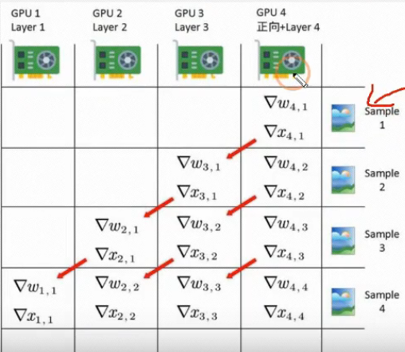
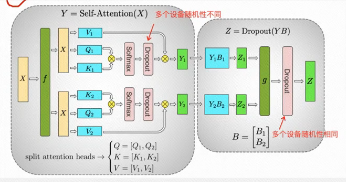
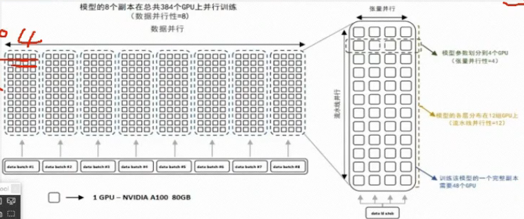
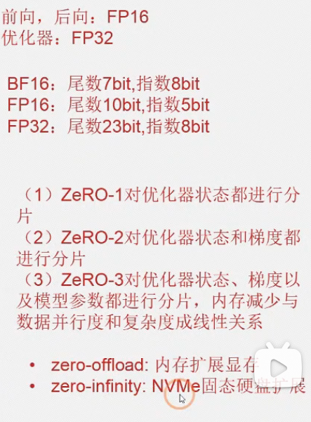

# DeepSpeed

## 1、数据并行DDP

每张卡模型参数相同，数据分发到每张卡上。

第一张卡还要额外做分发工作，因此显存需保有余量，使用率应小于85%。

在第一张卡上计算loss和统一的grad，并分发回每一张卡。

## 2、模型并行

### 2、1 层间并行 Pipeline并行

将模型不同层切分到不同gpu上计算。

下图中数据先进入的是layer4

### 2、2 层内并行 Tensor并行

对QK进行切分，在不同的卡上计算最后gather。

### 2、3 混合并行

分组——分层——分块

组间DDP

层间pipeline

块间tensor

## 3 一些设置

