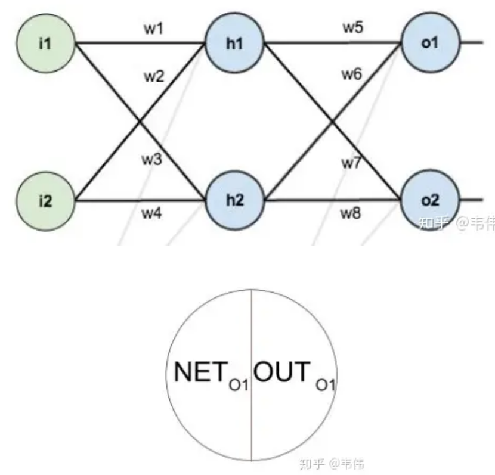
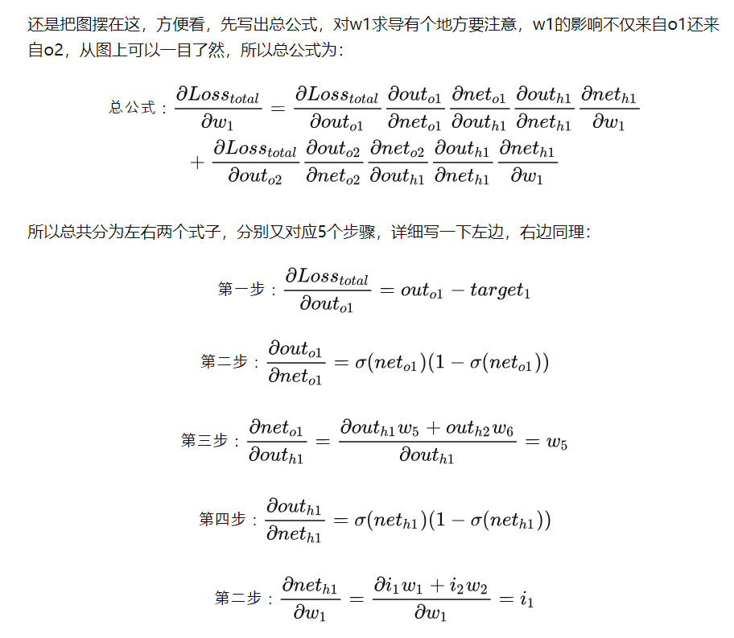

# Dropout

## Dropout具体工作流程

假设我们要训练这样一个神经网络输入是x输出是y，正常的流程是：我们首先把x通过网络前向传播，然后把误差反向传播以决定如何更新参数让网络进行学习。使用Dropout之后，过程变成如下：

> （1）首先随机（临时）删掉网络中一半的隐藏神经元，输入输出神经元保持不变（图3中虚线为部分临时被删除的神经元）
> （2） 然后把输入x通过修改后的网络前向传播，然后把得到的损失结果通过修改的网络反向传播。一小批训练样本执行完这个过程后，在没有被删除的神经元上按照随机梯度下降法更新对应的参数（w，b）。
> （3）然后继续重复这一过程：
> 恢复被删掉的神经元（此时被删除的神经元保持原样，而没有被删除的神经元已经有所更新）
> 从隐藏层神经元中随机选择一个一半大小的子集临时删除掉（备份被删除神经元的参数）。
> 对一小批训练样本，先前向传播然后反向传播损失并根据随机梯度下降法更新参数（w，b） （没有被删除的那一部分参数得到更新，删除的神经元参数保持被删除前的结果）。
> 不断重复这一过程。

代码层面实现让某个神经元以概率p停止工作，其实就是让它的激活函数值以概率p变为0。比如我们某一层网络神经元的个数为1000个，其激活函数输出值为y1、y2、y3、......、y1000，我们dropout比率选择0.4，那么这一层神经元经过dropout后，1000个神经元中会有大约400个的值被置为0。

## 为什么说Dropout可以解决过拟合？

（1）取平均的作用： 先回到标准的模型即没有dropout，我们用相同的训练数据去训练5个不同的神经网络，一般会得到5个不同的结果，此时我们可以采用 “5个结果取均值”或者“多数取胜的投票策略”去决定最终结果。例如3个网络判断结果为数字9,那么很有可能真正的结果就是数字9，其它两个网络给出了错误结果。这种“综合起来取平均”的策略通常可以有效防止过拟合问题。因为不同的网络可能产生不同的过拟合，取平均则有可能让一些“相反的”拟合互相抵消。 **dropout掉不同的隐藏神经元就类似在训练不同的网络，随机删掉一半隐藏神经元导致网络结构已经不同，整个dropout过程就相当于对很多个不同的神经网络取平均。而不同的网络产生不同的过拟合，一些互为“反向”的拟合相互抵消就可以达到整体上减少过拟合。 **

（2）减少神经元之间复杂的共适应关系： 因为dropout程序导致两个神经元不一定每次都在一个dropout网络中出现。这样权值的更新不再依赖于有固定关系的隐含节点的共同作用，阻止了某些特征仅仅在其它特定特征下才有效果的情况 。迫使网络去学习更加鲁棒的特征 ，这些特征在其它的神经元的随机子集中也存在。换句话说假如我们的神经网络是在做出某种预测，它不应该对一些特定的线索片段太过敏感，即使丢失特定的线索，它也应该可以从众多其它线索中学习一些共同的特征。 **从这个角度看dropout就有点像L1，L2正则，减少权重使得网络对丢失特定神经元连接的鲁棒性提高。**

## Keras中的Dropout实现

np.random.binomial：生成与x相同形状的、概率为p的二项分布遮罩Mask，每一项结果为1或0；通过此来屏蔽掉某些神经元，使其激活值为0以后，对激活值向量x1……x1000进行放大，也就是乘以1/(1-p)。

**dropout中scaler的作用：保持期望不变**

> 当模型使用了dropout layer，训练的时候只有 **占比为 q 的隐藏层单元参与训练**，那么**在预测的时候，如果所有的隐藏层单元都需要参与进来，则得到的结果相比训练时平均要大 $1/q$** ，为了避免这种情况，就需要测试的时候将输出结果乘以 $1/q$ 使下一层的输入规模保持不变。
> 利用**inverted dropout**，我们可以**在训练的时候直接将dropout后留下的权重扩大 1/q 倍**，这样就可以使结果的scale保持不变，而在预测的时候也不用做额外的操作了，更方便一些。

**Vanilla Dropout**：还有一种补偿方案：每个神经元的权重都乘以一个p，这样在“总体上”使得测试数据和训练数据是大致一样的。比如一个神经元的输出是x，那么在训练的时候它有p的概率参与训练，(1-p)的概率丢弃，那么它输出的期望是px+(1-p)0=px。因此**测试**的时候把所有神经元的权重乘以p可以得到同样的期望。

对于反向传播，梯度信息同样需要乘以相同的MASK遮罩。

## 应用

当前Dropout被大量利用于全连接网络，而且一般认为设置为0.5或者0.3，而在卷积网络隐藏层中由于卷积自身的稀疏化以及稀疏化的ReLu函数的大量使用等原因，Dropout策略在卷积网络隐藏层中使用较少。总体而言，Dropout是一个超参，需要根据具体的网络、具体的应用领域进行尝试。

## 代码实现

```python
# 我们实现dropout_layer函数，该函数以dropout的概率丢弃张量输入X中的元素
def dropout_layer(X,dropout):
    # assert用于判断一个表达式，在表达式条件为 false 时触发异常。
    # assert可以在条件不满足程序运行的情况下直接返回错误，不必等待程序运行后出现崩溃的情况。
    assert 0 <= dropout <= 1
    if dropout == 1:
        return torch.zeros_like(X)
    if dropout == 0:
        return X
    # 先产生一个X形状的矩阵，元素为rand输出的0到1的均匀分布
    # 然后判断每个值与dropout的大小关系，大于dropout的话值就变为1，否则为0
    # rand是产生0-1之间的均匀分布；randn是产生均值为0，方差为1的高斯分布
    mask = (torch.rand(X.shape) > dropout).float()
    return mask * X / (1.0 - dropout)
```

# 残差网络

随着网络层数的增加，网络发生了退化（degradation）的现象：随着网络层数的增多，训练集loss逐渐下降，然后趋于饱和，当你再增加网络深度的话，训练集loss反而会增大。注意这并不是过拟合，因为在过拟合中训练loss是一直减小的。当网络退化时，浅层网络能够达到比深层网络更好的训练效果，这时如果我们把低层的特征传到高层，那么效果应该至少不比浅层的网络效果差，基于这种使用直接映射来连接网络不同层直接的思想，残差网络应运而生。

> 误差：误差是衡量观测值和真实值之间的差距。
> 残差：残差是指预测值和观测值之间的差距。

## 1. 残差块


残差网络是由一系列残差块组成的。一个残差块可以用表示为：

$$
x_{l+1}=x_l+F(x_l,W_l)
$$

残差块分成两部分直接映射部分和残差部分。 $h(x_l)$ 是直接映射，反应在上图中是左边的曲线； $F(x_l,W_l)$ 是残差部分，一般由两个或者三个卷积操作构成，即上图中右侧包含卷积的部分。

**BN层：**
网络的第二层输入，是由第一层的参数和input计算得到的，而第一层的参数在整个训练过程中一直在变化，因此必然会引起后面每一层输入数据分布的改变。我们把网络中间层在训练过程中，数据分布的改变称之为：“Internal Covariate Shift”。BN就是要解决在训练过程中，中间层数据分布发生改变的情况。
变换重构，引入可学习参数 $\gamma,\beta$ ：

$$
y^{(k)}=\gamma^{(k)}\widehat{x}^{(k)}+\beta^{(k)}
$$

使每一层的输出在经过归一化之后，仍然能够恢复出其学习到的特征。
源码实现：

```python
m = K.mean(X,axis=-1,keepdims=True) #计算均值
std = K.std(X,axis=-1,keepdims=True) #计算标准差
X_normed = (X-m) / (std + self.epsilon) #归一化
out = self.gamma * X_normed + self.beta #重构变换
```

$$


$$

图中Weight在卷积网络中是指卷积操作，addition是指单位加操作。
在卷积网络中， $x_l$ 可能和 $x_{l+1}$ 的Feature Map的数量不一样，这时候就需要使用 1×1卷积进行升维或者降维。这时，残差块表示为：

$$
x_{l+1}=h(x_l)+F(x_l,W_l)
$$

**注意：h(·)最好不是那些非线性激活函数，常见的激活函数都可能会产生阻碍信息反向传播的问题。导致梯度爆炸或消失的问题。**
这种残差块叫做resnet_v1，keras代码实现如下：

```python
def res_block_v1(x, input_filter, output_filter):
    res_x = Conv2D(kernel_size=(3,3), filters=output_filter, strides=1, padding='same')(x)
    res_x = BatchNormalization()(res_x)
    res_x = Activation('relu')(res_x)
    res_x = Conv2D(kernel_size=(3,3), filters=output_filter, strides=1, padding='same')(res_x)
    res_x = BatchNormalization()(res_x)
    if input_filter == output_filter:
        identity = x
    else: #需要升维或者降维
        identity = Conv2D(kernel_size=(1,1), filters=output_filter, strides=1, padding='same')(x)
    x = keras.layers.add([identity, res_x])
    output = Activation('relu')(x)
    return output
```

## 2.残差网络

残差网络的搭建分为两步：1.使用VGG公式搭建Plain VGG网络；

> VGG的着重改进是**采用连续的几个3x3的卷积核代替AlexNet中的较大卷积核（11x11，7x7，5x5），** 在VGG中，使用了3个3x3卷积核来代替7x7卷积核，使用了2个3x3卷积核来代替5* 5卷积核。
> 2.在Plain VGG的卷积网络之间插入Identity Mapping，注意需要升维或者降维的时候加入 1×1卷积。
> 在实现过程中，一般是直接stack残差块的方式。
> 
> 假设“直接映射是最好的选择”，实验表明将激活函数移动到残差部分可以提高模型的精度。于是，上面的公式变为：

$$
x_{l+1}=x_l+F(\widehat{f}(y_l),w_{l+1})
$$

该网络一般称做resnet_v2，keras实现如下：

```python
def res_block_v2(x, input_filter, output_filter):
    res_x = BatchNormalization()(x)
    res_x = Activation('relu')(res_x)
    res_x = Conv2D(kernel_size=(3,3), filters=output_filter, strides=1, padding='same')(res_x)
    res_x = BatchNormalization()(res_x)
    res_x = Activation('relu')(res_x)
    res_x = Conv2D(kernel_size=(3,3), filters=output_filter, strides=1, padding='same')(res_x)
    if input_filter == output_filter:
        identity = x
    else: #需要升维或者降维
        identity = Conv2D(kernel_size=(1,1), filters=output_filter, strides=1, padding='same')(x)
    output= keras.layers.add([identity, res_x])
    return output

def resnet_v2(x):
    x = Conv2D(kernel_size=(3,3), filters=16 , strides=1, padding='same', activation='relu')(x)
    x = res_block_v2(x, 16, 16)
    x = res_block_v2(x, 16, 32)
    x = BatchNormalization()(x)
    y = Flatten()(x)
    outputs = Dense(10, activation='softmax', kernel_initializer='he_normal')(y)
    return outputs
```

# 反向传播

## 反向求导

链式法则，影响项相加





## 梯度消失、爆炸

### DNN

**DNN中各个权重的梯度是独立的，该消失的就会消失，不会消失的就不会消失。**

梯度爆炸和梯度消失问题都是因为网络太深，网络权值更新不稳定造成的，本质上是因为**梯度反向传播中的连乘效应**。

本质上是因为神经网络的更新方法，梯度消失是因为反向传播过程中对梯度的求解会产生（部分的）激活函数导数和参数的连乘，权重一般初始都在0，1之间，乘积小于1，多层的话就会有多个小于1的值连乘，导致靠近输入层的梯度几乎为0，得不到更新。梯度爆炸是也是同样的原因，只是如果初始权重大于1，或者更大一些，多个大于1的值连乘，将会很大或溢出，导致梯度更新过大，模型无法收敛。

因此，ReLU的导数的正数部分是常数1，也就解决了这个问题。

### RNN

RNN的特殊性在于，它的权重是共享的。

W_s和W_x（更新和输出）每一时刻都由前面所有时刻共同决定，是一个相加的过程，这样的话就有个问题，当距离长了，计算最前面的导数时，最前面的导数就会消失或爆炸。当下的梯度（输入）总会在，只是前面的梯度没了，但是更新时，由于权值共享，所以整体的梯度还是会更新。

**当下梯度更新时，用不到前面的信息了，因为距离长了，前面的梯度就会消失，也就是没有前面的信息了，但要知道，整体的梯度并不会消失，因为当下的梯度还在，并没有消失。** 也就是“遗忘”。

LSTM中遗忘门的加入使得这一条路径上的梯度流较为稳定，因为只有主元素相乘和相加的操作，因此不会发生梯度爆炸或者消失。但其他的还是和RNN一样会存在问题。但总的上来说，不会遗忘。
