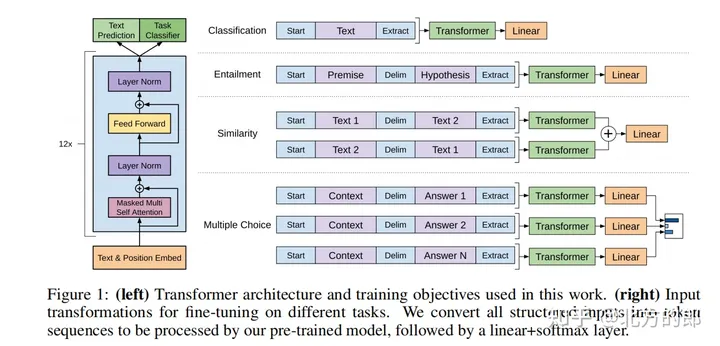

# GPT

## GPT1

基于Transformer decoder

预训练技术：GPT-1使用了一种称为“生成式预训练”（Generative Pre-Training，GPT）的技术。预训练分为两个阶段：预训练和微调（fine-tuning）。在预训练阶段，GPT-1使用了大量的无标注文本数据集，例如维基百科和网页文本等。通过最大化预训练数据集上的log-likelihood来训练模型参数。在微调阶段，GPT-1将预训练模型的参数用于特定的自然语言处理任务，如文本分类和问答系统等。

GPT-1使用了BooksCorpus数据集[7]，这个数据集包含 7,000 本没有发布的书籍。作者选这个数据集的原因有二：1. 数据集拥有更长的上下文依赖关系，使得模型能学得更长期的依赖关系；2. 这些书籍因为没有发布，所以很难在下游数据集上见到，更能验证模型的泛化能力。

多层模型：GPT-1模型由12个堆叠的Transformer编码器组成，每个编码器包含多个注意力头和前向神经网络。这使得模型可以从多个抽象层次对文本进行建模，从而更好地捕捉文本的语义信息。这里的 Transformer 模块是经过变体后的结构，只包含 Decoder 中的Mask Multi-Head Attention 以及后面的 Feed Forward

无监督训练$ \rightarrow$有监督fine-tuning

## GPT2（实现multi-task）

GPT-2主要解决的问题是如何利用大规模未标注的自然语言文本来预训练一个通用的语言模型，从而提高自然语言处理的能力。

构造统一格式的数据集。把要解决的问题当做condition加在LLM输入里，这样语言模型就从 p(output|input)变成了 p(output|task_info, input) 。

> 例如，翻译任务的数据变成了（translate to french,  **english text** ,  *french text* ），QA任务的数据变成了（answer the question, document,  **question** ,  *answer* ）。

模型结构两者是差不多的，GPT2增大了模型规模，提出了117M、345M、762M、1542M四种不同规模的模型。同时，增加了vocabulary size，token数目增加到了50257。

以下是GPT-2的主要技术特点(其实除了规模大一点，和GPT-1变化不大)：

    模预训练：GPT-2使用了一种无监督学习的方法，在大规模文本语料库上进行预训练。在这个阶段，模型从语料库中学习文本序列的统计规律和语义信息。

    非监督多任务学习：GPT-2具有多任务学习的能力，通过训练模型来执行多个不同的自然语言处理任务，从而提高模型的鲁棒性和泛化能力。

    Transformer架构：GPT-2使用Transformer架构作为模型的基础，使得模型可以自适应地处理长距离依赖关系，从而更好地理解文本的语义。

    无需人工标注数据：GPT-2在训练过程中不需要人工标注数据，可以自动从大规模文本语料库中学习自然语言的规律。

零样本学习：GPT-2具有零样本学习的能力，能够在只看到少量样本的情况下学习和执行新任务。

## GPT3
