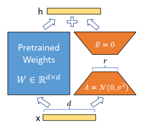
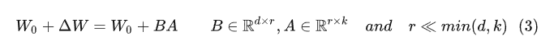
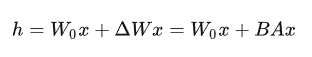
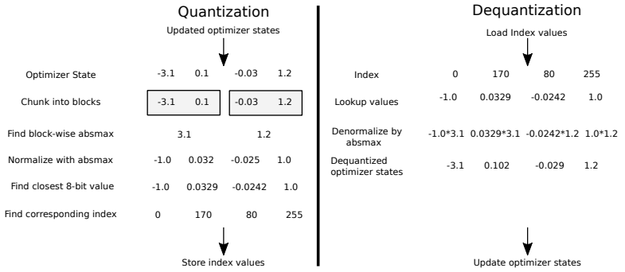
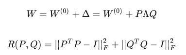

# LoRA

基本原理：**预训练模型拥有极小的内在维度(instrisic dimension)，即存在一个极低维度的参数，微调它和在全参数空间中微调能起到相同的效果** 。

因此，作者认为参数更新过程中也存在一个‘内在秩’。对于预训练权重矩阵W0，我们可以用一个低秩分解来表示参数更新ΔW，即：

训练过程中冻结参数W0，仅训练A和B中的参数。如上图所示，前向传播过程变为：

**在实际操作中，应当将可微调参数分配到多种类型权重矩阵中，而不应该用更大的秩单独微调某种类型的权重矩阵。**

# QLoRA

**分块量化(Block-wise Quantization)**

量化是将输入从存储更多信息的表征映射为存储较少信息的表征的过程。如将FP32的数据转化为INT8，能够节省大量的内存。

全局量化方式存在一个问题，即当输入中存在极大值或者离群值时，一些较小的参数无法被精确的表示，因此量化后的神经网络效果会下降很多。为了缓解这个问题，作者采用了分块量化，即将输入划分为多个block，每个block分别量化。

QLORA训练过程跟LORA基本上是一致的。区别在于QLORA模型是按照NF4保存的，训练时需要把参数反量化到bf16后进行训练。

# AdaLORA

LORA的局限性在于其预先规定了每个增量矩阵Δ的秩r必须相同。这样就忽略了不同层、不同类型参数对下游任务的重要程度。

本文需要解决的问题就变成了如何根据下游任务自动的找出重要的参数模块并为其分配更多的可微调参数，以提高模型的微调效果。

AdaLORA主要包含两个模块：

(i)  **SVD形式参数更新（SVD-based adaptation）** ：直接将增量矩阵Δ参数化为SVD的形式，避免了在训练过程中进行SVD计算带来的资源消耗；

> **奇异值分解（SVD** ）

> 奇异值分解 是将任意较复杂的矩阵用更小、更简单的 3个子矩阵的相乘表示 ，用这3个小矩阵来描述大矩 阵重要的特性。

(ii)  **基于重要程度的参数分配(Importance-aware rank allocation)** : 裁剪一些冗余的奇异值。

AdaLORA增量矩阵Δ显式的替换为PΛQ，这样既省去到了复杂的SVD计算又能显式的裁剪奇异值。同时，为保证P和Q的正交性，还在训练过程中增加了一个正则化，保证$P^TP=Q^TQ=I$:

相比LORA，AdaLORA这种设计方式有两个优点：

* AdaLORA只裁剪奇异值矩阵Λ，并不裁剪奇异向量，因此训练过程中更容易恢复被误删的奇异值。
* AdaLORA的P和Q正交矩阵，而LORA的A和B非正交。AdaLORA训练过程中裁剪操作不会影响其他奇异值对应的奇异向量，因此训练会更稳定泛化性能更好。
