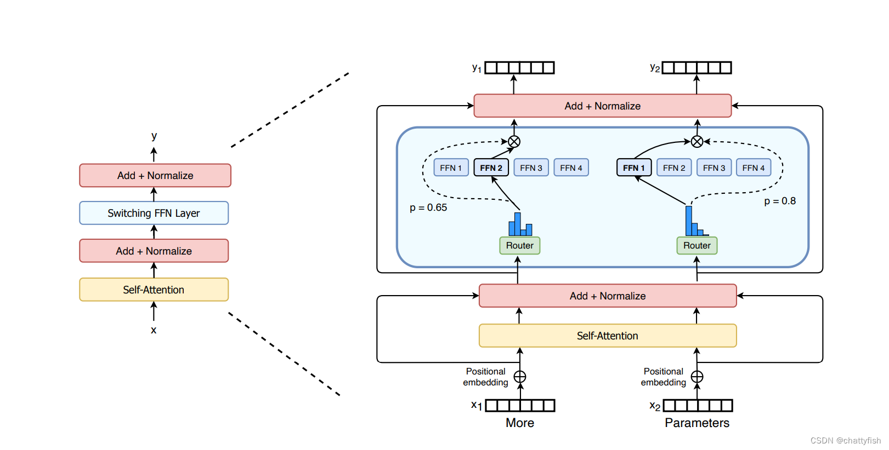

# 概念

混合专家模型，英文叫Mixture of Experts (MoE) 是一种模型设计策略，它通过将多个模型（称为"专家"）直接结合在一起，以获得更好的预测性能。

## ST模型

**ST (Switch Transformer)** : Switch Transformer中，模型的每一层都是一个专家网络的集合，输入数据会被动态地路由到不同的专家进行处理。

Sparse MOE Layers：是用来替换transformer结构中的FFN(Feed Forward Network)层的,MOE层有固定数字的专家，每个专家也是一个单独的Neural Network。 - Gate / Router：决定了token会进入哪个专家塔中。如下图中More这个token更多的进入第二个专家塔，而Parameters更多的进入第一个专家塔。控制进入哪个专家塔的Router作为一个可训练的部分，也会在模型训练中得到学习。

ST在Transformer模型中用一个稀疏的Switch前馈网络（FFN）层（浅蓝色）替换Transformer中存在的密集FFN层。该层独立地对序列中的标记进行操作，然后路由到多个FFN专家中。switch FFN层返回所选FFN的输出，然后乘以路由器阈值，然后进行合并。
