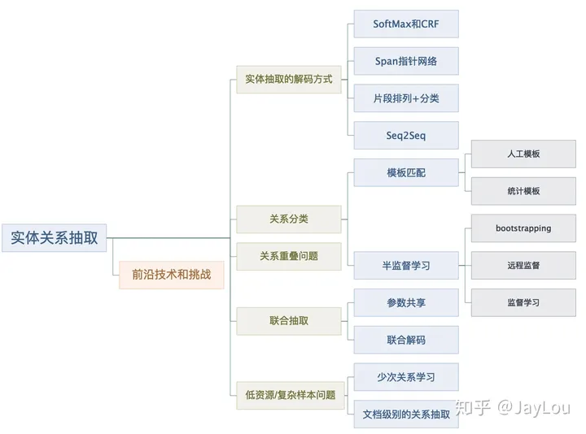
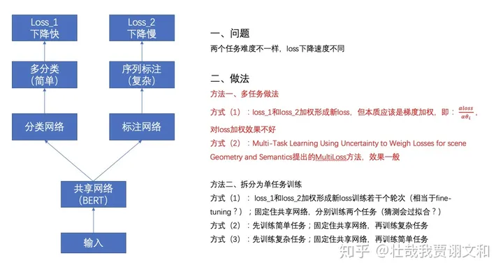
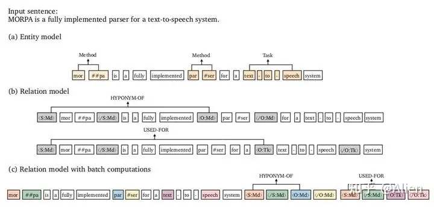
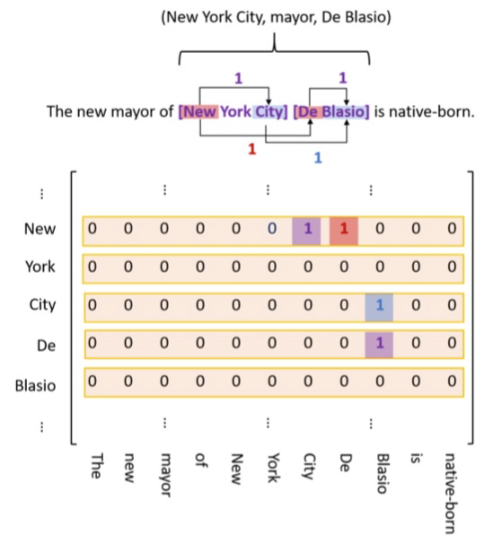

# 实体关系抽取

1. pipelined：先进行实体抽取（NER），在进行关系判断，将实体识别与关系抽取分为2步完成。
2. joint：联合抽取，实体关系通过一个EndtoEnd模型抽取。

**Pipeline方法指先抽取实体、再抽取关系。** 相比于传统的Pipeline方法，联合抽取能获得更好的性能。虽然Pipeline方法易于实现，这两个抽取模型的灵活性高，实体模型和关系模型可以使用独立的数据集，并不需要同时标注实体和关系的数据集。但存在以下缺点：

1. 误差积累：实体抽取的错误会影响下一步关系抽取的性能。
2. 实体冗余：由于先对抽取的实体进行两两配对，然后再进行关系分类，没有关系的候选实体对所带来的冗余信息，会提升错误率、增加计算复杂度。
3. 交互缺失：忽略了这两个任务之间的内在联系和依赖关系。

而joint方法：

* 多任务学习：实体与关系共用同一个模型，但实质上还是pipeline方式，并没有解决误差积累
* 建模复杂

## Pipeline方法

序列标注见《实体命名识别.md》

做完序列标注之后，对抽选的实体使用分类网络判定关系。

### PURE 2021SOTA

论文认为**NER和RE不应该都用同一个网络**，NER阶段和RE阶段，span（短语片段）的表示特征应该不一样，底层共享一个表示层会限制模型的表达能力。

#### 模型原理

论文的思路很简单，将关系抽取分为两个阶段，第一阶段是实体识别，第二阶段是利用实体的边界信息进行关系分类，即在实体的边界添加两个特殊字符，且每类实体都有代表该类别的特殊字符。分类时取主体的边界的embedding和客体的边界的embedding进行拼接，然后再接入分类层，如下图所示。

* **RE层** ：第一阶段识别出的实体，用边界和类型特殊字符标识出来，作为第二阶段的输入 ，第二阶段用一个 BERT2 来预测两个实体之间的关系。如第一阶段识别出的实体MORPA是一种method的subject，就把 \<S:Md> 和 /\<S:Md\>插入到实体边界，再去做RC，具体是对每个实体pair中第一个token的编码进行concatenate拼接处理，concatenate其实就是说所有输出这种向量去做拼接，后面接全连接层Fully connected layer ，最后接softmax。
* **批计算** ：如果直接插入pair两边，对每个实体pair都要轮流进行关系分类，同一文本要进行多次编码，计算量会特别大。所以提出了一种加速的近似模型：可将实体边界和类型的**标识符放入到文本之后，然后与原文对应实体共享位置向量。**上图中相同的颜色代表共享相同的位置向量。具体地，在attention层中，文本token只去attend文本token、不去attend标识符token，而标识符token可以attend原文token。

虽然上图后面接了一共8个标识符，但实际中每次只对4个标识符（两个实体）间的关系作推断。

## Joint方法

已经提到过的，例如UIE

### TPLinker

#### 建模

TPLinker其实就是通过链接(linking)3种类型的Span矩阵来实现的，为方便起见，论文作者将3种标注方式画到一个图里了，如上图所示（记关系类别总数为R个）：

1. **紫色标注** ：EH to EH，表示实体的头尾关系，是1个N*N矩阵；如两个实体：New York City:M(New, City) =1; De Blasio:M(De, Blasio) =1。
2. **红色标注** ：SH to OH，表示subject和object的头部token间的关系，是R个N*N矩阵；如三元组(New York City, mayor,De Blasio):M(New, De)=1。
3. **蓝色标注** ：ST to OT，表示subject和object的尾部token间的关系，是R个N*N矩阵；如三元组(New York City, mayor,De Blasio):M(City, Blasio)=1。

因此，可以得到TPLinker共有2R+1个矩阵。

#### 解码

TPLinker的解码过程为：

1. 解码（头到头）EH-to-ET可以得到句子中所有的实体，用实体头token idx作为key，实体作为value，存入字典D中；
2. 对每种关系r，解码（主客尾）ST-to-OT得到token对存入集合E中，解码（主客头）SH-to-OH得到token对并在D中关联其token idx的实体value；
3. 对上一步中得到的SH-to-OH token对的所有实体value对，在集合E中依次查询是否其尾token对在E中，进而可以得到三元组信息。
