### 实体分类

3大类：实体类、时间类、数字类

7小类：人名、地名、组织机构；时间、日期、货币量、百分数（正则匹配解决）

### 基本思想

（中文分词）——词实体标注——单个实体识别——复合实体识别

### 标注方法

IOB：I内部，O外部，B开始，B/I-XXX

BIOES：B开始，I内部，E结束，O外部，S单独形成实体

IOB-1：IOB与BIO字母对应的含义相同，其不同点是IOB中，标签B**仅用于**两个连续的同类型命名实体的边界区分，不用于命名实体的起始位置。

### 方法

#### 基于规则

依赖词典、模板、正则表达式

比如，XX喜欢吃东西。XX一定是人名。

#### 基于统计

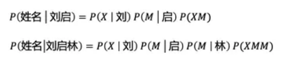

选择概率最大的：CRF条件随机场

常用方法统计：

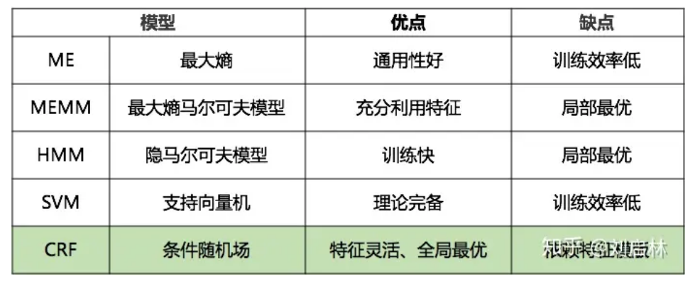

##### 马尔科夫

###### 马尔科夫性

xt只依赖于xt-1，不依赖于t-2既之前的过去。具有这样性质的随机序列被称为马尔科夫链。

###### 隐马尔可夫模型

假设：1。观测独立性，观测概率只受当前状态影响；2。马尔科夫性假设

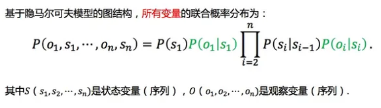

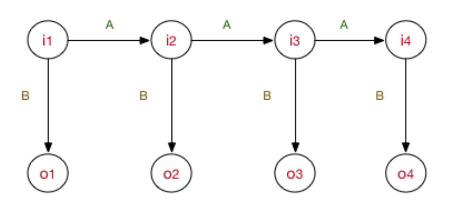

五要素：1.隐状态节点集；2.观测集；3.状态转移矩阵；4.观测概率矩阵；5.π，第一个状态节点时隐状态节点集中的某一个的概率分布。

首先，隐状态节点 it 是不能直接观测到的数据节点，ot 才是能观测到的节点，并且注意箭头的指向表示了依赖生成条件关系， it 在A的指导下生成下一个隐状态节点 it+1 ，并且it 在 B 的指导下生成依赖于该 it的观测节点ot , 并且我只能观测到序列 （o1,⋯,ot) 。

根据概率图分类，可以看到HMM属于有向图，并且是生成式模型。并且不难看出HMM是1-gram依赖，超过1-gram的依赖无法被考虑，限制了HMM的性能。

**训练过程：（常用）极大似然估计+隐状态序列：** 算A，算B，估计π

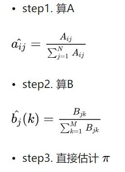

**训练过程2：前向后向：**不存在隐状态，实际上是EM过程，迭代收敛往复。由于不存在隐状态序列，因此需要给出ABπ的初值。

**序列标注过程：**对已知sample建模HMM模型，后续新sample都可以直接使用，就是在给定的观测序列下找出一条隐状态序列，条件是这个隐状态序列的概率是最大的那个。

**序列概率过程：**已知Sa和Sb的HMM模型，对Sc判断属于Sa还是Sb，只要分别过一遍HMM模型，选出概率最大的那个。

###### MEMM

MEMM因为是判别模型，所以与HMM模型有着较大的区别，直接为了确定边界而去建模，比如说序列求概率（分类）问题，直接考虑找出函数分类边界。

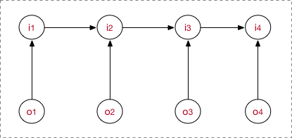

MEMM当前隐藏状态 it 应该是依赖当前时刻的观测节点ot 和上一时刻的隐藏节点it−1

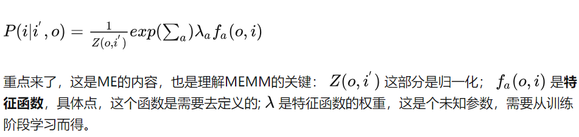

###### 层叠隐马尔可夫

这个模型的主要优点有两个：

（1）能够对自然语言处理领域的不同抽象层次和长度范围进行更好地建模；

（2）能够通过层次化结构对观测序列中距离较长时段的观察变量进行关联关系推断。

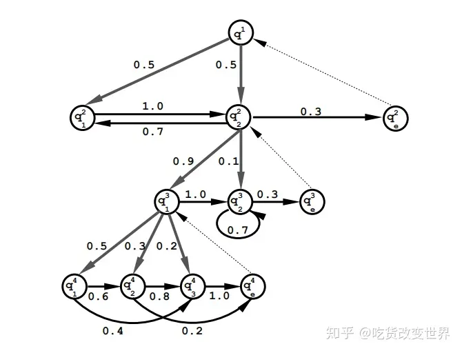

上图是截取了HHMM的一部分。实际上，HHMM必须是一个满多叉树，即每个叶子节点到树根的距离是一样的。解决了HMM模型的1-gram限制。即可以理解为，叶子结点是一个字母级别的HMM，上一层则是2个字母级别的HMM，等等。

父节点的子节点之间才能跳转，不能跨越父节点进行同层次的跳转。因此，每个父节点下的子节点的最后一个会被标记为end；

###### Viterbi(维特比)算法

维特比算法是一种动态规划算法用于最可能产生观测时间序列的-维特比路径-隐含状态序列，特别是在马尔可夫信息源上下文和隐马尔科夫模型中。换句话说，在以概率为cost的路径问题中，运用动态规划选择cost最大的路径。

#### 基于深度学习

基本思想：全部表示（重点表示）+选择概率最大的实体。

1. HMM
2. Bi-LSTM + CRF
3. BERT+CRF
4. BERT+GlobalPointer
5. NEZHA+CRF
6. NEZHA+GlobalPointer

##### GlobalPointer

具体来说，假设要识别文本序列长度为**n**，简单起见先假定只有一种实体要识别，并且假定每个待识别实体是该序列的一个连续片段，长度不限，并且可以相互嵌套（两个实体之间有交集），那么该序列有多少个“候选实体”呢？不难得出，答案是**n**(**n**+**1**)**/**2个，即长度为**n**的序列有**n**(**n**+**1**)**/**2个不同的连续子序列，这些子序列包含了所有可能的实体，而我们要做的就是从这**n**(**n**+**1**)**/**2“候选实体”里边挑出真正的实体，其实就是一个“**n**(**n**+**1**)**/**2选**k**”的多标签分类问题。如果有**m**种实体类型需要识别，那么就做成**m**个“**n**(**n**+**1**)**/**2选**k**”的多标签分类问题。这就是GlobalPointer的基本思想

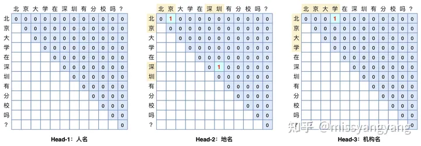

设长度为**n**的输入**t**经过编码后得到向量序列 **[**h**1**,**h**2,**⋯**,**h**n]，通过变换$q_{i,\alpha}=W_{q,\alpha}h_i+b_{q,\alpha}$**和$q_{i,\alpha}=W_{q,\alpha}h_i+b_{q,\alpha}$**我们可以得到序列向量序列**[**q**1**,**α**,**q**2,**α**,**⋯**,**q**n,**α**]和**[**k**1,**α**,**k**2,**α**,**⋯**,**k**n,**α**],它们是识别第**α**种类型实体所用的向量序列。此时我们可以定义
**$S_{\alpha}(i,j)=q^T_{i,\alpha}k_{j,\alpha}$**

作为从**i**到**j**的连续片段是一个类型为**α**的实体的打分。也就是说，用**q**i,**α与**k**j**,**α的内积，作为片段**t[**i**:**j**]是类型为**α**的实体的打分（logits），这里的**t**[**i**:**j**]指的是序列**t**的第**i**个到第**j**个元素组成的连续子串。在这样的设计下，GlobalPointer事实上就是Multi-Head Attention的一个简化版而已，有多少种实体就对应多少个head，相比Multi-Head Attention去掉了**V**相关的运算。

实际上训练语料比较有限的情况下，它的表现往往欠佳，因为它没有显式地包含相对位置信息。所以加入旋转位置编码。

$$
S_{\alpha}(i,j)=q^T_{i,\alpha}\mathcal{R}_{i-j}k_{j,\alpha}
$$

损失函数：softmax+交叉熵

单标签多分类：

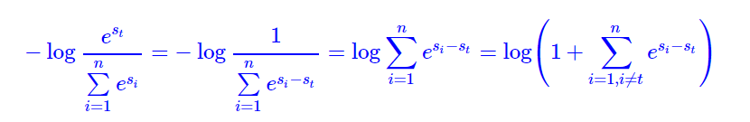log(sum(exp))近似于max函数。这个loss的特点是，所有的非目标类得分{**s**1,**⋯**,**s**t−**1**,**s**t+**1**,**⋯**,**s**n}**跟目标类得分**{**s**t}两两作差比较，它们的差的最大值都要尽可能小于零，所以实现了“目标类得分都大于每个非目标类的得分”的效果。合理将目标st推广至一个多标签集合，就有多标签多分类：

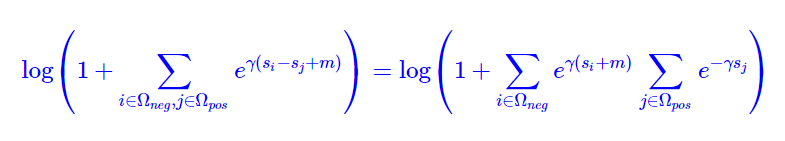

其中缩放因子**γ**和间隔**m。一般不考虑。**

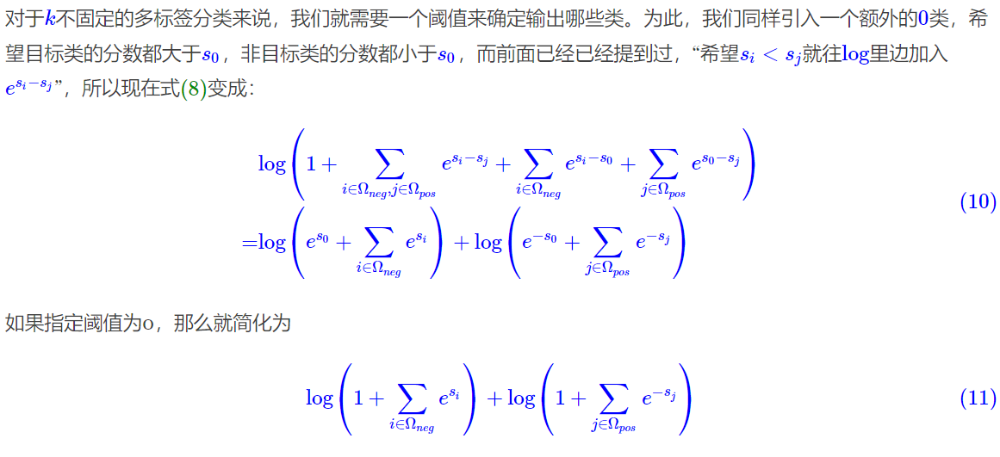

##### NEZHA

NEZHA是华为在预训练模型上的实践总结，它在BERT的基础上加了很多当下有用的优化，比如Functional Relative Positional Encoding、Whole Word Masking策略、混合精度训练和Lamb优化器。

###### Functional Relative Positional Encoding

Transformer和BERT都使用到了位置编码，一个是函数式位置编码，即使用正余弦函数来对位置进行编码；另一个是参数式位置编码，即把位置嵌入理解成模型参数的一部分，通过预训练来学习。它们都是绝对位置编码。后来《Self-attention with relative position representations》提出一个参数式的相对位置编码，将相对位置信息加到了Transformer的自注意力层；Transformer-XL和XLNet提出了函数式相对位置编码。所以本文主要的内容就是采用函数式相对位置编码。

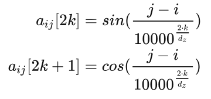

###### Whole Word Masking

BERT-WWM的意思就是在对汉字进行掩码时，会直接对整个词语进行遮掩，所以需要使用分词工具。NEZHA使用jieba作为中文分词工具。

**Mixed Precision Training**

混合精度可以提高训练效率2-3倍，同时也减少了模型的占用空间，这样便可以使用较大的batch size

##### ID-CNN

计算速度快但效果不如Bi-LSTM

相较于传统的CNN，IDCNN能够捕捉更长的上下文信息，同时，相比于LSTM，IDCNN能够实现并行计算。

正常CNN的filter，都是作用在输入矩阵一片连续的位置上，不断sliding做卷积，接着通过pooling来整合多尺度的上下文信息，这种方式会损失分辨率。既然网络中加入pooling层会损失信息，降低精度。那么不加pooling层会使感受野变小，学不到全局的特征。如果我们单纯的去掉pooling层、扩大卷积核的话，这样纯粹的扩大卷积核势必导致计算量的增大，此时最好的办法就是Dilated Convolutions（扩张卷积或叫空洞卷积）。

###### Dilated Convolutions

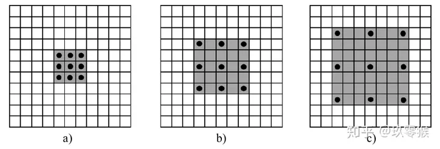

* a是普通的卷积过程(dilation rate = 1),卷积后的感受野为3
* b是dilation rate = 2的空洞卷积,卷积后的感受野为5
* c是dilation rate = 3的空洞卷积,卷积后的感受野为8

另外,**空洞卷积可以增大感受野,但是可以不改变图像输出特征图的尺寸(分辨率,resolution)**

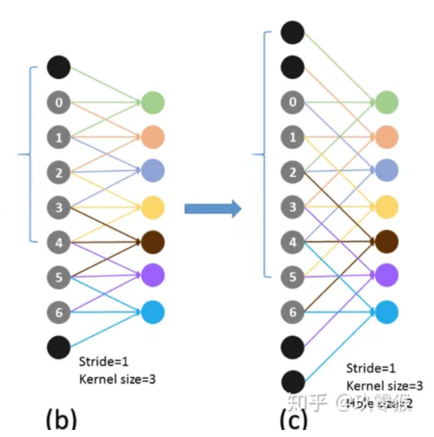

###### ID-CNN结构

在IDCNN中，通过重复使用自膨胀卷积的模块，来达到共享参数的目的以防止过拟合。对于IDCNN的输出也可以使用维特比算法来进行序列标签的预测。

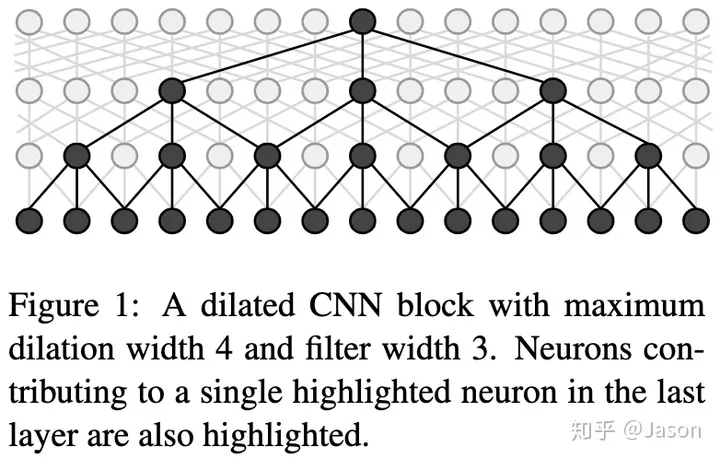

```
nn.Conv1d(in_channels=embedding_dim, out_channels=filters, kernel_size=kernel_size, padding=kernel_size // 2, dilation=(1,))
```

torch直接增加dilation选项就行。

###### 蒸馏方法

使用知识蒸馏，student模型用IDCNN模型（参数量约250万 膨胀间隙 1 1 2 4），teacher模型使用Bert类模型，直接用BERT模型在大量无标注数据上进行标注，将其one-hot标签作为训练数据喂给student模型。最终IDCNN模型的CPU推理速度是Bert 12层的50倍，Bert 6层的30倍，且真实场景效果相差1个点以内。

##### Lattice-LSTM

着重于中文NER任务，中文NER和分词相关。直观来看，中文NER可以先进行分词， 然后应用词序列标注。但是不正确的分词可能导致NER错误。但是基于字符的方法的缺点在于，没有充分利用句子中显式的词和词序信息，这些信息可能对识别效果有潜在的提升作用。

Lattice LSTM模型，能够通过门控单元，将不同的词信息传递到每个字符，这种结构能够从上下文中自动发现更加有用的词，提升NER的效果。比起基于字符和基于词的方法，这种结构能够有效的利用词信息，而且也不会出现分词错误。

###### 结构

Lattice LSTM可以看做是基于字符的NER模型的扩展，其添加了词作为输入(比如下图输入中包括“南京市”)和额外的门(下图的绿色线连接的门控单元)来控制信息流动。

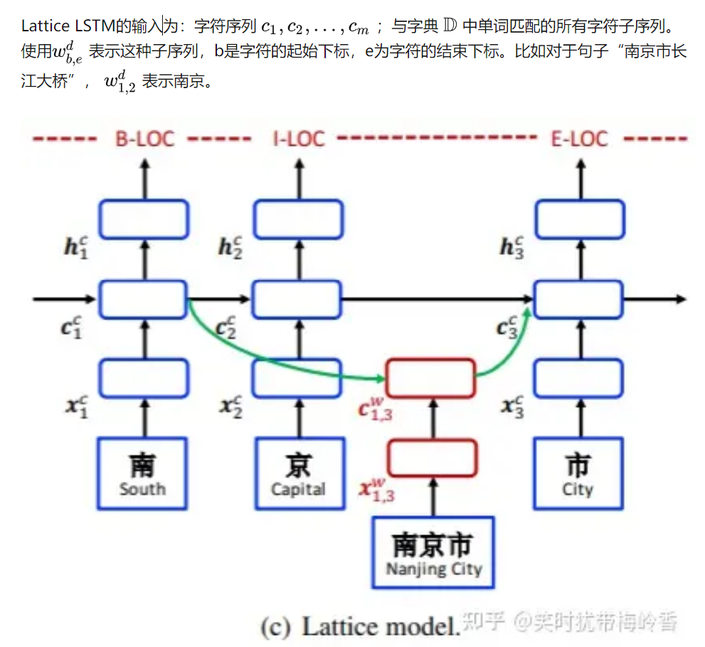

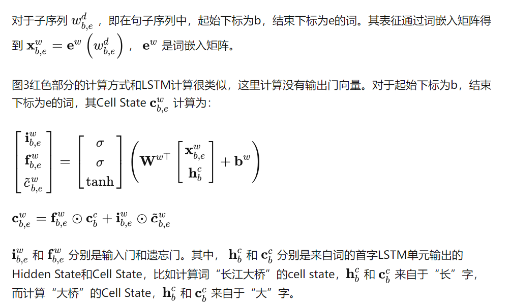

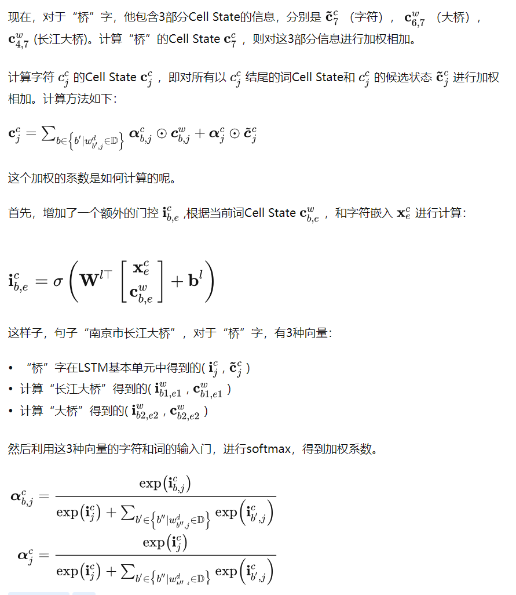

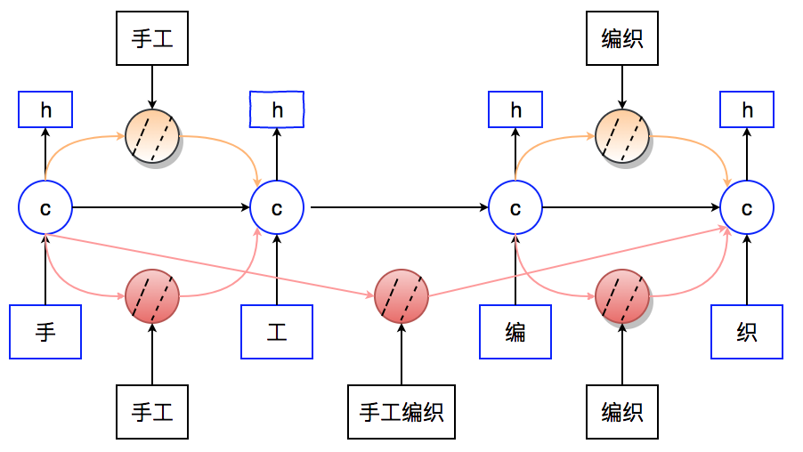

###### 缺点：

**计算性能低下，不能batch并行化** 。究其原因主要是每个字符之间的增加word cell（看作节点）数目不一致；

**可迁移性差** ：只适配于LSTM，不具备向其他网络迁移的特性

## 小样本NER

### EntLM

EntLM该方法核心思想：抛弃模板，把NER作为语言模型任务，实体的位置预测为label word,非实体位置预测为原来的词，该方法速度较快。


label word是一系列选择的代表实体类型的代表词，这样子一次前向过程就能预测所有实体。但是如何选择这样的代表词成为了新的问题。

一种方案：

1）采用领域数据构造实体词典；

2）基于实体词典和已有的实体识别模型对中文数据(100 000)进行远程监督，构造伪标签数据；

3）采用预训练的语言模型对计算LM的输出，取实体部分概率较高的top3个词；

4）根据伪标签数据和LM的输出结果，计算词频；

由于可能出现在很多类中都出现的高频标签词，因此需要去除冲突；

5）使用均值向量作为类别的原型，选择top6高频词的进行求平均得到均值向量；

### LightNER

带有pointer network(指针网络)的seq2seq体系结构+可学习的prompt网络指导注意力。

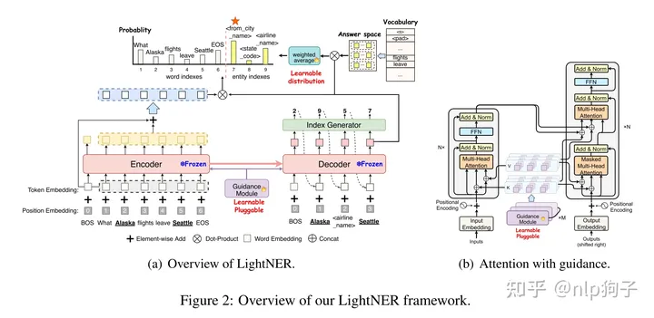

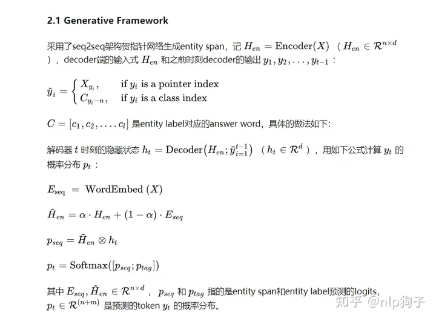

# UIE-通用信息抽取

IE结构生成可分解为两个原子操作：

1. **定位：** 指示从句子中定位目标信息块，例如事件中的实体和触发词。
2. **关联：** 表示根据所需的关联（例如，实体对之间的关系或事件及其参数之间的角色）连接不同的信息块。

### 结构化抽取语言（SEL）

具体来说，论文设计了一种统一的结构化抽取语言（SEL），它通过**定位-关联结构**对不同的IE结构进行编码。如图2a所示，每个SEL表达式包含三种类型的语义单元：1）**SPOTNAME**表示存在一个特定的信息块，该信息块的SPOTNAME类型存在于源文本中；2） **ASSONAME**表示源文本中存在特定的信息块，该信息块与ASSONAME关联到其结构中的上层定位信息；3） **INFOSPAN**表示与源文本中特定的定位或关联信息块相对应的文本范围。此外，SEL中的“：”表示从InfoSpan到其定位或关联名称的映射，两个结构指示器“（”和“）”用于在提取的信息之间形成层次结构。

使用SEL，图2b显示了如何表示实体、关系和事件结构。有三个实体，每个实体都表示为一个定位结构，如“person：Steve”、“organization：Apple”和“time：1997”；一种关系，表示为“Steve”和“Apple”之间的关联结构，关联名称为work for；还有一个事件被表示为关联结构，其中触发器是一个定位结构“start-position:became”，其参数与触发器相关：史蒂夫作为雇员，苹果作为雇主，1997年作为时间。

我们可以看到，SEL的优点是：1）统一编码不同的IE结构，因此不同的IE任务可以建模为相同的文本到结构生成过程；2） 高效地表示同一结构中句子的所有提取结果，可以自然地进行联合提取；3） 生成的输出结构非常紧凑，大大降低了解码的复杂度。

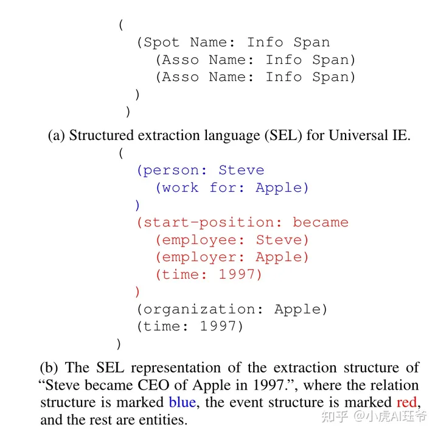

### 结构模式指导器（SSI）

基于SEL，论文提出了 **结构模式指导器（SSI）** ，这是一种基于模式的提示（prompt）机制，用于控制需要发现和关联哪些类型的信息。

为了描述任务的提取目标，结构化模式指导器构建了一个基于模式的提示，并在生成过程中将其用作前缀。具体来说，与spotting-association结构相对应，结构模式指导器包含三种类型的标记段：1）SPOTNAME：特定信息提取任务中的目标spotting名称，如NER任务中的“person”；2）ASSONAME：目标关联名称，如关系提取任务中的“work for”；3） 在每个SPOTNAME、ASSONAME和输入文本序列之前添加的特殊符号（[spot]、[asso]、[text]）。SSI中的所有标记（tokens）都连接在一起，并放在原始文本序列之前。如图3所示，UIE的整个输入形式为

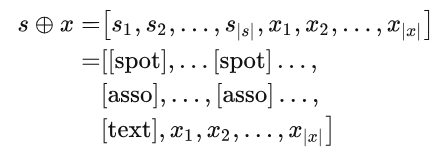

例如，SSI“[spot] person [spot] company [asso] work for [text]”表示从句子中提取关系模式“the person works for the company”的记录。

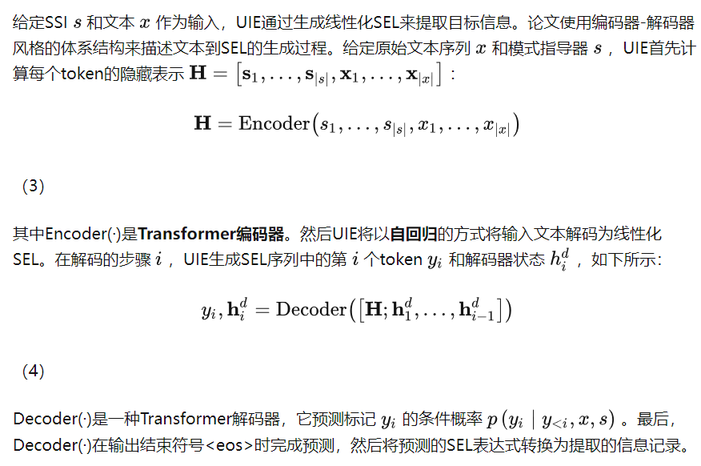

### Dpair正负例对比学习

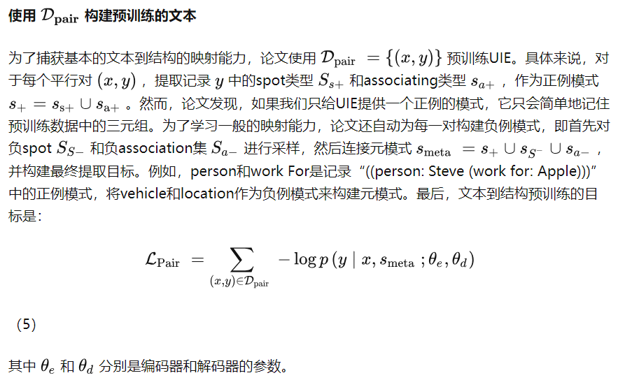

### Drecord结构化训练

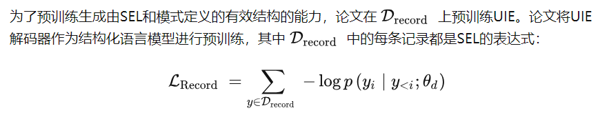

### Dtext语义训练

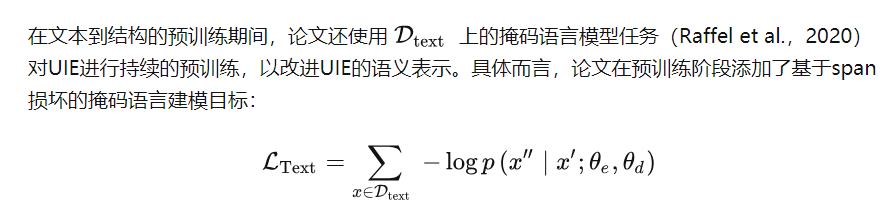

可以缓解 语义的灾难性遗忘。

### 微调

使用**teacher-forcing 交叉熵损失**对UIE模型进行微调

> Teacher Forcing[1]训练方式指的是当我们在训练一个自回归模型时（比如RNN，LSTM，或者Transformer的decoder部分），我们需要将真实的目标序列（比如我们想要翻译的句子）作为自回归模型的输入，以便模型能够收敛的更快更好。虽然TF训练方式简单，但它会导致exposure bias的问题，即在训练阶段模型使用的输入来自于真实数据分布，而在测试阶段模型每一时刻使用的输入来自于模型上一时刻的预测结果，这两个输入分布之间的差异被称作exposure bias。

为了缓解解码过程中**自回归**模型的 **暴露偏差** （Ranzato et al.，2016；Zhang et al.，2020），论文还设计了一种有效微调的 **拒绝机制** 。然后随机将几个具有负SPOTNAME和ASSONAME：（SPOTNAME，[NULL]）和（ASSONAME，[NULL]）的[NULL]单元插入到真实SEL中。

例如，facility是模式提示中的负样例spot，即“Steve became CEO of Apple in 1997”一句中没有facility实体。因此，在模型学习期间将“（facility:[NULL]）的噪声随机注入目标记录。这样，UIE可以通过生成[NULL]token有效地学习拒绝误导性生成。


# W2NER
