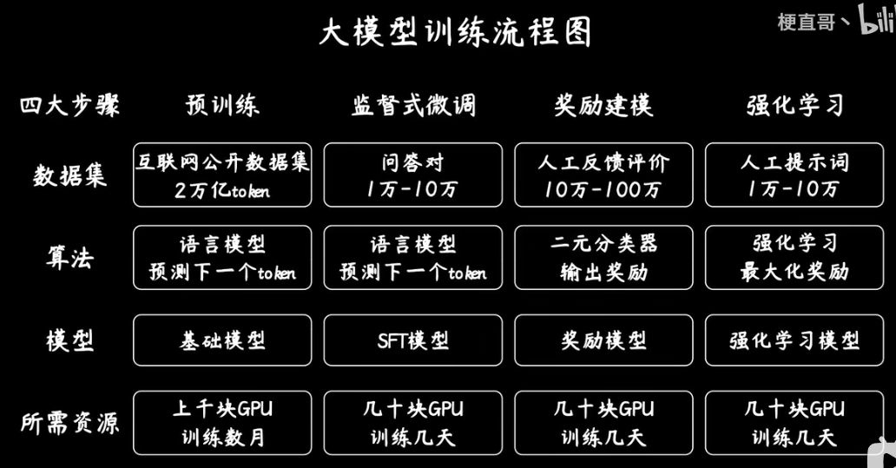
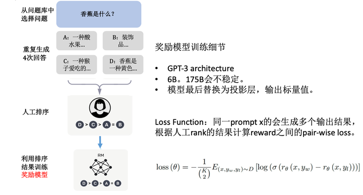
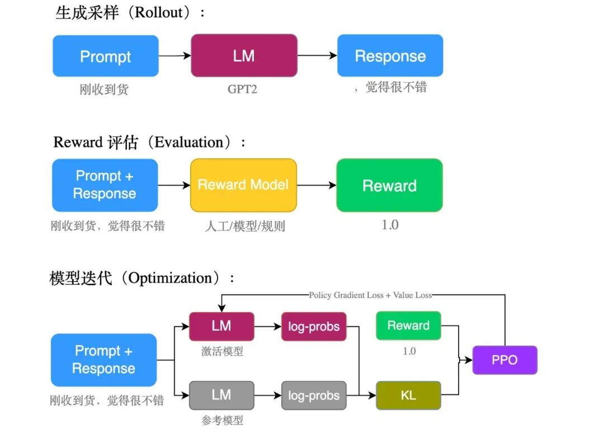
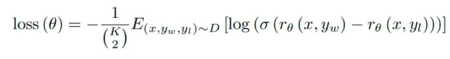

### 1 数据预处理

了解数据集，无论做什么任务，公司一般都会给你提供一些现有的数据，或者公司搞爬虫的同事给你爬数据，但是数据一般很脏需要你自己来清洗。如果是NER任务，可能还需要你来根据需求设计标注规则，要落实到书面上，比如我之前做地图项目，新加坡的数据要用ner技术识别POI里面的where部分，POI有10种以上类型，我就要每种类型都要做个标注规则。否则标注不一致，准确率不稳定。这个环节要算法基本功要打牢，算法这块还有数据结构也是面试必考的，笔试和机试逃不掉的，通过刷力扣就能搞定。建议从现在开始就做题，先做字符串和容器这块，常用。

### 2 分词工具

Jieba ,Hanlp, NLTK,corenlp 这些工具必掌握的，Tf-IDF 必须会的。

* jieba：jieba是优秀的中文分词第三方库，可以对中文文本进行分割。ieba分词的三种模式精确模式（全分割，无冗余）、全模式（所有可能组合，有冗余）、搜索引擎模式（在精确模式上，对长词再进行分割，即比精确模式多一些复数短词组成的长词）。

### 3 机器学习相关知识

一个NLP模型输出的结果有时候作为机器学习模型的特征输入。而且NLP中很多组件都用到了机器学习的基础。需要掌握的理论有：
1、梯度下降原理，面试会让你手推，而且NLP模型训练就是利用梯度下降原理，必须会的。
2、优化器，损失函数，学习率，这些NLP训练模型用的组件必须知道什么意思。其中损失函数要知道交叉熵损失函数做分类任务，mse做回归任务。
3、softmax原理，NLP在全连接层最后会接softmax生成概率。
4、机器学习模型，一般都使用集成模型GBDT需要知道原理，面试还会问你XGBOOST和GBDT啥区别？朴素贝叶斯，SVM，KNN，逻辑回归，线性回归的原理，能说出原理就行 ，代码层面知道怎么使用，自己查一下，这里不多说。

### 4 TensorFlow和pytorch框架

### 5 训练词向量和词嵌入

当你数据处理完，都是汉字和英文，计算机不认识这些，需要把汉字或者英文转化成计算机认识的语言，这里不做细节解释，否则篇幅太长，需要掌握的是，word2vec 和embedding技术。tensorflow框架会用到embedding_lookup查找。pytorch框架直接用embedding查找。要会使用bert 把文本转化成向量，必须会。要会使用GPU训练，GPU型号搜一下。有时候面试官会问冷门问题，GPU型号？训练的模型尺寸？bert建议你最后学，对初学者有点难。其他训练词向量方法也很多先掌握这几个常用的够了。

### 6 nlp模型

crf 条件随机场 和 hmm要掌握 ，尤其CRF 做NER命名实体识别任务会用到BILSTM+CRF或者IDCNN+CRF。
全连接线性层必须知道原理，面试可能会问谈谈对全连接层的理解？
dnn网络必须会的，前向传播和反向传播知道怎么回事。
cnn现在有很多NLP任务也会用卷积网络，idcnn膨胀卷积要知道，ner任务中如果你的领导非让你用idcnn做，你要知道模型什么原理。
rnn,lstm,gru 要搞明白rnn可以处理短文本，lstm,gru可以处理长文本。
seq2seq 模型做机器翻译和机器人。
transformer框架要掌握，其中bert 不仅原理知道还要会使用，面试会问你说下你对self-attention的理解？这里考点很多。
残差网络，dropout,要知道原理。
以上都掌握了可以看下BERT变种模型，迁移学习，这里不做介绍 ，掌握这些面试足够了。进了公司再学其他的都来得及。学习的时候对数据送入模型的维度的转换是重点学习的地方。包括看项目调试要看维度。维度，维度，维度！很重要。

### 7预训练



#### 奖励建模

奖励建模的大致含义如下：



大致流程：



##### 生成采样：

生成采样的目的是保持句子的多样性，可以使用包括prompt池或者同一个prompt生成多次等方法。

##### 评估：

利用其他模型或者人工方法为生成内容按需求打分。

由于分数太过于主观性，因此可以采用另一种更好的方法：对结果进行排序而不是直接打分（GPT）

即：奖励模型（也是需要训练的）输出分数（标量），（可选）人工排序，计算损失函数：



其中后面log的部分的作用是最大化好的输出与坏的输出之间的差距，yw与yl指的是在排序中的结果，其中yw比yl大（好）的。总的损失函数就是所有大-小句子对的loss和。

注意：排序的目的主要是为了抹除掉打分的主观性，同时与loss函数结合，来最大化优劣差异。

##### 模型迭代(强化学习)：

利用强化学习算法对模型进行训练。其中参考模型指的是微调结束时的原始模型，计算其与参考模型的KL散度的目的是为了让最终的训练结果不要偏离原始模型太多。

###### 强化学习经典算法：PPO

PPO是基于AC架构的，也就是说，PPO也有两个网络，分别是Actor和Critic，这是因为AC架构有一个好处。这个好处就是解决了连续动作空间的问题。

使用trl.ppotrainer

```
//创建
ppo_trainer = PPOTrainer(gpt2_model, gpt2_model_ref, gpt2_tokenizer, **config)
//迭代
stats = ppo_trainer.step(query_tensors, response_tensors, rewards)
```
