# Prompt Learning和delta tuning

## Prompt Learning

### 概念

* 左边是传统的 Model Tuning 的范式：对于不同的任务，都需要将整个预训练语言模型进行精调，每个任务都有自己的一整套参数。
* 右边是Prompt Tuning，对于不同的任务，仅需要插入不同的prompt 参数，每个任务都单独训练Prompt 参数，不训练预训练语言模型，这样子可以大大缩短训练时间，也极大的提升了模型的使用率。

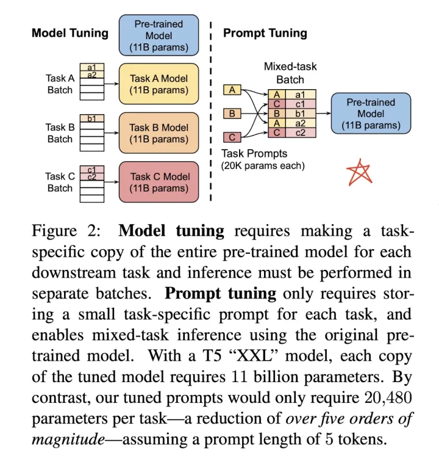

### 原理

Prompt 的工作流包含以下4部分：

1. Prompt 模版（Template）的构造
2. Prompt 答案空间映射（Verbalizer）的构造
3. 文本代入template，并且使用预训练语言模型进行预测
4. 将预测的结果映射回label。

#### Step 1: prompt construction【Template】

模版的作用是将输入和输出进行重新构造，变成一个新的带有mask slots的文本，具体如下：

* 定义一个模版，包含了2处代填入的slots：[x] 和 [z]
* 将[x] 用输入文本代入

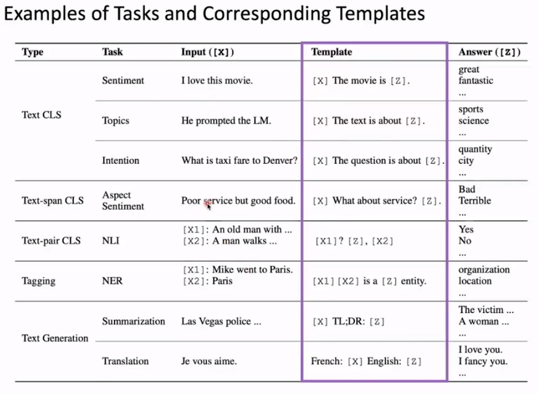

生成Template的方式可以是人工的。

也可以是自动生成的，甚至可以是抽象的，让模型自己去学习抽象的符号所代表的Template意义。通过[mask]（[T]）来初始化Template，最大化标签后验概率，在找到trigger tokens里与预测[mask]的embedding最接近的token组成Template。其结果从语法上来说很可能是没有意义的，但却有着较好的效果。

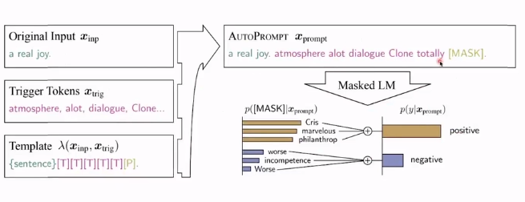

或者额外使用一个模型生成。

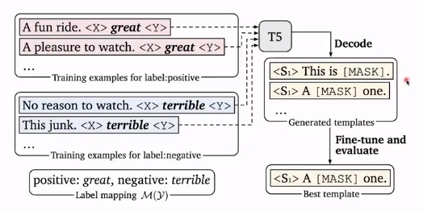

P-tuning&P-tuning v2

Template也可以是结构化的，通过不同的元素来组成目标Template，转化为了键值对。

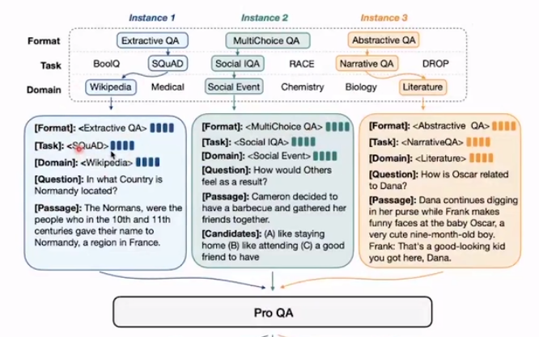

#### Step 2: answer construction【Verbalizer】

对于我们构造的prompt，我们需要知道我们的预测词和我们的label 之间的关系，并且我们也不可能运行z是任意词，这边我们就需要一个映射函数（mapping function）将输出的词与label进行映射。即，（great，good，....，fancy）→positive。

方法：

* 人为构造（困难）
* 对初始词进行同义词的扩展（噪音大）
* 对初始词，由额外知识库辅助扩展
* label拆解成为不同token
* 等等

知识库辅助+消减

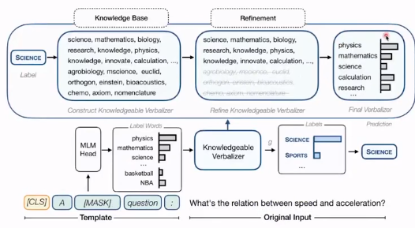

抽象token（聚类方法）

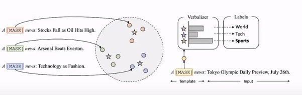

#### Step 3: answer prediction【Prediction】

选择合适的预训练模型进行预测。将结果代入[z]中。

#### Step 4: answer-label mapping【Mapping】

第四步骤，对于得到的 `answer`，我们需要使用 `Verbalizer` 将其映射回原本的label。

## Delta tuning

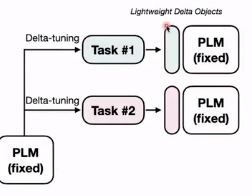

### 三种范式

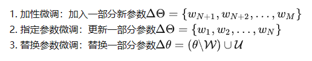

#### 加性微调

Adapter-tuning

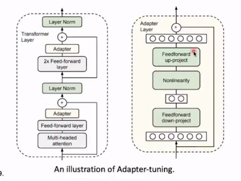

增加新的adapterlayer，冻结Transformer中其他参数，只训练adapterlayer。

改进版（放在了模型外面）：

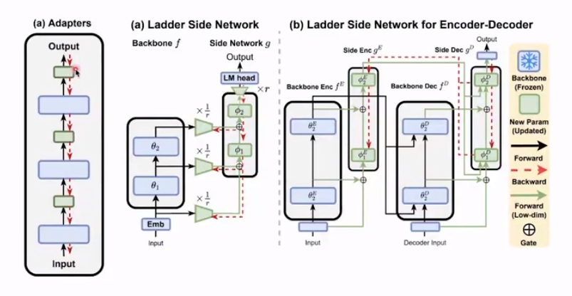

好处：简化了反向传播计算；降维后减少了空间消耗。

P-tuning也属于加性微调

#### 指定微调

Bitfit：比如，只微调bias。

#### 替代微调（重参数化）

寻找多任务的低维（低秩）子空间公共解

LoRA：低秩分解降低运算量。

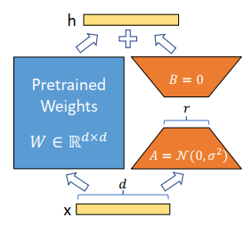

上述的方式又可以被包含在更加通用的范式中：

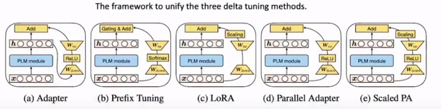
