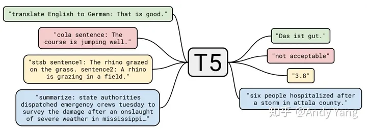

# T5

**Transfer Text-to-Text Transformer**

**Transformer 的 Encoder-Decoder 模型**

**将所有 NLP 任务都转化成 Text-to-Text （文本到文本）任务** 。

\<Task:info\>的形式。将 NLP 任务都转换成 Text-to-Text 形式，也就可以 **用同样的模型，同样的损失函数，同样的训练过程，同样的解码过程来完成所有 NLP 任务** 。

**Data：C4。作者从 Common Crawl（一个公开的网页存档数据集，每个月大概抓取 20TB 文本数据） 里清出了 750 GB 的训练数据**

总体架构：

* Transformer Encoder-Decoder 模型；
* BERT-style 式的破坏方法；
* Replace Span 的破坏策略；
* 15 %的破坏比；
* 3 的破坏时小段长度。

## 架构探索

首先作者们先对预训练模型中的多种模型架构（Transformer）进行了比对，最主要的模型架构可以分成下面三种。

第一种， **Encoder-Decoder 型** ，即 Seq2Seq 常用模型，分成 Encoder 和 Decoder 两部分，对于 Encoder 部分，输入可以看到全体，之后结果输给 Decoder，而 Decoder 因为输出方式只能看到之前的。此架构代表是 MASS（今年WMT的胜者），而 BERT 可以看作是其中 Encoder 部分。

第二种， 相当于上面的  **Decoder 部分** ，当前时间步只能看到之前时间步信息。典型代表是 GPT2 还有最近 CTRL 这样的。

第三种， **Prefix LM（Language Model） 型** ，可看作是上面 Encoder 和 Decoder 的融合体，一部分如 Encoder 一样能看到全体信息，一部分如 Decoder 一样只能看到过去信息。最近开源的 UniLM 便是此结构。

**Text-to-Text 架构中，Encoder-Decoder 模型效果最好**

## **对预训练的探索：**

第一个方面， **高层次方法（自监督的预训练方法）对比** ，总共三种方式。

1. **语言模型式** ，就是 GPT-2 那种方式，从左到右预测；
2. **BERT-style 式** ，就是像 BERT 一样将一部分给破坏掉，然后还原出来；
3. Deshuffling （顺序还原）式，就是将文本打乱，然后还原出来。

Bert-style 最好，进入下一轮。

第二方面，对文本一部分进行 **破坏时的策略** ，也分三种方法。

1. **Mask 法** ，如现在大多模型的做法，将被破坏 token 换成特殊符如 [M]；
2. **replace span（小段替换）法** ，可以把它当作是把上面 Mask 法中相邻 [M] 都合成了一个特殊符，每一小段替换一个特殊符，提高计算效率；
3. **Drop 法** ，没有替换操作，直接随机丢弃一些字符。

此轮获胜的是 **Replace Span 法**

第三方面，到底该**对文本百分之多少进行破坏**呢，挑了 4 个值，10%，15%，25%，50%，最后发现 BERT 的 **15%** 就很 ok了。

第四方面，因为 Replace Span 需要决定 **对大概多长的小段进行破坏** ，于是对不同长度进行探索，2，3，5，10 这四个值，最后发现 **3** 结果最好。

# flan-t5（小且好）

这里的Flan 指的是（Instruction finetuning ），即"基于指令的微调"。核心贡献是提出一套多任务的微调方案（Flan），来极大提升语言模型的泛化性。

**(1) 任务收集：** 工作的第一步是收集一系列监督的数据，这里一个任务可以被定义成<数据集，任务类型的形式>，比如“基于SQuAD数据集的问题生成任务”。需要注意的是这里有9个任务是需要进行推理的任务，即Chain-of-thought （CoT）任务。

**(2) 形式改写：** 因为需要用单个语言模型来完成超过1800+种不同的任务，所以需要将任务都转换成相同的“输入格式”喂给模型训练，同时这些任务的输出也需要是统一的“输出格式”。根据 “是否需要进行推理 （CoT）” 以及 “是否需要提供示例（Few-shot）” 可将输入输出划分成四种类型。

**(3) 训练过程** ：采用恒定的学习率以及Adafactor优化器进行训练；同时会将多个训练样本“打包”成一个训练样本，这些训练样本直接会通过一个特殊的“结束token”进行分割。训练时候在每个指定的步数会在“保留任务”上进行模型评估，保存最佳的checkpoint。

# BART

t5架构。**BART模型**就是使用**Transformer模型整体结构的预训练语言模型**

BART模型的预训练是 **对原始文本破坏再重建** ，因此损失函数为decoder的输出与原始文本的交叉熵。BART模型共介绍了**5种**破坏原始文本的噪声方法。

**Token Masking**

Token掩码，与BERT模型策略一致，随机抽取token，并用[MASK]标记进行替换。

**Token Deletion**

Token删除，从输入中随机删除token，与掩码不同，该策略为了让模型学习哪些位置缺少输入信息。

**Text Infilling**

文本填充，随机挑选一个文本片段（文本片段的长度符合 *λ * = 3的泊松分布），并且使用一个[MASK]标记进行替换。当片段长度为0时，相当于在原始位置插入一个[MASK]标记。与SpanBERT模型不同的是，SpanBERT模型是使用片段长度个数的[MASK]标记进行替换。

**Sentence Permutation**

句子排序，将文本按照句号进行分割，生成句子序列，然后将句子之间的顺序随机打乱。

**Document Rotation**

文档旋转，随机选择一个token，然后将文本进行旋转，即以选择token作为文本的开头。该策略让模型学习文本的开头。
