# Attention

## 概述

在深度学习时往往需要接受大量数据，然而在特定应用上只有少部分数据是重要的。Attention就是从大量信息中有筛选出少量重要信息，并聚焦到这些重要信息上，忽略大多不重要的信息。Attention通过权重来衡量两个数据对之间的相关程度，也即一部分另外一部分的重要程度，权重越大则模型就更多的聚焦在其对应信息上。

在nlp中Attention最主要的作用应该还是语义对齐方面，也就是挖掘数据之中数据点之间的关系。

**Attention机制的实质其实就是一个寻址（addressing）的过程** ，如上图所示：给定一个和任务相关的查询**Query**向量 ** q** ，通过计算与**Key**的注意力分布并附加在**Value**上，从而计算 **Attention Value** ，这个过程实际上是 **Attention机制缓解神经网络模型复杂度的体现** ：不需要将所有的N个输入信息都输入到神经网络进行计算，只需要从X中选择一些和任务相关的信息输入给神经网络。

## 一般过程（以lstm为例子

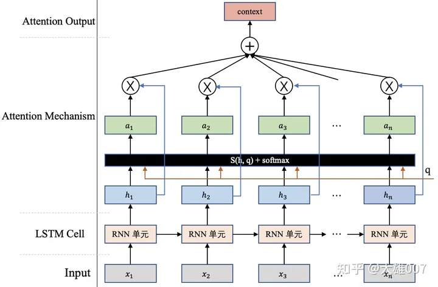

第一个阶段根据Query和Key计算两者的相似性或者相关性；第二个阶段对第一阶段的原始分值进行归一化处理；第三个阶段根据权重系数对Value进行加权求和。

## 注意力计算方式

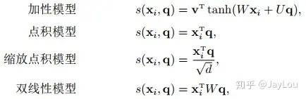

点积模型具有更好地计算效率，但通常有比较大的方差，从而导致Softmax的梯度较小。因此缩放点积模型通过除以一个平方根项来平滑分数值以缓解这个问题。

## 变种

* **变种1-硬性注意力：** 之前提到的注意力是软性注意力，其选择的信息是所有输入信息在注意力 分布下的期望。还有一种注意力是只关注到某一个位置上的信息，叫做硬性注意力（hard attention）。硬性注意力有两种实现方式：（1）一种是选取最高概率的输入信息；（2）另一种硬性注意力可以通过在注意力分布式上随机采样的方式实现。硬性注意力模型的缺点：

> 硬性注意力的一个缺点是基于最大采样或随机采样的方式来选择信息。因此最终的损失函数与注意力分布之间的函数关系不可导，因此无法使用在反向传播算法进行训练。为了使用反向传播算法，一般使用软性注意力来代替硬性注意力。硬性注意力需要通过强化学习来进行训练。

# Transformer

## Transformer

整体结构：

### 1. 工作流程

* 第一步：获取输入句子的每一个单词的表示向量 X，X由单词的 Embedding（Embedding就是从原始数据提取出来的Feature） 和单词位置的 Embedding 相加得到。
* 第二步：将得到的单词表示向量矩阵 (如上图所示，每一行是一个单词的表示 x) 传入 Encoder 中，经过 6 个 Encoder block 后可以得到句子所有单词的编码信息矩阵 C，如下图。单词向量矩阵用 $X_{n×d}$ 表示， n 是句子中单词个数，d 是表示向量的维度 (论文中 d=512)。每一个 Encoder block 输出的矩阵维度与输入完全一致。
* 第三步：将 Encoder 输出的编码信息矩阵 C传递到 Decoder 中，Decoder 依次会根据当前翻译过的单词 1~ i 翻译下一个单词 i+1，如下图所示。在使用的过程中，翻译到单词 i+1 的时候需要通过 Mask (掩盖) 操作遮盖住 i+1 之后的单词。

### 2. 关于单词embedding

Transformer 中除了单词的 Embedding(BPE)，还需要使用位置 Embedding 表示单词出现在句子中的位置。**因为 Transformer 不采用 RNN 的结构，而是使用全局信息，不能利用单词的顺序信息，而这部分信息对于 NLP 来说非常重要。** 所以 Transformer 中使用位置 Embedding 保存单词在序列中的相对或绝对位置。

位置 Embedding 用 PE表示，PE 的维度与单词 Embedding 是一样的。PE 可以通过训练得到，也可以使用某种公式计算得到。在 Transformer 中采用了后者，计算公式如下：

$PE_{(pos,2i)=sin(\frac{pos}{10000^{ 2 i/d}})}$$

$PE_{(pos,2i+1)=cos(\frac{pos}{10000^{ 2 i/d}})}$$其中，pos 表示单词在句子中的位置，d 表示 PE的维度 (与词 Embedding 一样)，2i 表示偶数的维度，2i+1 表示奇数维度 (即 2i≤d, 2i+1≤d)。使用这种公式计算 PE 有以下的好处：

* 使 PE 能够适应比训练集里面所有句子更长的句子，假设训练集里面最长的句子是有 20 个单词，突然来了一个长度为 21 的句子，则使用公式计算的方法可以计算出第 21 位的 Embedding。
* 可以让模型容易地计算出相对位置，对于固定长度的间距 k，PE(pos+k) 可以用 PE(pos) 计算得到。因为 Sin(A+B) = Sin(A)Cos(B) + Cos(A)Sin(B), Cos(A+B) = Cos(A)Cos(B) - Sin(A)Sin(B)。
  将单词的词 Embedding 和位置 Embedding 相加，就可以得到单词的表示向量 x，x 就是 Transformer 的输入。

### 3. 自注意力机制self-attention

上图是论文中 Transformer 的内部结构图，左侧为 Encoder block，右侧为 Decoder block。红色圈中的部分为 Multi-Head Attention，是由多个 Self-Attention组成的，可以看到 Encoder block 包含一个 Multi-Head Attention，而 Decoder block 包含两个 Multi-Head Attention (其中有一个用到 Masked)。Multi-Head Attention 上方还包括一个 Add & Norm 层，Add 表示残差连接 (Residual Connection) 用于防止网络退化，Norm 表示 Layer Normalization，用于对每一层的激活值进行归一化。
self-attention的计算公式如下：

$Attention(Q,K,V)=softmax(\frac{QK^T}{\sqrt{d_k}})V$$

$d_k是Q,K矩阵的维度$$在计算的时候需要用到矩阵Q(查询),K(键值),V(值)。在实际中，Self-Attention 接收的是输入(单词的表示向量x组成的矩阵X) 或者上一个 Encoder block 的输出。而Q,K,V正是通过 Self-Attention 的输入进行线性变换得到的。

> 关于 $softmax(XX^T)X$
> $X$ ：n个向量本身；
> $XX^T$ ：向量与其他向量的乘积，表现为向量i对于每一个向量的相似度；
> $softmax(XX^T)$ ：对每一行进行归一化处理，其使相似度归一化；
> $softmax(XX^T)X$ ： 得到的结果词向量是经过加权求和之后的新表示，而权重矩阵是经过相似度和归一化计算得到的。

### 4. 多头注意力机制multi-head attention

Multi-Head Attention 包含多个 Self-Attention 层，首先将输入X分别传递到 h 个不同的 Self-Attention 中，计算得到 h 个输出矩阵Z。下图是 h=8 时候的情况，此时会得到 8 个输出矩阵Z。
得到 8 个输出矩阵Z1到Z8之后，Multi-Head Attention 将它们拼接在一起 (Concat)，然后传入一个Linear层，得到 Multi-Head Attention 最终的输出Z。**Multi-Head Attention 输出的矩阵Z与其输入的矩阵X的维度是一样的。**

对于每一个encoder块，输入 $X_(n×d)$ ，输出 $O_(n×d)$ ，其包含Multi-Head Attention, Add & Norm, Feed Forward, Add & Norm 组成。
Add & Norm：残差连接+normalization：

$LayerNorm=(X+MultiHeadAttention(X))$$

$LayerNorm=(X+FeedForward(X))$$

Feed Forward前馈网络是一个两层的全连接层，第一层的激活函数为 Relu，第二层不使用激活函数：

$X_out=max(0,XW_1+b_1)W_2+b_2$$

对于每一个decoder块：

* 包含两个 Multi-Head Attention 层。
* 第一个 Multi-Head Attention 层采用了 Masked 操作。

> Masked:
> 通过 Masked 操作可以防止第 i 个单词知道 i+1 个单词之后的信息。**注意 Mask 操作是在 Self-Attention 的 Softmax 之前使用的。即** $softmax(Masked(QK^T))V$
> 

* 第二个 Multi-Head Attention 层的K, V矩阵使用 Encoder 的编码信息矩阵C（即输出）进行计算，而Q使用上一个 Decoder block 的输出计算。
* 最后有一个 Softmax 层计算下一个翻译单词的概率。

### 5. Feed Forward

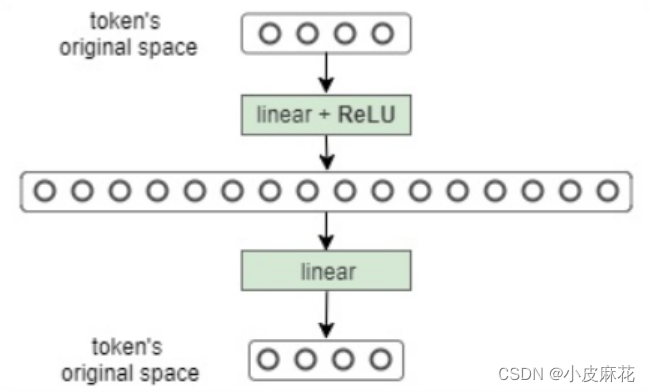

### 6.参数计算

先定：transformer有l个相同的层，每个层分为attention部分和MLP模块。
attention：模型参数有 $Q,K,V$ ，对应权重矩阵和偏置 $W_Q,W_K,W_V$ 和偏置，输出权重矩阵 $W_o$ 和偏置,总参数为 $4h^2+4h$ 。
MLP：两个线性层，分别从 $h\rightarrow4h$ 和 $4h\rightarrow h$ ,总参数为 $8h^2+5h$ 。
所以，对于一个有l层的transformer来说，其参数量可近似表达为： $12lh^2+Vh$ 。

### 7.Trick

checkpoint averaging：从几个检查点获取模型参数的平均值。相应的损失函数也会有变化。[label smoothing(标签平滑)学习笔记 - 知乎 (zhihu.com)](https://zhuanlan.zhihu.com/p/116466239)

Adam

Dropout

Label smoothing：解决过拟合问题。主要是通过soft one-hot来加入噪声，减少了真实样本标签的类别在计算损失函数时的权重，最终起到抑制过拟合的效果。

Auto-regressive decoding with beam search and length penalties

## **Universal Transformer**

解决了Transformer非图灵完备的缺点，和计算资源投入平均的问题。

从构架来看，Universal Transformer和Transformer并没有太大的区别。使用共享权重的transition function代替FFN。

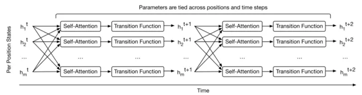

其中，纵向看是文本的序列顺序，横向看是时间步骤。

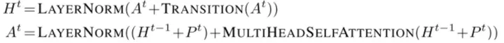

Transition function可以和之前一样是全连接层，也可以是其他函数层。

Universal Transforer模型多了一个时间维度，因此每一次循环都需要进行一轮坐标编码。

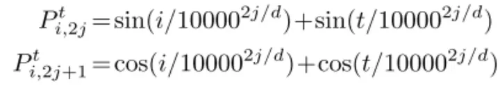

为了控制循环的次数，模型引入了Adaptive Computation Time（ACT）机制。ACT可以调整计算步数，加入ACT机制的Universal transformer被称为Adaptive universal transformer。以下图为例，可以看出，引入ACT机制后，模型对于文本中更重要的token会进行更多次数的循环，而对于相对不重要的单词会减少计算资源的投入。

## **Transformer-XL**

Transformer通常会将本文分割成长度小于等于dmodel （默认是512）的segment，每个segment之间互相独立，互不干涉。segment之间的依赖关系，或者说距离超过512的token之间的依赖关系就完全无法建模抽取。同时，这还会带来一个context fragmentation的问题，因为segment的划分并不是根据语义边界，而是根据长度进行划分的，可能会将一个完整的句子拆成两个。那么在对这样被拆分的句子进行预测时，可能就会缺少必要的语义信息。

Transformer-XL提出了Segment-level Recurrence来解决这个问题。用一句话概括Segment-level Recurrence，那就是，在对当前segment进行处理的时候，缓存并利用上一个segment中所有layer的隐向量，而且上一个segment的所有隐向量只参与前向计算，不再进行反向传播。

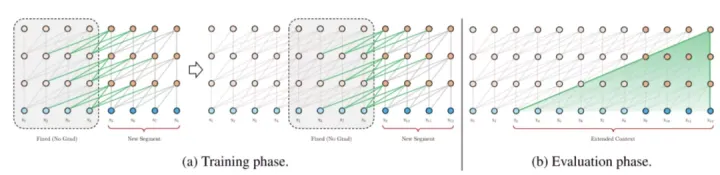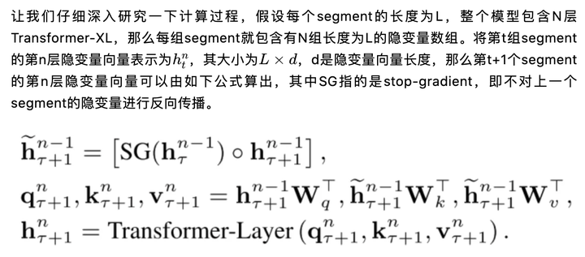由于考虑了之前的segment，那么先前的位置编码就不足以区分不同segment之间的相同位置的token，因此作者提出了使用Relative Positional Encodeing来替代之前的位置编码。具体来说，就是使用相对位置编码来替代绝对位置编码。

做法是把**相对位置编码**加入到了self-attention的 **内部** 。

原理是在计算第 i 个元素与第 j 个元素之间的attention的值和权值的时候加入 i 与 j 之间的距离编码，因为加入的是 i 与 j 之间的相对位置关系，因此叫做相对位置编码。在self-attention中添加了两个可学习的变量$a^V_{i,j}和a^K_{i,j}$。分别加在计算K和V时。$a^V_{i,j}和a^K_{i,j}$的计算方式相同，即在 [−k,k] 的范围之内计算相对距离，超出范围的用 0 或者 k 进行截断。也可以称之为**函数式相对位置编码**。

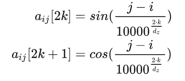

## **Reformer**

为了解决Transformer计算QK时开销过大的问题和Transformer处理长距离依赖问题表现并不太好的问题。作者提出了两个机制分别解决这两个问题，它们是locality-sensitve hashing(LSH) attention和Reversible transformer。

### locality-sensitve hashing(LSH) attention

用LSH代替QK的计算

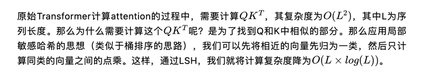

首先用LSH来对每个segment进行分桶，将相似的部分放在同一个桶里面。然后我们将每一个桶并行化计算其中两两之间的点乘。考虑到有一定的概率相似的向量会被分到不同的桶里，因此采用了多轮hashing来降低这个概率。

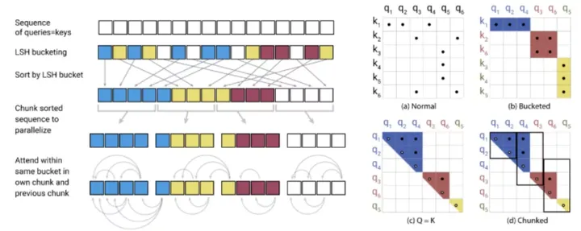

### Reversible transformer

LSH解决了计算速度的问题，但仍有一个内存消耗的问题。当我们训练一个多层模型时，需要保存每一层的激活值和隐变量，以便在反向传播时使用。这极大地提高了内存的占用量。

这里作者借鉴了RevNet的思想，不保留中间残差连接部分的输入了，取而代之的，是应用一种“可逆层”的思路，就如同下图中所示的那样，（a）为前向传播，（b）为反向传播。

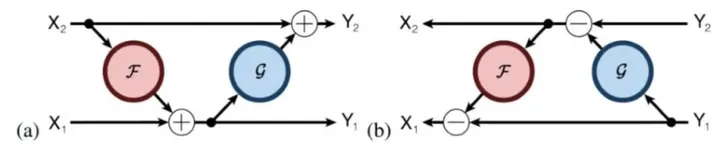每一层的输入可以根据其输出计算出来，就不用保存了。虽然增加了冗余计算，但极大地节省了内存开支。
