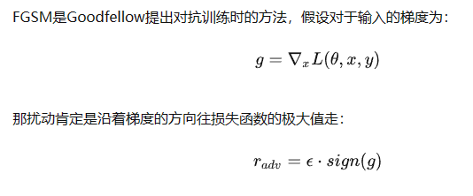
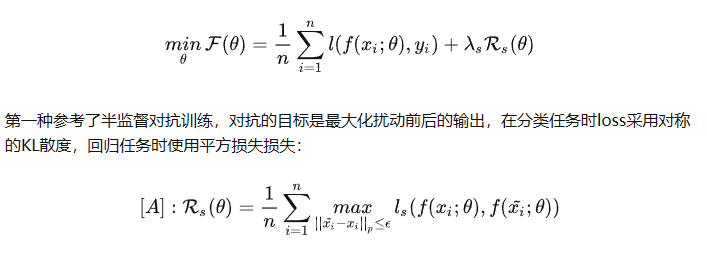
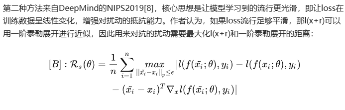

# 1.对抗训练


**对抗训练是一种引入噪声的训练方式，可以对参数进行正则化，提升模型鲁棒性和泛化能力。**

对抗训练的假设是：给输入加上扰动之后，输出分布和原Y的分布一致。

即**往增大损失的方向增加扰动**。

用一句话形容对抗训练的思路，就是 **在输入上进行梯度上升(增大loss)，在参数上进行梯度下降(减小loss)** 。由于输入会进行embedding lookup，所以 **实际的做法是在embedding table上进行梯度上升** 。

## FGSM



## FGM

FSGM是每个方向上都走相同的一步，Goodfellow后续提出的FGM则是根据具体的梯度进行scale，得到更好的对抗样本。

伪代码：

```text
对于每个x:
  1.计算x的前向loss、反向传播得到梯度
  2.根据embedding矩阵的梯度计算出r，并加到当前embedding上，相当于x+r
  3.计算x+r的前向loss，反向传播得到对抗的梯度，累加到(1)的梯度上
  4.将embedding恢复为(1)时的值
  5.根据(3)的梯度对参数进行更新
```

## PGD

FGM直接通过epsilon参数一下子算出了对抗扰动，这样得到的可能不是最优的。因此PGD进行了改进，多迭代几次，慢慢找到最优的扰动。

伪代码：

```text
对于每个x:
  1.计算x的前向loss、反向传播得到梯度并备份
  对于每步t:
    2.根据embedding矩阵的梯度计算出r，并加到当前embedding上，相当于x+r(超出范围则投影回epsilon内)
    3.t不是最后一步: 将梯度归0，根据1的x+r计算前后向并得到梯度
    4.t是最后一步: 恢复(1)的梯度，计算最后的x+r并将梯度累加到(1)上
  5.将embedding恢复为(1)时的值
  6.根据(4)的梯度对参数进行更新
```

## **FreeAT**

从FGSM到PGD，主要是优化对抗扰动的计算，虽然取得了更好的效果，但计算量也一步步增加。对于每个样本，FGSM和FGM都只用计算两次，一次是计算x的前后向，一次是计算x+r的前后向。而PGD则计算了K+1次，消耗了更多的计算资源。因此FreeAT被提了出来，在PGD的基础上进行训练速度的优化。

FreeAT的思想是在对每个样本x连续重复m次训练，计算r时复用上一步的梯度，为了保证速度，整体epoch会除以m。

```text
初始化r=0
对于epoch=1...N/m:
  对于每个x:
    对于每步m:
      1.利用上一步的r，计算x+r的前后向，得到梯度
      2.根据梯度更新参数
      3.根据梯度更新r
```

## YOPO

YOPO的目标也是提升PGD的效率。

极大值原理PMP(Pontryagin's maximum principle)是optimizer的一种，它将神经网络看作动力学系统。这个方法的优点是在优化网络参数时，层之间是解藕的。通过这个思想，我们可以想到，既然扰动是加在embedding层的，为什么每次还要计算完整的前后向传播呢？

```text
对于每个样本x
初始化r(1,0)
对于j=1,2,...,m:
  1.根据r(j,0),计算p
  对于s=0,1,...,n-1:
    2.计算r(j,s+1)
  3.另r(j+1,0)=r(j,n)
```

## FREELB

FreeLB认为，FreeAT和YOPO对于获得最优r (inner max)的计算都存在问题，因此提出了一种类似PGD的方法。只不过PGD只使用了最后一步x+r输出的梯度，而FreeLB取了每次迭代r输出梯度的平均值，相当于把输入看作一个K倍大的虚拟batch，由[X+r1, X+r2, ..., X+rk]拼接而成。

FreeLB和PGD主要有两点区别：

1.PGD是迭代K次r后取最后一次扰动的梯度更新参数，FreeLB是取K次迭代中的平均梯度

2.PGD的扰动范围都在epsilon内，因为伪代码第3步将梯度归0了，每次投影都会回到以第1步x为圆心，半径是epsilon的圆内，而FreeLB每次的x都会迭代，所以r的范围更加灵活，更可能接近局部最优。

```text
对于每个x:
  1.通过均匀分布初始化r，梯度g为0
  对于每步t=1...K:
    2.根据x+r计算前后向，累计梯度g
    3.更新r
  4.根据g/K更新梯度
```

## SMART

1.对抗正则 SMoothness-inducing Adversarial Regularization，提升模型鲁棒性

SMART提出了两种对抗正则损失，加到损失函数中：

第一种



第二种



2.优化算法 Bregman proximal point optimization，避免灾难性遗忘
