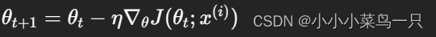

# SGD

随机梯度下降，1847年提出。每次选择一个mini-batch，而不是全部样本，使用梯度下降来更新模型参数。求解当前位置的梯度，并使用与梯度相反的方向来进行更新，它解决了随机小批量样本的问题，但仍然有自适应学习率、容易陷入局部最优等问题。



# SGDM

SGD with momentum，加入了动量机制的SGD，简单来说就像物理学中的动量一样，物体有保持之前运动状态的趋势。即，t次更新的梯度是由t-1次的迭代动量和当前梯度共同决定的。

**优点：**

1. 指数加权融合了历史梯度,平滑了更新方向
2. 加速了梯度下降过程,可以跳出局部最优解
3. 在一定程度上抑制了振荡和oscilation


γ为动量参数，通常为0.9


缺点：平坦区域可能跳过最优解

# NAG牛顿法


与经典动量法的区别在于, **NAG在计算梯度 η∇θJ 时,使用的参数值为 θ{t-1} - γv{t-1},** 即在当前参数值的基础上,先沿当前动量方向移动一步,再评估该位置的梯度。

    **这样做相当于能够让算法提前看到前方的地形梯度** ，如果前面的梯度比当前位置的梯度大，那我就可以把步子迈得比原来大一些，如果前面的梯度比现在的梯度小，那我就可以把步子迈得小一些。

# **Adagrad**

它利用迭代次数和累积梯度，对学习率进行自动衰减，2011年提出。从而使得刚开始迭代时，学习率较大，可以快速收敛。而后来则逐渐减小，精调参数，使得模型可以稳定找到最优点。

具体方法是使用学习率除以 前t-1 迭代的梯度的平方和。故称为自适应梯度下降。


如果刚开始的梯度特别大，而后面的比较小，则学习率基本不会变化了，也就谈不上自适应学习率了。这个问题在RMSProp中得到了修正。

**为什么是η/sqrt(r_t+ε)这种形式吗？**

> 主要原因有两点:
>
> 1. **自适应学习率**
>
>    在Adagrad和RMSProp等算法中,r_t实际上是对每个参数维度的历史梯度平方的累积(Adagrad)或指数加权累积(RMSProp)。**较大的r_t意味着该维度的梯度值较大,参数在该方向上可能有较大的振荡,因此需要较小的学习率以保证稳定性。**
>
>    相反,较小的r_t意味着该维度的梯度较小,参数在该方向上的更新量可以相对较大一些。因此,η/sqrt(r_t+ε)实现了对不同参数维度自适应的学习率,**避免了单一的全局学习率带来的问题。**
> 2. **数值稳定性**
>
>    将学习率η除以sqrt(r_t+ε)还有一个作用是防止分母为0导致数值不稳定。ε是一个很小的正数,确保分母不会为0。
>
>    **此外,开平方根的作用是约束学习率的数量级,使其呈现一种下降的趋势,有利于算法收敛。** 如果直接除以r_t,学习率会下降过快,收敛性能可能会变差。
>
>    综上所述,η/sqrt(r_t+ε)提供了自适应学习率和数值稳定性的优点,是Adagrad/RMSProp等优化算法中一种常见且理论合理的设计选择。通过调节η的初始值和ε,可以控制整体学习率的下降速率。

# **RMSProp**

它与Adagrad基本类似，只是加入了**迭代衰减。在于RMSProp中，梯度累积不是简单的前t-1次迭代梯度的平方和了，而是加入了衰减因子β。简单理解就是学习率除以前t-1次迭代的梯度的加权平方和。加入衰减时make sense的，因为与当前迭代越近的梯度，对当前影响应该越大。**


# Adam

Adam是SGDM和RMSProp的结合，它基本解决了之前提到的梯度下降的一系列问题，比如随机小样本、自适应学习率、容易卡在梯度较小点等问题。加入了两个衰减系数β1和β2。刚开始所需动量比较大，后面模型基本稳定后，逐步减小对动量的依赖。自适应学习率同样也会随迭代次数逐渐衰减。


# AdamW

AdamW[2]相对与Adam的改动十分简单，其将权重衰减项从梯度的计算中拿出来直接加在了最后的权重更新步骤上。即对上式5改变如下：

$$
\theta_{t+1}=\theta_t - \eta ( \frac{\alpha m_t}{\sqrt{v_t}+\epsilon} + \lambda \theta_t )
$$

原先Adam的实现中如果采用了L2正则，相当于在分子上直接加上了$\lambda \theta_t$，导致与分母的vt抵消，减弱了l2对权重较大的项的惩罚，而这影响了Adam的优化效果，而将权重衰减与梯度的计算进行解耦能够显著提升Adam的效果。

换句话说，adamw是adam+wd的正确实现：

```text
w= w - lr *w.grad - lr *wd * w
```

而不是大多数库的：

```text
final_loss = loss + wd * all_weights.pow(2).sum() / 2
```
