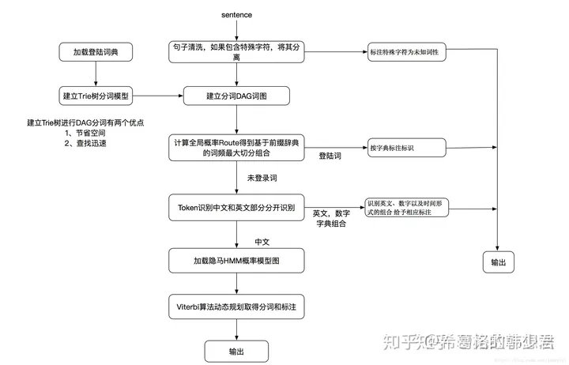

# 面经

[NLP面试高频知识点整理分享（附详细中文答案） - 知乎 (zhihu.com)](https://zhuanlan.zhihu.com/p/419827551)

[别求面经了！小夕手把手教你如何斩下和选择NLP算法岗offer！（2020.4.14更新） - 知乎 (zhihu.com)](https://zhuanlan.zhihu.com/p/45802662)

[NLP算法岗春秋招八股文 - 知乎 (zhihu.com)](https://zhuanlan.zhihu.com/p/470674031)

# 八股

## 集成学习

boosting

* 串行的方式训练基分类器，各分类器之间有依赖。每次训练时，对前一层基分类器分错的样本给与更高的权重

bagging

* bagging是Bootstrap aggregating的意思，各分类器之间无强依赖，可以并行。

stacking

* 将不同弱分类器的输出结果加权求和作为总输出。

方差&偏差

* 偏差:
  * **【背下来】偏差是指由有所采样得到的大小为m的训练数据集，训练出的所有模型的输出的平均值和真实模型输出之间的偏差。**
  * 通常是由对学习算法做了错误的假设导致的
  * 描述模型输出结果的期望与样本真实结果的差距。分类器表达能力有限导致的系统性错误，表现在训练误差不收敛

方差:

* **【背下来】是指有所有采样得到的大小为m的训练数据集，训练出的所有模型的输出的方差**
* 描述模型对于给定值的输出稳定性。分类器对样本分布过于敏感，到指在训练样本较少的时候，出现过拟合
* 基分类器的错误，是偏差和方差之和
* boosting方法通过逐步聚焦分类器分错的样本，减少集成分类器的**偏差**
* Bagging采用分而治之的策略，通过对样本多次采样，分别训练多个模型，减少**方差**
* 为什么决策树是常用的基分类器

  * 可以方便地将样本权重正和岛训练过程中，不需要使用过采样的方法来调整样本券种
  * 决策树的表达能力和繁华能力，可以通过调节树的层数来做折中
  * 数据样本扰动对决策树影响 **较大** ，因此不同子样本集生成的基分类器随机性就较大。这样的不稳定学习器更适合作为基分类器。
  * 插一句，神经网络也适合做基分类器

### Adaboost

* boosting的思想：
  * 对分类正确的样本降低权重
  * 对错误分类的样本升高或者保持全中不变
  * 在模型融合过程中，根据错误率对基分类器器进行加权融合，错误率低的分类器拥有更大的“话语权”

### GBDT

* GBDT也称MART。基本的树：CART
* 拟合函数：负梯度
* 损失函数：
  * 回归：直接用连续的值计算负梯度
    * 均方差
    * 绝对损失
    * huber损失
    * 分位数损失
  * 分类：指数（此时退化成为Adaboost）、对数
* 正则化:
  * 步长，v就是步长，空驶学习速度 ( )= −1( )+ ℎ ( )
  * 自采样比例（subsample）无放回的抽样
  * 正则化剪枝

GBDT主要的优点有：

* 1) 可以灵活处理各种类型的数据，包括连续值和离散值。
* 2) 在相对少的调参时间情况下，预测的准确率也可以比较高。这个是相对SVM来说的。
* 3）使用一些健壮的损失函数，对异常值的鲁棒性非常强。比如 Huber损失函数和Quantile损失函数。
* from百面机器学习：

  * 预测阶段计算速度较快，树与树之间可以并行化计算
  * 在分布稠密的数据机上，泛化能力和表达能力都比较好
  * 具有较好的解释性和鲁棒性
  * 能够自动发现特征质检的高阶关系
  * 不需要做特殊预处理（比如归一化）

GBDT的主要缺点有：

* 由于弱学习器之间存在依赖关系，难以并行训练数据。不过可以通过自采样的SGBT来达到部分并行。
* 在高维稀疏数据上，表现不如SVM或神经网络
* 在处理文本分类特征问题上，相对其他模型优势不如在处理数值特征时明显
* 训练过程需要串行，只能在决策树内部采用一些局部并行手段提高训练速度

### Xgboost

* 思路：对损失函数进行了二阶泰勒展开，同时使用一阶二阶导数
* 正则化：


J是叶子节点的个数，w是滴j个叶子节点的最优质的

* 损失函数：


* 二阶泰勒展开：


* 第i个样本在第t个托学习期的一阶、二阶导数分别记为


* 最终的损失函数：


* 决策树的分裂标准不是MSE，而是下式：


* 分裂方式：

  * 分裂前后损失函数的差值为：
  * XGB通过最大化这个差值作为准则来进行决策树的构建。通过遍历所有特征的取值，寻找时的损失函数前后相差最大时的分裂方式
  * 一次求解出决策树最优的所有J个子节点区域、和每个子节点区域的最优解w
* 效率优化：

  * **并行：** Boosting算法的弱学习器是没法并行迭代的，但是单个弱学习器里面最耗时的是决策树的分裂过程，XGBoost针对这个分裂做了比较大的 **并行优化** 。对于不同的特征的特征划分点，XGBoost分别在不同的线程中并行选择分裂的最大增益。
  * **内存优化：** 对训练的每个特征排序并且 **以块的的结构存储在内存中** ，方便后面迭代重复使用，减少计算量。计算量的减少参见上面第4节的算法流程，首先默认所有的样本都在右子树，然后从小到大迭代，依次放入左子树，并寻找最优的分裂点。这样做可以减少很多不必要的比较。
  * **存储+IO** ：通过设置合理的分块的大小，充分利用了CPU缓存进行读取加速（cache-aware access）。使得数据读取的速度更快。另外，通过将分块进行压缩（block compressoin）并存储到硬盘上，并且通过将分块分区到多个硬盘上实现了更大的IO。
* 效果优化：

  * **缺失值：** XGBoost没有假设缺失值一定进入左子树还是右子树，则是尝试通过枚举所有缺失值在当前节点是进入左子树，还是进入右子树更优来决定一个处理缺失值默认的方向，这样处理起来更加的灵活和合理。
  * 引入了**适用于树模型的正则项**用于控制模型复杂度。
    * 包含了输的叶子节点个数、每个叶子节点输出分数的L2平方和
    * 正则化项γ起到了一定的预剪枝的效果
    * xgboost采用预剪枝策略，只有分裂后的增益大于0才会进行分裂。
* 参数

  * XGB架构参数
    * booster：CART、或者线性模型、或者DART
    * n_estimator：
    * objective：
      * 分类：MSE
      * 分类：二分类用logistic、多分类用softma
  * 弱学习器参数
    * max_depth：树的深度
    * min_child_weight：最小子节点的权重。如果某个子节点权重小于这个阈值，则不会在分裂。使用的是该节点所有二阶导数的和
    * gamma：分裂所带来的损失最小阈值，大于此值，才能继续分裂
    * subsample：子采样参数，无放回抽样
    * colsample_bytree 整棵树的特征采样比例
    * colsample_bylevel 某层的特征采样比例
    * colsample_bynode 某一个树节点的特征采样比例
    * reg_alpha：L1正则化参数
    * reg_lambda： L2正则化参数
* 其他

  * n_jobs控制算法的并发线程数
  * scale_pos_weight用于类别不平衡的时候，负例和正例的比例。类似于sklearn中的class_weight
  * importance_type则可以查询各个特征的重要性程度。最后可以通过调用booster的get_score方法获取对应的特征权重。
    * “weight”通过特征被选中作为分裂特征的计数来计算重要性
    * “gain”和“total_gain”则通过分别计算特征被选中做分裂特征时带来的平均增益和总增益来计算重要性
    * “cover”和 “total_cover”通过计算特征被选中做分裂时的平均样本覆盖度和总体样本覆盖度来来计算重要性。
* 总体：

  * 另一个梯度提升树的实现框架
  * 引入了基于直方图的统计量来表示特征离散化之后的值
    * 构造叶子节点直方图的时候，可以直接用父节点的直方图与兄弟节点的直方图进行作差得到
* LGB不需要通过所有样本计算信息增益了，而且内置特征降维技术，所以更快
* 优化：

  * 如果一个样本的梯度较小，证明这个样本训练的误差已经很小了，所以不需要计算了。我们在XGB的那篇文章中说过，GBDT的梯度算出来实际上就是残差，梯度小残差就小，所以该样本拟合较好，不需要去拟合他们了。
  * 这听起来仿佛很有道理，但问题是丢掉他们会改变数据的分布，还是无法避免信息损失，进而导致精度下降，所以LGB提出了一个很朴实无华且枯燥的方法进行优化。
  * LGB的优化方法是，在保留大梯度样本的同时，随机地保留一些小梯度样本，同时放大了小梯度样本带来的信息增益。
* 优点：

  * 支持高效并行训练、训练速度快内存消耗低、准确率高、分布式支持

### 对比

* 作为GBDT的高效实现，XGBoost是一个上限特别高的算法，因此在算法竞赛中比较受欢迎。简单来说，对比原算法GBDT，XGBoost主要从下面三个方面做了优化：

  * 一是算法本身的优化：在算法的弱学习器模型选择上，对比GBDT只支持决策树，还可以直接很多其他的弱学习器。在算法的损失函数上，除了本身的损失，还加上了正则化部分。在算法的优化方式上，GBDT的损失函数只对误差部分做负梯度（一阶泰勒）展开，而XGBoost损失函数对误差部分做二阶泰勒展开，更加准确。算法本身的优化是我们后面讨论的重点。
  * 二是算法运行效率的优化：对每个弱学习器，比如决策树建立的过程做并行选择，找到合适的子树分裂特征和特征值。在并行选择之前，先对所有的特征的值进行排序分组，方便前面说的并行选择。对分组的特征，选择合适的分组大小，使用CPU缓存进行读取加速。将各个分组保存到多个硬盘以提高IO速度。
  * 三是算法健壮性的优化：对于缺失值的特征，通过枚举所有缺失值在当前节点是进入左子树还是右子树来决定缺失值的处理方式。算法本身加入了L1和L2正则化项，可以防止过拟合，泛化能力更强。
* **联系&区别（百面机器学习+知乎）：**

  * GBDT是机器学习算法；XGB是算法的工程实现
  * XGB使用CART做基分类器的时候，显式地加入了**正则项**来控制模型的复杂度，有利于防止过拟合，提高泛化能力
    * 正则项里包含了树的叶子节点个数、每个叶子节点上输出的score的L2模的平方和。
  * GBDT在模型训练的时候只使用了一阶导数信息，XGB对代价函数进行了二姐泰勒展开，同时使用一阶、二阶导数信息。并且可以自定义代价函数，只要是二阶可导数的
  * 传统GBDT使用CART作为 **基分类器** ；XGB支持多种类型的基分类器，如线性分类器
  * **缺失值** ：
  * 传统GBDT没有专门针对 **缺失值进行处理** ；XGB能够自动学习出缺失值的处理策略：
    * 指定缺失值的分隔方向：可以为缺失值或者指定的值指定分支的默认方向，为了保证完备性，会分别处理将missing该特征值的样本分配到左叶子结点和右叶子结点的两种情形，分到那个子节点带来的增益大，默认的方向就是哪个子节点，这能大大提升算法的效率。
  * 忽略缺失值：在寻找splitpoint的时候，不会对该特征为missing的样本进行遍历统计，只对该列特征值为non-missing的样本上对应的特征值进行遍历，通过这个工程技巧来减少了为稀疏离散特征寻找splitpoint的时间开销
  * **Shrinkage（缩减）** ，相当于学习速率（xgboost中的eta）。每次迭代，增加新的模型，在前面成上一个小于1的系数，降低优化的速度，每次走一小步逐步逼近最优模型比每次走一大步逼近更加容易避免过拟合现象；
  * **抽样**
    * **列抽样** （column subsampling）。xgboost借鉴了随机森林的做法，支持列抽样（即每次的输入特征不是全部特征），不仅能降低过拟合，还能减少计算，这也是xgboost异于传统gbdt的一个特性。
    * **行抽样** ：传统GBDT在每轮迭代时使用全部的数据；XGB则采用了类似RF的策略，支持对数据进行采样
  * **并行化处理** ：
  * 在训练之前，预先对每个特征内部进行了排序找出候选切割点，然后保存为block结构，后面的迭代中重复地使用这个结构，大大减小计算量。
  * 在进行**节点的分裂**时，需要计算每个特征的增益，最终选增益最大的那个特征去做分裂，那么各个特征的增益计算就可以开多线程进行，即在不同的特征属性上采用多线程并行方式寻找最佳分割点。
* 与其他模型对比

  * VS 线性模型：
    * 提升树可以较好地处理不在同一个区间的特征（年龄vs星期几vs比率）；
    * 可以更好地应对异常点；
    * 更好处理特征质检的相关性；
    * 处理非线性决策边界问题
  * VS RF：
    * RF可以并行训练，比较不容易过拟合；提升树可以学习到更复杂的决策边界，效果更好
  * VS NN：
    * NN vc维较多，训练比较困难；提升树在小数据集上效果会很好
* from知乎

  * 传统GBDT以CART作为基分类器，xgboost还支持线性分类器，这个时候xgboost相当于带L1和L2正则化项的逻辑斯蒂回归（分类问题）或者线性回归（回归问题）。
  * 传统GBDT在优化时只用到一阶导数信息，xgboost则对代价函数进行了二阶泰勒展开，同时用到了一阶和二阶导数。顺便提一下，xgboost工具支持自定义代价函数，只要函数可一阶和二阶求导。
  * xgboost在代价函数里加入了正则项，用于控制模型的复杂度。正则项里包含了树的叶子节点个数、每个叶子节点上输出的score的L2模的平方和。从Bias-variance tradeoff角度来讲，正则项降低了模型的variance，使学习出来的模型更加简单，防止过拟合，这也是xgboost优于传统GBDT的一个特性。
  * Shrinkage（缩减），相当于学习速率（xgboost中的eta）。每次迭代，增加新的模型，在前面成上一个小于1的系数，降低优化的速度，每次走一小步逐步逼近最优模型比每次走一大步逼近更加容易避免过拟合现象；
  * 列抽样（column subsampling）。xgboost借鉴了随机森林的做法，支持列抽样（即每次的输入特征不是全部特征），不仅能降低过拟合，还能减少计算，这也是xgboost异于传统gbdt的一个特性。
  * 忽略缺失值：在寻找splitpoint的时候，不会对该特征为missing的样本进行遍历统计，只对该列特征值为non-missing的样本上对应的特征值进行遍历，通过这个工程技巧来减少了为稀疏离散特征寻找splitpoint的时间开销
  * 指定缺失值的分隔方向：可以为缺失值或者指定的值指定分支的默认方向，为了保证完备性，会分别处理将missing该特征值的样本分配到左叶子结点和右叶子结点的两种情形，分到那个子节点带来的增益大，默认的方向就是哪个子节点，这能大大提升算法的效率。
  * 并行化处理：在训练之前，预先对每个特征内部进行了排序找出候选切割点，然后保存为block结构，后面的迭代中重复地使用这个结构，大大减小计算量。在进行节点的分裂时，需要计算每个特征的增益，最终选增益最大的那个特征去做分裂，那么各个特征的增益计算就可以开多线程进行，即在不同的特征属性上采用多线程并行方式寻找最佳分割点。

## 词向量

### GloVe模型

> 基于奇异值分解（SVD）的LSA算法，该方法对term-document矩阵（矩阵的每个元素为tf-idf）进行奇异值分解，从而得到term的向量表示和document的向量表示。此处使用的tf-idf主要还是term的全局统计特征。

LSA和word2vec作为两大类方法的代表，一个是利用了全局特征的矩阵分解方法，一个是利用局部上下文的方法。

GloVe模型就是将这两中特征合并到一起的，即使用了语料库的全局统计（overall statistics）特征，也使用了局部的上下文特征（即滑动窗口）。

#### 共现矩阵

首先引入word-word的共现矩阵X


举例来说：其中窗口大小为1，即中心词左右延伸1。


矩阵每个词所对应的行（列）即为词向量。


整个概率可以表现为：

* 当词i与中心词k相关，而j与k没那么相关时，比值较大
* 当词i与中心词k没那么相关，而j与k相关时，比值较小
* 当i,j与k都相关或不相关是，比值接近1

存在问题：

1. 随着词汇增多，向量的大小会变得很大。
2. 非常高维，需要大量存储空间。
3. 随后的分类模型具有稀疏性的问题。（注：因为维数高，又稀疏，模型分类不易）
4. 模型不够健壮（robust

因此使用

#### 低维化共现矩阵向量

**方法一：SVD分解**

问题：

1. 计算代价太大。对于一个n*m的矩阵，计算复杂度是O(mn2)O(mn2)。这就导致会与数百万的文档或词汇不易计算。
2. 难以将新的词汇或文档合并进去，难以更新。

**方法二：基于计数（LSA）+基于预测（W2V）**

#### GloVe原理


#### 使用

可以找到论文作者基于维基百科及推特还有其他数据集分别训练的多个GloVe模型，可以下载下来，解压缩，使用gensim工具包进行使用。我这里没有自己用数据集进行训练，只使用了他们训练好的模型。

这里以[6]为例。依然使用python的gensim工具包。首先需要将这个训练好的模型转换成gensim方便加载的格式(gensim支持word2vec格式的预训练模型格式）。这个只需要进行一次即可。

```python3
from gensim.scripts.glove2word2vec import glove2word2vec


glove_input_file = 'glove.840B.300d.txt'
word2vec_output_file = 'glove.840B.300d.word2vec.txt'
```

转换过模型格式后，就可以使用里面的词向量了。

```text
from gensim.models import KeyedVectors


# 加载模型
glove_model = KeyedVectors.load_word2vec_format(word2vec_output_file, binary=False)
# 获得单词cat的词向量
cat_vec = glove_model['cat']
print(cat_vec)
# 获得单词frog的最相似向量的词汇
print(glove_model.most_similar('frog'))
```

### ELMO

**ELMO 由一层input层 和 两层双向LSTM 组合而成的**

注：input层可看为embedding层，不过ELMO是通过字符卷积来得到embedding的，不是矩阵相乘；用两个单向LSTM替代一个双向LSTM。

> 字符卷积：字符one-hot输入卷积网络，输出词向量。


**ELMO解决了大部分问题，其中最重要的一个是：它解决了一词多义的问题。因为它是上下文的，能够区分不同的含义。**

ELMO有三层，每一层都有一个输出，将这三层的输出按比例相加后即为所得vector。这个比例是模型学习得到的。得到加权后的向量后，如何使用取决于任务的效果。

**为什么ELMO用两个单向的LSTM代替一个双向的LSTM呢**

用双向的模型结构去训练语言模型会导致“看到自己”或“看到答案”的问题。后来的预训练语言模型也都在避免或解决这个问题，解决的程度也影响着模型效果。

## 子词划分

#### BPE


以此类推

#### WordPiece

与BPE算法类似，WordPiece算法也是每次从词表中选出两个子词合并成新的子词。与BPE的最大区别在于，如何选择两个子词进行合并：BPE选择频数最高的相邻子词合并，而WordPiece选择**能够提升语言模型概率最大的相邻子词**加入词表。


#### ULM

与WordPiece一样，Unigram Language Model(ULM)同样使用语言模型来挑选子词。不同之处在于，BPE和WordPiece算法的词表大小都是从小到大变化，属于增量法。而Unigram Language Model则是减量法,即先初始化一个大词表，根据评估准则不断丢弃词表，直到满足限定条件。ULM算法考虑了句子的不同分词可能，因而能够输出带概率的多个子词分段。

1. 初始时，建立一个足够大的词表。一般，可用语料中的所有字符加上常见的子字符串初始化词表，也可以通过BPE算法初始化。
2. 针对当前词表，用EM算法求解每个子词在语料上的概率。
3. 对于每个子词，计算当该子词被从词表中移除时，总的loss降低了多少，记为该子词的loss。
4. 将子词按照loss大小进行排序，丢弃一定比例loss最小的子词(比如20%)，保留下来的子词生成新的词表。这里需要注意的是，单字符不能被丢弃，这是为了避免OOV情况。
5. 重复步骤2到4，直到词表大小减少到设定范围。

#### **jieba**

**基于N-gram语言模型的分词方法**和**基于HMM的分词方法**



## Trans/Bert/Attention知识点

##### **1、不考虑多头的原因，self-attention中词向量不乘QKV参数矩阵，会有什么问题？**

qkv矩阵的目的是去计算各个token之间的点积相似度的，对于 self-attention，一般会说它的 q=k=v，这里的相等实际上是指它们来自同一个基础向量，而在实际计算时，它们是不一样的，因为这三者都是乘了QKV参数矩阵的。那如果不乘，每个词对应的q,k,v就是完全一样的。

##### **2、Self-Attention 的时间复杂度是怎么计算的？**

首先，答案是o(n^2·d)，相似度计算可以看作大小为(n,d)和(d,n)的两个矩阵相乘： (n,d)∗(d,n)=o(n^2⋅d) ，得到一个(n,n)的矩阵

softmax就是直接计算了，时间复杂度为 o(n^2)

加权平均可以看作大小为(n,n)和(n,d)的两个矩阵相乘： (n,n)∗(n,d)=o(n^2⋅d) ，得到一个(n,d)的矩阵

因此，Self-Attention的时间复杂度是 o(n^2⋅d) 。

对于多头机制：


##### **3、Transformer在哪里做了权重共享，为什么可以做权重共享？**

Transformer在两个地方进行了权重共享：

 **（1）** Encoder和Decoder间的Embedding层权重共享；

 **（2）** Decoder中Embedding层和FC层权重共享。

对于2：Decoder中的 **Embedding层和FC层有点像互为逆过程** 。

通过这样的权重共享可以减少参数的数量，加快收敛。

> Linear 层的权重定义中，是按照 (out_features, in_features) 顺序来的，实际计算会先将 weight 转置在乘以输入矩阵。所以 FC层 对应的 Linear 权重维度也是 (v,d)，可以直接共享。

##### 4、**BERT非线性的来源在哪里？**

前馈层的gelu激活函数和self-attention，self-attention是非线性的。

##### 5、**BERT的三个Embedding直接相加会对语义有影响吗？**

本质上不管是什么embedding，都是one-hot，同为onehot向量，相加或是concat的结果都是不影响其语义的，过维度为 [4+3+2,768] = [9, 768] 的全连接层，得到的向量其实就是一样的。

对于concat，直接将三个one-hot 特征 concat 起来得到的 [1,0,0,0,1,0,0,1,0] 不再是one-hot了，但可以把它映射到三个one-hot 组成的特征空间，空间维度是 4*3*2=24 ，那在新的特征空间，这个字的one-hot就是[1,0,0,0,0...] (23个0)。此时，Embedding 矩阵维度就是 [24,768]，最后得到的 word Embedding 依然是和上面的等效。

##### 6、**Transformer的点积模型做缩放的原因是什么？**

softmax函数区间：


因为在transformer里，是使用qkT的点积去做相似度计算的，点积有可能带来的结果就是乘积落在softmax较大的（较小的）平滑函数区间，这可能会导致梯度消失。而除以$\sqrt{d_k}$的原因是类似于正态分布的标准化，能够将qkt的方差分布放缩到接近1。

##### **7、Bert处理长文本（文档）**

（1）暴力截断法；

（2）sliding window：有重叠地对长文档进行截断。


（3）pooling下采样：


当切完片后的数据喂给 BERT 后，我们取 BERT 模型的 [CLS] 的输出，此时输出维度应该为：(4, 768) 。随即，我们需要将这 4 个 output 按照所属句子分组，由下图所示，前 2 个向量属于一个句子，因此我们将它们归为一组，此时的维度变化：(4, 768) -> (2, 2, 768)。接着，我们对同一组的向量进行 Pooling 操作，使其下采样为 1 维的向量，即（1, 768）。这里 Pooling（池化法） 有两种 Pooling（池化法）方式：Max-Pooling 和 Avg-Pooling。

##### **9、Bert如何区分一词多义**

对于一个句子，每经过一层 Self-Attention，每个词的 embedding 都会是这句话中所有词 embedding 的加权平均，也就会融合这句话中所有词的信息。

因此，对于同一个词，不同的上下文会让这个词融合不同的语义信息，使得同一个词在不同的上下文中有不同的embedding，去表征不同的语义，从而区分一词多义。

**为什么分类层是确定的，BERT还能区分一词多义**

（1）为什么不同的含义词性能够指向同一个词

《How Contextual are Contextualized Word Representations?》得出的结论是：在BERT、ELMo和GPT-2等表示模型的所有层中，所有的词它们在嵌入空间中占据一个狭窄的锥，而不是分布在整个区域；而且模型的层次越高，对应的嵌入空间越小，即锥越狭窄。这也就让 「同一个词在不同上下文情况下得到的embedding 都在对应的分类层权重附近」成为可能。

（2）一个狭窄的词锥如何表示不同的含义

锥内还有足够的向量空间去表达不同的词义。

##### 10、**BERT训练时使用的学习率 warm-up 策略是怎样的？**

warmup 需要在训练最初使用较小的学习率来启动，并很快切换到大学习率而后进行常见的 decay。

这是因为，刚开始模型对数据的“分布”理解为零，或者是说“均匀分布”（当然这取决于你的初始化）；在第一轮训练的时候，每个数据点对模型来说都是新的，模型会很快地进行数据分布修正，如果这时候学习率就很大，极有可能导致开始的时候就对该数据“过拟合”，后面要通过多轮训练才能拉回来，浪费时间。
