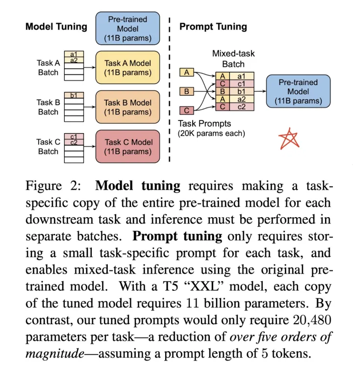
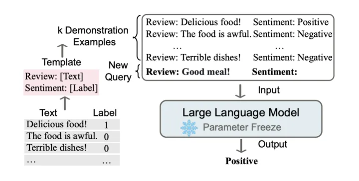

# Prompt Learning和delta tuning

## Prompt Learning

### 概念

* 左边是传统的 Model Tuning 的范式：对于不同的任务，都需要将整个预训练语言模型进行精调，每个任务都有自己的一整套参数。
* 右边是Prompt Tuning，对于不同的任务，仅需要插入不同的prompt 参数，每个任务都单独训练Prompt 参数，不训练预训练语言模型，这样子可以大大缩短训练时间，也极大的提升了模型的使用率。



### 原理

Prompt 的工作流包含以下4部分：

1. Prompt 模版（Template）的构造
2. Prompt 答案空间映射（Verbalizer）的构造
3. 文本代入template，并且使用预训练语言模型进行预测
4. 将预测的结果映射回label。

#### Step 1: prompt construction【Template】

模版的作用是将输入和输出进行重新构造，变成一个新的带有mask slots的文本，具体如下：

* 定义一个模版，包含了2处代填入的slots：[x] 和 [z]
* 将[x] 用输入文本代入


生成Template的方式可以是人工的。

也可以是自动生成的，甚至可以是抽象的，让模型自己去学习抽象的符号所代表的Template意义。通过[mask]（[T]）来初始化Template，最大化标签后验概率，在找到trigger tokens里与预测[mask]的embedding最接近的token组成Template。其结果从语法上来说很可能是没有意义的，但却有着较好的效果。


或者额外使用一个模型生成。


Template也可以是结构化的，通过不同的元素来组成目标Template，转化为了键值对。


#### Step 2: answer construction【Verbalizer】

对于我们构造的prompt，我们需要知道我们的预测词和我们的label 之间的关系，并且我们也不可能运行z是任意词，这边我们就需要一个映射函数（mapping function）将输出的词与label进行映射。即，（great，good，....，fancy）→positive。

方法：

* 人为构造（困难）
* 对初始词进行同义词的扩展（噪音大）
* 对初始词，由额外知识库辅助扩展
* label拆解成为不同token
* 等等

知识库辅助+消减


抽象token（聚类方法）


#### Step 3: answer prediction【Prediction】

选择合适的预训练模型进行预测。将结果代入[z]中。

#### Step 4: answer-label mapping【Mapping】

第四步骤，对于得到的 `answer`，我们需要使用 `Verbalizer` 将其映射回原本的label。

## P-tuning&P-tuning v2

### P-tuning

P-Tuning（论文： **GPT Understands, Too** ），该方法将Prompt转换为可以学习的Embedding层，并用MLP+LSTM的方式来对Prompt Embedding进行一层处理。


冻结网络层，只训练prompt generator。

P-tuning v1只有transformer第一层的embedding输入需要被tuned。

p-tuning的插入位置是可变的，但是对于不同任务的长度是固定的。

### p-tuningv2

p-tuningv2为每一层都增加了virual token


P-tuning v2在实际上就是Prefix-tuning，在Prefix部分，**每一层transformer的embedding输入**需要被tuned。

代码实现：

生成prefix-tune：

```python
class PrefixEncoder(torch.nn.Module):
    r'''
    The torch.nn model to encode the prefix
    Input shape: (batch-size, prefix-length)
    Output shape: (batch-size, prefix-length, 2*layers*hidden)
    '''
    def __init__(self, config):
        super().__init__()
        self.prefix_projection = config.prefix_projection
        if self.prefix_projection:
            # Use a two-layer MLP to encode the prefix
			...
        else:
            self.embedding = torch.nn.Embedding(
                config.pre_seq_len,
                config.num_hidden_layers * 2 * config.hidden_size)

    def forward(self, prefix: torch.Tensor):
        if self.prefix_projection:
           	...
        else:
            past_key_values = self.embedding(prefix)
        return past_key_values
```

对生成的prefix进行形状调整：

```python
 def get_prompt(self, batch_size):
        prefix_tokens = self.prefix_tokens.unsqueeze(0).expand(batch_size, -1).to(self.roberta.device)
        # 得到连续Prompt
        past_key_values = self.prefix_encoder(prefix_tokens)
        # 改变形状
        past_key_values = past_key_values.view(
            batch_size,
            self.pre_seq_len,
            self.n_layer * 2, 
            self.n_head,
            self.n_embd
        )
        past_key_values = self.dropout(past_key_values)
        # 改变形状，划分成数组。每一个数组元素形状为：(2,batch_size,n_head,pre_seq_len,head_dim)
	# 因为每一层都需要分别和K以及V分别拼接，因此一共需要layer_num * 2个
        past_key_values = past_key_values.permute([2, 0, 3, 1, 4]).split(2)
        return past_key_values
```

在for i in encoders 时调用相应的past_key_value[i]

计算注意力时进行拼接，注意，Q不进行拼接！：

```python
 elif past_key_value is not None:
            # 
            key_layer = self.transpose_for_scores(self.key(hidden_states))
            value_layer = self.transpose_for_scores(self.value(hidden_states))
            key_layer = torch.cat([past_key_value[0], key_layer], dim=2)
            value_layer = torch.cat([past_key_value[1], value_layer], dim=2)
```

然后其他部分正常进行注意力计算。

这里对形状变化进行说明：

> 假设hidden_state的形状为 [batch_size, seq_len, model]
>
> 经过W变化和按注意力头进行拆分调整后，形状为: [B, n_head, seq_len, head_size]
>
> 对K和V与prefix进行拼接后，形状变为： [B, n_head, seq_len+pre_seq_len, head_size]
>
> Q与K转置相乘： [B, n_head, seq_len, head_size] × [B, n_head, head_size, seq_len+pre_seq_len]
>
> = [B, n_head, seq_len, seq_len+pre_seq_len]
>
> 进行softmax后再与V相乘，结果的形状为： [B, n_head, seq_len, seq_len+pre_seq_len] × [B, n_head, seq_len+pre_seq_len, head_size]
>
> = [B, n_head, seq_len, head_size]
>
> 可以看到，的确不需要也不能对Q进行拼接。

## In-Context Learning



In Context Learning（ICL）的关键思想是从类比中学习。上图给出了一个描述语言模型如何使用 ICL 进行决策的例子。首先，ICL 需要一些示例来形成一个演示上下文。这些示例通常是用自然语言模板编写的。然后 ICL 将查询的问题（即你需要预测标签的 input）和一个上下文演示（一些相关的 cases）连接在一起，形成带有提示的输入，并将其输入到语言模型中进行预测。

值得注意的是，与需要使用反向梯度更新模型参数的训练阶段的监督学习不同， **ICL 不需要参数更新，并直接对预先训练好的语言模型进行预测（这是与 prompt，传统 demonstration learning 不同的地方，ICL 不需要在下游 P-tuning 或 Fine-tuning）** 。我们希望该模型学习隐藏在演示中的模式，并据此做出正确的预测。


### 结论一、in-context learning中，模型并没有学习输入和标签之间的对应关系

### 结论二、in-context learning中，模型学到（激活）了输入数据、预测标签的分布，以及这种数据+label的语言表达形式。

## Delta tuning


### 三种范式


#### 加性微调

Adapter-tuning


增加新的adapterlayer，冻结Transformer中其他参数，只训练adapterlayer。

改进版（放在了模型外面）：


好处：简化了反向传播计算；降维后减少了空间消耗。

P-tuning也属于加性微调

#### 指定微调

Bitfit：比如，只微调bias。

#### 替代微调（重参数化）

寻找多任务的低维（低秩）子空间公共解

LoRA：低秩分解降低运算量。


上述的方式又可以被包含在更加通用的范式中：


# Instruction Tuning与Prompt tuning方法的区别：

Prompt tuning:针对每个任务，单独生成prompt模板（hard prompt or soft prompt），然后在每个任务上进行full-shot微调与评估，其中预训练模型参数是freeze的。

Instruction Tuning：针对每个任务，单独生成instruction（hard token），通过在若干个full-shot任务上进行微调，然后在具体的任务上进行评估泛化能力（zero shot），其中预训练模型参数是unfreeze的。
Instruction Tuning和Prompt方法的核心一样，就是去发掘语言模型本身具备的知识。而他们的不同点就在于，Prompt是去激发语言模型的补全能力，比如给出上半句生成下半句、或者做完形填空，都还是像在做language model任务，而Instruction Tuning则是激发语言模型的理解能力，通过给出更明显的指令，让模型去理解并做出正确的反馈。

in context learning： 不需要更新任何参数，希望通过示例激发llm本身隐藏的能力。


# deepspeed微调
