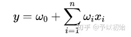
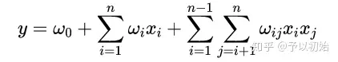
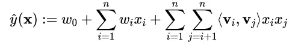
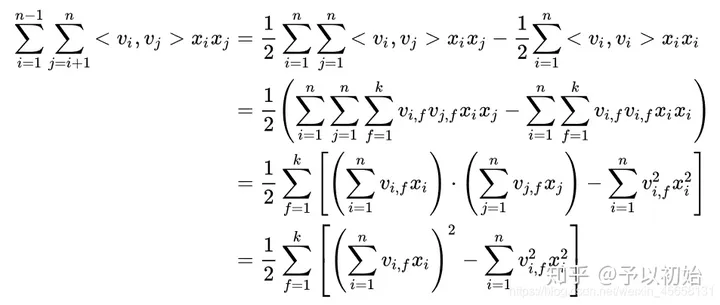

# 召回：

多路召回结合。

## 规则召回：

规则召回最为简单直接，典型的规则召回有兴趣标签Top、热门Top、新品Top、类目Top以及用户LBS Top等等。（应急预案就是，事件性质：中毒、输入性传染病、自然灾害等，涉及范围，危害程度等等相关，）

## 协同召回CF：

https://zhuanlan.zhihu.com/p/338582478
用户行为或明或暗地表达了他们对一些物品的喜欢程度，这些行为可以构成一个用户与物品的关系矩阵。（历史事件和对应使用的预案）

### 基于近邻的：

**UserCF：** 1.计算关系矩阵中两两用户向量之间的相似度；需要设定阈值；2.将用户集合涵盖的所有对象推荐至集合内所有用户。

--存在的问题：矩阵过于稀疏且巨大，难以存储计算且很难准确推荐；无法反映喜欢变化趋势。
**ItemCF：** 1.由关系矩阵得到物品与物品向量之间的相似度矩阵；2.获得用户历史行为数据中的正反馈（买过的、喜欢的）物品列表，利用物品相似度矩阵找出相似的其他物品。

#### ItemCF的改进Slope one：

1.计算物品之间的评分差的均值，记为物品间的评分偏差 (两物品同时被评分)；

2.根据物品间的评分偏差和用户的历史评分，预测用户对未评分的物品的评分；

3.将预测评分进行排序，取Top N对应的物品推荐给用户

#### 相似度指标：

欧式、余弦相似度，共现相似度（余弦相似度的另一种形式，适用于集合都是[0,1]），皮尔逊相关系数、杰卡德相似度

#### 修正平均分：

用以去掉不同用户之间的评分总体差异（体现打分趋势，避免个人高低分喜欢不同带来的影响）。
热门物品惩罚降权。

#### Hybrid I2I：

较早的做法是用物品特征信息辅助用户行为信息来辅助学习，但效果一般都不算太好。
现在多用嵌入特征的思想，用机器学习或深度学习方法，融合物品侧和用户行为侧信息，进行排序学习。

### 基于模型的：

基于模型的协同过滤算法则是从用户和物品的关系矩阵中学习一个可以泛化的模型，从而将那些矩阵空白处填满。

#### 矩阵分解思想：

将m*n的大矩阵分解为m*k、和k*n的小矩阵；可以使用梯度下降法求解，目标函数的目的是让原始评分与用户向量和物品向量之积（也就是“复原”的评分）的差尽量小。

#### SVD奇异值分解：

在矩阵分解目标函数的基础上，增加了对两个小矩阵的正则正则项，以保证泛化能力，避免过拟合。
新用户：A=USV’ —> U=A*V*S^-1
此时令A是一个新用户的1*n的矩阵，就可以得到这个用户不同因子的相关程度的向量，此后可以通过U矩阵与其他用户进行相似度计算，从而进行相应的推荐

#### FM因子分解机

最大的特征是用向量组合<vi,vj>去替代传统的特征组合wi,j，使得能够特征之间的隐式关系
DEEPFM：https://blog.csdn.net/m0_59596990/article/details/130479234

对于LR来说，，没有考虑特征之间的交叉，效果不佳。

因此FM算法多加了一项用于计算特征之间的交叉特征，

但对新的权重wij的更新十分困难，因为CF矩阵是稀疏的，很多都是0，没法对wij进行更新，且存储wij也造成了额外的空间开销。因此将wij替换为隐向量 <xi,xj>。对每个特征分量xi都引入一个k维的隐向量，于是FM计算成为：

**式子化简：**



化简之后，FM的复杂度从 **𝑂(𝑛2𝑘)** 降到线性的𝑂(𝑛𝑘) ，**更利于上线使用。**

**代码实现：**

```python
import torch.nn as nn
import torch
class FM_layer(nn.Module):
    def __init__(self, k, input) -> None:
        self.w0 = nn.Parameter(data=torch.randn(1,))
        self.wij = nn.Parameter(data=torch.randn(input.size(-1),1))
        self.vij = nn.Parameter(data=torch.randn(input.size(-1),k))
    
    def forward(self,input):
        # 逻辑回归部分
        lr_part = self.w0 + torch.matmul(input,self.wij)
        cross_part1 = torch.pow(torch.matmul(input,self.vij), 2)
        cross_part2 = torch.matmul(torch.pow(input,2), torch.pow(self.vij,2))
        cross = 0.5 * torch.sum(input=(cross_part1 - cross_part2),
                                dim=-1, keepdim=True)
        return torch.sigmoid(lr_part + cross)
```

#### FFM:

在FM基础上将隐向量个数扩展到(n-1)个，因为不需要和自己做特征交叉。但是，因为急剧增长的参数量，导致并不被广泛使用。

### 工程经验：

#### 1.稀疏矩阵的构造与存储：

COO格式是将矩阵中的非零元素以坐标的方式存储。（行号、列号、值）
对于COO格式的一种改进就是CSR格式，这种格式要求矩阵元按行顺序存储（拉成一维），每一行中的元素可以乱序存储。那么对于每一行，就不需要记录所有元素的行指标。（行偏移、列号、值）
CSC：原理同CSR，只不过是按列偏移（列偏移、行号、值）

#### 2.相似度计算消耗：

* **维度很大**

牺牲一定精度采样向量计算，例如100维抽50维
向量并行运算

* 用户量很大

将相似度计算拆成 Map Reduce 任务，将原始矩阵 Map 成键为用户对，值为两个用户对同一个物品的评分之积，Reduce 阶段对这些乘积再求和，Map Reduce 任务结束后再对这些值归一化；

或者别用usercf

#### 3.推荐分数计算效率：

1）只有相似用户喜欢过的物品需要计算，这个数量相比全部物品少了很多；

2）把计算过程拆成 Map Reduce 任务。

> Map Reduce：
>
> 1）遍历每个用户喜欢的物品列表；
>
> 2）获取该用户的相似用户列表；
>
> 3）把每一个喜欢的物品 Map 成两个记录发射出去，一个是键为 < 相似用户 ID，物品 ID，1> 三元组，可以拼成一个字符串，值为 < 相似度 >，一个是键为 < 相似用户 ID，物品 ID，0> 三元组，值为 < 喜欢程度 * 相似度 >，其中的 1 和 0 为了区分两者，在最后一步中会用到；
>
> 4）Reduce 阶段，求和后输出；
>
> 5）< 相似用户 ID，物品 ID, 0> 的值除以 < 相似用户 ID，物品 ID, 1> 的值

#### 4.冷启动问题：

•基于代表性：使用有代表性的项目和用户子集；
•基于内容：使用诸如文本、社交网络等的辅助信息；
•老虎机：考虑新项目中的EE问题（Exploration&Exploitation）；
•深度学习：使用黑盒子。

（如果要对政策和事件的使用协同过滤，那杰卡德或共现相似度比较合适布尔值，但事件不是连续的、有喜好的个体，因此协同过滤感觉不合适）

向量召回：https://zhuanlan.zhihu.com/p/472770659

## 向量召回

**做用户向量和视频向量的相似度筛选：**

（考虑到应急事件的关键词和预案之间，本身就都属于强语言关联，所以其实向量方法是合适的，但如何构建向量是个问题。有点类似llm问答中的文本搜索。）

### 用FM来做召回：

在训练完FM模型后，我们就可以得到用户和物料各个特征的隐向量。通过将用户和物料的隐向量做sum pooling就可以得到它们对应的Embedding向量，进而就可以它们的Embedding向量做相似召回。（m*k, n*k的k）

合理性：当我们在做用户个性化召回时，用户的属性是不变的，因此<user,user>可以直接忽略不计，同时也更关注用户和物料之间的匹配度，即<user,item>部分，因此即使不做计算<item,item>，产生的影响也相对有限。

没有考虑使用物料的一阶隐向量和二阶内部交叉，理论上不是最优解，主要是胜在可操作性比较强

### Youtube向量召回：

userembedding：<观看历史，搜索历史，用户其他特征等>的向量，输入3层mlp，以最后一层relu激活的向量为user embedding

itemembedding：上述relu后的结果再经过一个softmax，得到m*n（m个用户，n个item）的矩阵，作为item embedding。负采样训练。

### item2vec：

参考word2vec的思路。将文字序列替换为item访问序列。

基于Item2vec我们能直接得到的是物料Embedding，如果是i2i的召回方式的话直接将物料的Embedding做相似计算就可以得到召回结果。

u2i的召回方式，则需要基于物料的Embedding生成用户的Embedding。对于用访问记录的用户，而生成用户Embeeding最简单的方式是，将用户最近访问过的商品做avg操作来作为用户的Embeeding，复杂一点的方式则可以加一些时间衰减或者attention的操作。

* 冷启动时，可以采用与新用户静态描述相似的老用户向量。

（整体来说，item2vec的方式也比较更着重于喜好变化趋势，强调用户历史行为的相关性）

### 双塔召回：

（本身是用于做query和doc的相似度计算，还比较适合预案推荐）

现在所说的双塔召回并不是某种具体的算法，而是一种架构范式。即user item分别有自己的embedding网络，在最后一步匹配层前没有任何交叉。可以实现在线user embedding 离线item embedding，降低工程成本。

#### 微软改进：

结合了term信息的双塔，在原本学习语义联系的双塔模型之上，增加了一个Local model，输入是一个nq∗nd的矩阵mm，nq是query中term个数，nd是doc中term个数，位置m(i,j)=0or1m(i,j)=0or1表示query里的第i个词是否与doc里的第j个词匹配，对这个输入矩阵通过convolution抽取特征并向量化。

（如果使用doc的全部term是不是太大了，有一些结合了关键字匹配的想法）

* 召回时的样例选择：

召回是为了区分感兴趣和不感兴趣（相似和不相似）

* 正样本：热门欠采样、冷门过采样，重复或丢弃概率与热门程度挂钩，
* 简单负样本：当全体样本很大时，召回样本比例几乎为0，此时非均匀随机抽样全体样本作为负样本即可，概率正比于点击次数^0.75；batch内负样本，取非<user1,item1>的对都可以是负样本，例如<user1,item2>，但负样本概率p过高，训练时需要在相似度后修正偏差：-logp
* 困难&极度困难负样本：通过召回，但被粗排/精排淘汰的样本。一般和简单负样本混合使用。
* **错误**：曝光但是没有点击的物品作为负样本。只能作为排序的负样本，召回要曝光的都是哪怕一点点感兴趣的，而感兴趣的程度由后续排序决定。

## TallRec:

https://zhuanlan.zhihu.com/p/650495502

### 指令微调

任务目标：

* 由用户交互的历史项目被表示为一个由 [item_1, item_2, ...,item_n] 表示的序列。序列中的每个项目都包含 ID 和 文本信息（例如，电影名称或书名）。
* 此外，该序列还伴有一个用户反馈序列，表示为[ r a t e 1 , r a t e 2 , . . . , rat e n ] ，其中 rate_i∈{1,0} 表示用户是否喜欢item_i
* 在作者的设置中，作者的任务是利用表示为 M 的 LLM 来构建一个表示为M_rec 的 LRLM，它可以根据用户的推荐任务指令和用户的历史交互来预测用户是否会喜欢一个新项目（表示为item_n+1）。

整体过程：

* 构造 **任务指令** Task Instruction；
* 指定 **任务输入** Task Input 和 **任务输出** Task Output；
* 构造 **指令输入** Instruction Input ( Task Instruction + Task Input ) 和 **指令输出** Instruction Output（ 也即 Task Output ）；
* 根据 <指令输入，指令输出> 对，完成对LLM模型的精调。

利用有限数量的用户历史交互数据来预测用户对新项目的偏好。

### Alpace

Alpaca是一个基于Meta的LLaMA 7B模型经过微调的**指令遵循型**语言模型。Alpaca模型的开发过程涉及到从LLaMA 7B模型开始，通过52K条**指令**遵循演示进行微调，这些演示是以OpenAI的text-davinci-003模型为样本生成的。


1. 首先，基于175个人工编写的指令-输出对，作为self-instruct的种子集；
2. 基于种子集，提示text-davinci-003生成更多的指令；
3. 优化self-instruct：简化生成pipeline，大幅降低成本；
4. 使用openai api生成52k不重复的指令和对应输出，成本低于500美元；
5. 使用huggingface框架来微调llama模型。过程中，使用 fully sharded data parallel和mixed precision training两项技术；

# 特征交叉

## GBDT+LR

* LR逻辑回归

逻辑回归是在线性回归的基础上加了一个 Sigmoid 函数（非线形）映射，使得逻辑回归成为了一个优秀的分类算法， 学习逻辑回归模型， 首先应该记住一句话：**逻辑回归假设数据服从伯努利分布,通过极大化似然函数的方法，运用梯度下降来求解参数，来达到将数据二分类的目的。**

**逻辑回归模型将推荐问题转化成了一个点击率预估问题**

逻辑回归一般过程：

1. 将用户年龄、性别、物品属性、物品描述、当前时间、当前地点等特征转成数值型向量
2. 确定逻辑回归的优化目标，比如把点击率预测转换成二分类问题， 这样就可以得到分类问题常用的损失作为目标， 训练模型
3. 在预测的时候， 将特征向量输入模型产生预测， 得到用户“点击”物品的概率
4. 利用点击概率对候选物品排序， 得到推荐列表

**优点：**

1. LR模型形式简单，可解释性好，从特征的权重可以看到不同的特征对最后结果的影响。
2. 训练时便于并行化，在预测时只需要对特征进行线性加权，所以 **性能比较好** ，往往适合处理 **海量id类特征** ，用id类特征有一个很重要的好处，就是 **防止信息损失** （相对于范化的 CTR 特征），对于头部资源会有更细致的描述
3. 资源占用小,尤其是内存。在实际的工程应用中只需要存储权重比较大的特征及特征对应的权重。
4. 方便输出结果调整。逻辑回归可以很方便的得到最后的分类结果，因为输出的是每个样本的概率分数，我们可以很容易的对这些概率分数进行cutoff，也就是划分阈值(大于某个阈值的是一类，小于某个阈值的是一类)

**局限性**

1. 表达能力不强， 无法进行特征交叉， 特征筛选等一系列“高级“操作（这些工作都得人工来干， 这样就需要一定的经验， 否则会走一些弯路）， 因此可能造成信息的损失
2. 准确率并不是很高。因为这毕竟是一个线性模型加了个sigmoid， 形式非常的简单(非常类似线性模型)，很难去拟合数据的真实分布
3. 处理非线性数据较麻烦。逻辑回归在不引入其他方法的情况下，只能处理线性可分的数据， 如果想处理非线性， 首先对连续特征的处理需要先进行 **离散化** （离散化的目的是为了引入非线性），如上文所说，人工分桶的方式会引入多种问题。
4. LR 需要进行 **人工特征组合** ，这就需要开发者有非常丰富的领域经验，才能不走弯路。这样的模型迁移起来比较困难，换一个领域又需要重新进行大量的特征工程。

* GBDT

GBDT全称梯度提升决策树，在传统机器学习算法里面是对真实分布拟合的最好的几种算法之一。

gbdt通过多轮迭代， **每轮迭代会产生一个弱分类器**， 每个分类器在上一轮分类器的残差基础上进行训练。 gbdt对弱分类器的要求一般是足够简单， 并且低方差高偏差。 因为训练的过程是通过降低偏差来不断提高最终分类器的精度。 由于上述高偏差和简单的要求，每个分类回归树的深度不会很深。最终的总分类器是将每轮训练得到的弱分类器加权求和得到的（也就是加法模型）。

GBDT——>XGBoost——>LightGBM

[常考点：GBDT - XGBoost - LightGBM - 知乎 (zhihu.com)](https://zhuanlan.zhihu.com/p/275052805)

## FM因子分解（粗排以前会用）

FM 作为推荐算法广泛应用于推荐系统及计算广告领域，通常用于预测点击率 CTR（click-through rate）和转化率 CVR（conversion rate）。

FM在线性模型的基础上添加了一个多项式，用于描述特征之间的二阶交叉。


参数 𝑤𝑖𝑗 学习困难，因为对 𝑤𝑖𝑗 进行更新时，求得的梯度对应为𝑥𝑖𝑥𝑗，当且仅当 𝑥𝑖与 𝑥𝑗都非 0 时参数才会得到更新。作者对每个特征分量 𝑥𝑖 引入 𝑘 维（k<<n) 辅助向量 𝑣𝑖=(𝑣𝑖1,𝑣𝑖2,...,𝑣𝑖𝑘)，每个特征对应一个总共 𝑛 个向量，然后利用向量内积的结果 𝑣𝑖𝑣𝑗𝑇 来表示原来的组合参数 𝑤𝑖𝑗 .

这样要学习的参数从 𝑛(𝑛−1)/2 个 𝑤𝑖𝑗 系数变成了元素个数为 𝑛×𝑘 的 𝑉 矩阵，因为 𝑘<<𝑛 ， 所以该做法降低了训练复杂度。

**FM** ：模型参数量为 1+𝑛+𝑛𝑘 ，𝑛 为特征数， 𝑘 为隐向量维度。公式可化简，化简之后的复杂度为 𝑂(𝑛𝑘) 线性复杂度，随着特征数 𝑛 线性增长。

tf代码

```python
    def call(self, inputs, **kwargs):
        # inputs维度判断，不符合则抛出异常
        if K.ndim(inputs) != 2:
            raise ValueError("Unexpected inputs dimensions %d, expect to be 2 dimensions" % (K.ndim(inputs)))

        # 线性部分，相当于逻辑回归
        linear_part = tf.matmul(inputs, self.w) + self.w0   #shape:(batchsize, 1)
        # 交叉部分——第一项
        inter_part1 = tf.pow(tf.matmul(inputs, self.v), 2)  #shape:(batchsize, self.k)
        # 交叉部分——第二项
        inter_part2 = tf.matmul(tf.pow(inputs, 2), tf.pow(self.v, 2)) #shape:(batchsize, k)
        # 交叉结果
        inter_part = 0.5*tf.reduce_sum(inter_part1 - inter_part2, axis=-1, keepdims=True) #shape:(batchsize, 1)
        # 最终结果
        output = linear_part + inter_part
        return tf.nn.sigmoid(output) #shape:(batchsize, 1)
```

## FFM

FFM 将隐向量进一步细分，每个特征具有多个隐向量 (等于 field 的数目)。

**FFM** ：模型参数量为 1+𝑛+𝑛(𝐹−1)𝑘 ， 𝐹 为 field 数。公式不可化简，复杂度为 𝑂(𝑛2𝑘) ，随着特征数 𝑛 平方级增长。

在隐向量矩阵维度上会比FM多一个维度，field数目由特征数目-1决定

## PNN

# 排序算法

### Pointwise排序学习（单点法）总结：

1. 将文档转化为特征向量，每个文档都是独立的
2. 对于某一个query，它将每个doc分别判断与这个query的相关程度
3. 将docs排序问题转化为了分类（比如相关、不相关）或回归问题（相关程度越大，回归函数的值越大）
4. 从训练数据中学习到的分类或者回归函数对doc打分，打分结果即是搜索结果，CTR可以采用Pointwise方式进行学习，对每一个候选item给出一个评分，基于评分进行排序
5. 仅仅考虑了query和doc之间的关系，而没有考虑排序列表中docs之间的关系
6. 主要算法：转换为回归问题，使用LR，GBDT，Prank, McRank

**缺陷**

* ranking 追求的是排序结果，并不要求精确打分，只要有相对打分即可。
* pointwise 类方法并没有考虑同一个 query 对应的 docs 间的内部依赖性。一方面，导致输入空间内的样本不是 IID 的，违反了 ML 的基本假设，另一方面，没有充分利用这种样本间的结构性。其次，当不同 query 对应不同数量的 docs 时，整体 loss 将会被对应 docs 数量大的 query 组所支配，前面说过应该每组 query 都是等价的。
* 损失函数也没有 model 到预测排序中的位置信息。因此，损失函数可能无意的过多强调那些不重要的 docs，即那些排序在后面对用户体验影响小的 doc。

**改进** * Pointwise 类算法也可以再改进，比如在 loss 中引入基于 query 的正则化因子的 RankCosine 方法。

### pairwise

**pairwise将其转化为pair分类问题**

Pairwise 类方法，其 L2R 框架具有以下特征：

* 输入空间中样本是（同一 query 对应的）两个 doc（和对应 query）构成的两个特征向量；
* 输出空间中样本是 pairwise preference；
* 假设空间中样本是二变量函数；
* 损失函数评估 doc pair 的预测 preference 和真实 preference 之间差异。 这里讨论下，关于人工标注标签怎么转换到 pairwise 类方法的输出空间：
* 如果标注直接是相关度 $s_j$，则 doc $pair (x_u,x_v)$ 的真实标签定义为 $y_{u,v}=2*I_{s_u>s_v}-1$
* 如果标注是 pairwise preference $s_{u,v}$，则 doc $pair (x_u,x_v)$ 的真实标签定义为$y_{u,v}=s_{u,v}$
* 如果标注是整体排序 π，则 doc $pair (x_u,x_v)$ 的真实标签定义为$y_{u,v}=2*I_{π_u,π_v}-1$

细则：

* 输入: 一个pair对document (A,B)
* 输出标签: 相对顺序label (1, 0.5, 0)

其中1表示相关性等级A>B，0.5表示相关性等级A=B，0表示相关性等级A<B。


# **推荐系统特征分为哪几类，连续特征离散化方法以及为什么需要对连续特征离散化（好处）**

* 用户侧特征（profile、bias），item侧特征（属性、bias），context侧特征，笛卡尔积特征（id类、可泛化类特征），序列特征
* 连续特征离散化方法比如等频分桶、log取整
* 连续特征离散化好处
  * 引入非线性变换，增强模型性能
  * 对异常值不敏感，防止过拟合
  * 可进一步对离散后的特征进行统计以及特征组合
  * 增强模型可解释性
