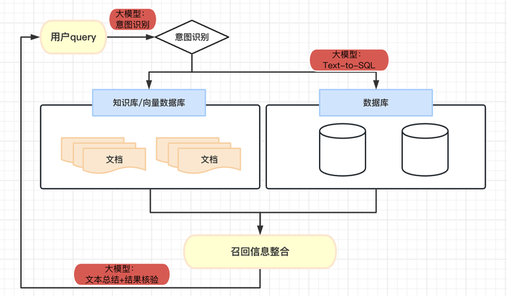
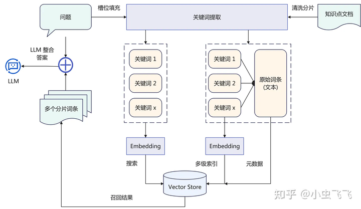
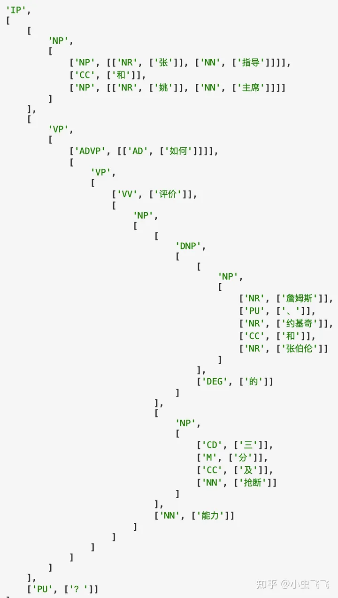
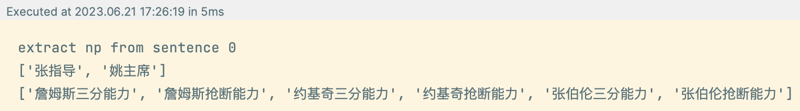
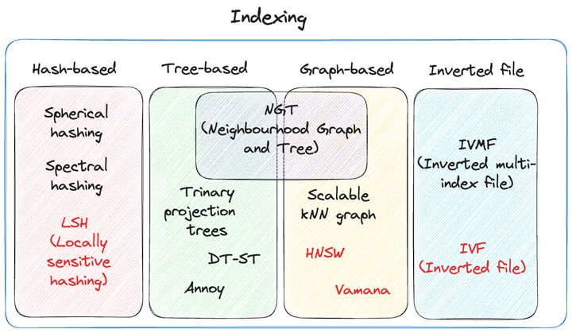
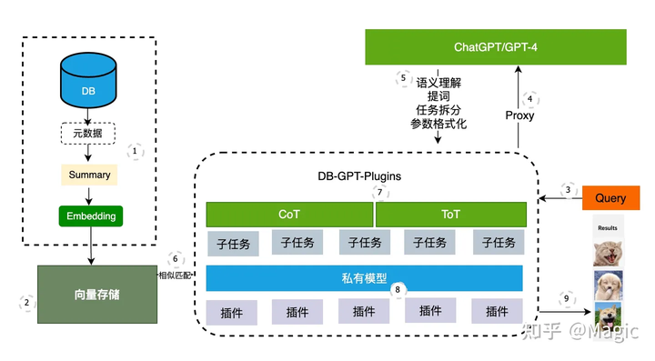
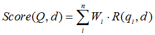

# 向量搜索思想下的设计概览

[LLM+Embedding构建问答系统的局限性及优化方案 - 知乎 (zhihu.com)](https://zhuanlan.zhihu.com/p/641132245)

[大模型+知识库/数据库问答的若干问题（三） - 知乎 (zhihu.com)](https://zhuanlan.zhihu.com/p/642125832)



## 一、意图识别

对于长文本，直接将query向量与文本切片向量进行相似度搜索效率低下，精准度低下。且浪费token。

### 1 方式一：关键词/主题词提取 + 基于多个关键词向量搜索



无监督关键词提取方法主要有三类：

**基于统计特征的关键词提取** （TF,TF-IDF）；

* 基于统计特征的关键词提取算法的思想是利用文档中词语的统计信息抽取文档的关键词：**噪音很大**

**基于词图模型的关键词提取** (PageRank,TextRank)；

* 基于词图模型的关键词提取首先要构建文档的语言网络图，然后对语言进行网络图分析，在这个图上寻找具有重要作用的词或者短语，这些短语就是文档的关键词；

**基于主题模型的关键词提取** (LDA)

* 基于主题关键词提取算法主要利用的是主题模型中关于主题分布的性质进行关键词提取；

**基于LLM的关键词提取：**

* 优点是对输入没什么限制，缺点是受到LLM能力限制，而且多轮交互效率下降。

> 对知识库使用**关键词向量**代替原始文本向量：
>
> 单个关键词对应一段文本可能太冗余，应该更适合小切片，例如1-2句话的切片，每个切片对应1-2个关键词，降低冗余存取。
>
> 但小切片可能导致上下文信息丢失。

基于多个关键词的搜索（对query提取关键词）可以看作吸取多路召回的思想


从问题的不同角度、层级去进行搜索并获取不同的topk结果。

**关于query的关键词提取+意图补充：**

通过对句子进行 词性标记、成分句法分析，查找

* 主体：并列关系 [张指导, 姚主席]
* 客体：[三分能力]，三分和能力是修饰关系
* 客体还存在三个并列的领事关系（所属关系）：[詹姆斯, 约基奇, 张伯伦]
* 语义关系

随后将主客体和并列的领事关系叉乘平铺后，扩大query关键词。

例子：张指导和姚主席如何评价詹姆斯、约基奇和张柏伦的三分及抢断能力：

词性标注+成分句法分析：



叉乘：



速度上要比LLM快很多，可用于对query的处理。

### 2 方式二：中心化大模型做语义识别

通过深度学习、统计学习，甚至 LLM ，理解用户问题提取语义槽中需要的内容。

例如：通过 System Role 告知LLM 需要提取槽位信息，让 LLM通过多轮对话引导用户给出所有槽位信息。

还是以游戏攻略为例，玩家咨询球员的打法，那么必须提供：球员姓名，年代（比如2020/2022 年），比赛模式。对应的语义槽可以定义为：

```text
"球员打法" : {
        "球员名称" : ____,
        "年代" : ____,
        "比赛模式": ____,
    }
```

通过LLM，还可以完成对用户输入的补充、消歧、引导

* 引导能力，槽位补充能力
  * 用户：我想查一下电量；Bot: 好的，请问您想查的时间范围、空间范围，和分项是？用户：查上个月的整个园区的吧；Bot:好的，那请问是要查照明、空调、动力的还是其他类型的耗电量？用户：就查询各个分项的，和总体的都查询。Bot:好的，那我复述一下，您希望查询，"照明、空调、动力的还是其他类型的耗电量，以及总体耗电量，时间范围是上个月，空间范围是整体园区"，请问是吗？用户：是的/没问题/对。
  * 引导用户表述完整，查询要素，指标、维度、范围
  * 槽位修复能力

    * 比如：“好的，查询目标设置为查询温度，请问查询哪个空间的温度？”
* 指代消除，解析能力
  * 澄清，它、这等指代词的具体含义
* 改写
  * 改写模块其实非常关键，数据库的存储有特定的形式，但是用户不会按照你的底层数据结构去写，例如，用户不见得会输入和平精英，而是吃鸡，数据库里可不见得会存吃鸡。

### 3  向量索引类型

#### **按数据结构区分：**



哈希索引

哈希索引（Hash-based index）是一种基于哈希函数的索引方法，例如局部敏感哈希（Locally Sensitive Hashing，LSH）。哈希索引将高维数据转换为低维哈希码，旨在尽可能保持原始数据的相似性。在建立索引时，数据集会被多次哈希，以确保相似的数据点更有可能发生碰撞（这与传统的哈希技术相反，传统哈希技术的目标是尽量减少碰撞）。在查询时，查询点也会使用与建立索引时相同的哈希函数进行哈希，由于相似的数据点被分配到同一个哈希桶中，所以检索非常快速。哈希索引的主要优点是在处理大量数据时非常快速，但缺点是准确性较低。

基于树的索引

基于树的索引结构（Tree-based index）通过二叉搜索树实现在高维空间中的快速搜索。树的构建方式使得相似的数据点更有可能位于同一子树中，从而更快地发现近似最近邻。Annoy（Approximate Nearest Neighbors Oh Yeah）是一种使用二叉搜索树森林的方法，由Spotify开发。基于树的索引的缺点是，它们只对低维数据表现较好，在高维数据中准确性较低，因为它们无法充分捕捉数据的复杂性。

基于图的索引

基于图的索引（Graph-based index）是基于数据点在向量空间中形成图的思想构建的索引。图中的节点表示数据值，连接节点的边表示数据点之间的相似性。图的构建方式使得相似的数据点更有可能通过边连接在一起，而近似最近邻（ANN）搜索算法被设计为以高效的方式遍历图。图的索引主要优势在于能够在高维数据中找到近似最近邻，并且具有较高的内存效率，提高性能。下面是图的索引的两个例子：HNSW和Vamana。 将图的索引与树的索引概念相结合的扩展是NGT3（Neighbourhood Graphs and Trees）。由Yahoo! Japan Corporation开发，它在索引过程中进行了两个构建操作：一个将密集的kNN图转换为双向图，另一个逐步构建可导航的小世界（NSW）图。与纯图的索引不同之处在于它使用了类似树状结构（Vantage-point，或称为“VP”树）的范围搜索，这是在图的构建过程中的一种贪婪搜索的变体。由于这两个构建操作导致节点具有较高的出度，为了避免组合爆炸，搜索起点使用范围搜索使遍历更加高效。这使得NGT成为一种混合的图和树的索引。

倒排文件索引

倒排文件索引（Inverted file index，IVF）将向量空间划分为多个细分的单元，称为Voronoi图，这些图减少了搜索空间，类似于聚类的效果。为了找到最近邻，ANN算法只需定位最近Voronoi图单元的质心，然后仅在该单元内进行搜索。IVF的好处在于它有助于设计快速缩小相似性感兴趣区域的ANN算法，但其原始形式的缺点是在细分向量空间的量化步骤可能对于非常大量的数据而言速度较慢。因此，IVF通常与量化方法（如产品量化，PQ）结合使用以提高性能。

#### **压缩与否**

平坦索引 FLAT

在使用ANN（非穷举）搜索时，当现有的索引（如IVF或HNSW）直接计算查询向量与数据库向量之间的距离时，它被称为“平坦”索引。

量化索引

量化索引（Quantized indexes）是将现有的索引（如IVF、HNSW、Vamana）与量化等压缩方法结合起来，以减少内存占用并加快搜索速度。量化通常有两种类型：标量量化（Scalar Quantization，SQ）和产品量化（Product Quantization，PQ）。SQ将向量中的浮点数转换为整数（在字节大小上要小得多），通过将向量对称地分成考虑每个维度的最小值和最大值的区间。 PQ是一种更复杂的方法，它考虑了每个向量维度上的值分布，同时进行压缩和数据降维。PQ的思想是将较大维度的向量空间分解为较小维度子空间的笛卡尔积，通过将每个子空间量化为自己的聚类来表示向量，使得可以从它们的代码（称为重构值）有效地估计它们之间的距离。与SQ不同，PQ使用了非对称的分箱过程，增加了精度，因为它将每个子空间内向量的分布纳入了近似距离估计的一部分。然而，这也存在一个权衡，即它会显著降低召回率。

#### 常见索引类型

##### IVF-PQ

VF-PQ（向量倒排文件索引与产品量化）是在Milvus和LanceDB等数据库中提供的复合索引。索引的IVF部分用于缩小搜索空间，而PQ部分用于加速查询向量与数据库向量之间的距离计算，并通过量化向量来减少内存需求。由于在大型数据集上存储这么多32位或64位浮点数可能非常昂贵，产品量化通过两个阶段来解决这个问题：第一阶段是粗量化阶段，将向量分成m个子向量，每个子向量的维度为d/m，并为每个子向量分配一个量化值（称为“重构值”），将原始向量映射到该子空间中点的质心。 第二阶段类似于k-means聚类，通过最小化原始向量与量化向量质心之间的距离来学习一组“码本”值。通过将大型高维向量映射为较小的低维子向量，只需存储量化值的码本，从而使内存占用量大大减小。

##### HNSW

分层可导航小世界（HNSW）图是构建向量索引中最受欢迎的算法之一。在高层次上，HNSW基于小世界图现象构建，该现象表明尽管图中的大多数节点不是彼此的邻居，但给定节点的邻居很可能是彼此的邻居，无论图的大小如何。基本上，图中的任何节点都可以通过相对较少的步骤从其他节点到达。

您的数据所在的向量空间也可以被视为一个可导航的小世界（NSW）图，其中节点表示数据点，边表示相似性，即描述两个节点在向量空间中的接近程度的数值。

NSW图的一个问题是它是平坦的 - 某些节点可能会创建密集的“交通枢纽”，降低遍历的效率，并导致方法的搜索复杂度为多对数级别。HNSW通过分层图结构来解决这个问题，并修复了每个节点邻居数量的上限，将搜索复杂度降低到对数级别。基本思想是根据节点之间的距离尺度将最近邻分层在图中。图中的长边保留在顶层（即最稀疏的层），每个较低的层包含的边比上面的层更短。最低层形成完全图，并且搜索是从上到下进行的。如果所有层都“折叠”到彼此中，HNSW图本质上就是一个NSW图。

在顶层给定任意入口点的情况下，可以快速遍历整个图，逐层降低，直到找到与查询向量最近的邻居。

## 二、Text to SQL

### 1 LLM分解子任务+小模型生成语句

当库表数量繁多，经常需要进行多表联合查询时，LLM处理这个任务时，有两个大的难点：

* 1. LLM当前不具备6张表关联如此复杂的SQL编写能力。
* 2. 受限与Token长度，我们无法直接将所有的表信息提供给模型来生成正确的SQL语句。 基于大模型当前的能力，我们通过系统架构优化的方式，对此问题进行了解决。



会根据Query + Summary的内容让大模型先完成语义提取。 将复杂问题的理解，格式化输出一个固定的ToT的模版内容，将复杂的任务拆解为几个独立的简单步骤。

在此之后，我们将每个小步的任务丢给小模型去处理。 当然在这个环节，我们为了更稳定的效果，还需要跟大模型完成一些交互。例如当小模型输出的格式不准确时，可以使用大模型来对输出进行格式化。

**但是，和大模型服务交互意味着一些内部资源的泄露。只生成TOT模版在一定程度上可以避免库表信息泄露。**

### 2 开源ft

使用开源大模型进行finetune，开源SQL数据集：WikiSQL，Spider，Cspider，Sparc，CHASE，BIRD

### 3 过程

1. 先验过滤：根据用户输入（或TOT模版），通过embedding检索的方式搜索出topk数据表。数据表的 schema 设计非常重要，需要描述清楚这个表它的主体信息以及表中重要字段和字段含义。embedding可以提前存储。
2. 构建Prompt，生成SQL：开头角色和要求的定义+外部知识+库表信息+one/few-shot+问题
3. 检查SQL语句正确性
4. 执行SQL语句，返回格式化结果
5. 根据数据结果，整合、计算，回答问题。

> 思维链不一定完全有益：在模型没有给定数据库值描述和零样本（zero-shot）情况下，模型自身的 COT 推理可以更准确地生成答案。然而，当给定额外的知识（knowledge evidence）后，让 LLM 进行 COT，发现效果并不显著，甚至会下降。因此在这个场景中， LLM 可能会产生知识冲突。如何解决这种冲突，使模型既能接受外部知识，又能从自身强大的多步推理中受益，将是未来重点的研究方向。

## DB-GPT项目

### 数据处理

需要注意5个方面：

**Schema Encoding：** 对数据库的结构模式进行编码。在数据库中，我们通常会通过主键和外键进行跨表连接，通过记录这种连接关系可以保留数据库表列之间的一个结构信息，不至于在直接简单序列化的过程中丢失二维表结构。

**Schema Linking：** 它指的是schema和question单词之间的关系。在一般的对话中，用户他有时并不会非常精准的说出哪一些表哪一些列的名字，这时候就需要模型能够去判断用户在这个问句过程中，到底提到了哪一些表哪一些列。

**Question Dependency Structure：** 由于用户是用自然语言进行询问，因此呢他在句法上存在一些依存关系。词之间不同的依存关系可能指向不同的字段。复杂的句式也可能加大LLM的理解难度。

**Questions Coreference：指代消解。** 这是为多轮的Text-to-SQL任务所设计的一种关系,比如说用户呢在最开始询问which students have a cat at their pet?然后在第二轮用户又问到what are they majoring in?然后在第三轮用户还会问Also, how old are they?第二轮和第三轮中的这个指代词they所指代的呢都是students而不是pets,这样的一个指代关系，也是一个多轮对话中经常出现的一种关系。

**Database Content Mentions：** 最后也是一个非常重要的关系称之为**数据库内容的提及**，因为在实际情况下，用户在询问一个问题时，他可以提到一个具体列中的某个值，那么在这种情况下，信息内容匹配就显得非常重要。比如用户询问Show names of properties that are either (houses)or apartments，由于horses和apartments并不是数据库的一个表明或者一个列名，所以在进行Schema Encoding或者说在序列化的时候并不会被考虑，然而如果只给出这两个单词，模型根本就无法猜测到他们到底是属于哪一个列，所以这里我们会使用模糊匹配的方式，来搜寻可能的数据库内容，并将这种信息告诉模型

综合考虑的格式化信息处理：

```json
{
        "query": sample["query"],#要生成的sql指令
        "question": sample["question"],#输入的问题
        "db_id": db_id,#数据库名称
        "db_path": db_path,#数据库文件的地址
        "db_table_names": schema["table_names_original"],#数据库中的表名
        "db_column_names": [
            {"table_id": table_id, "column_name": column_name}
            for table_id, column_name in schema["column_names_original"]
        ],
        "db_column_types": schema["column_types"],
        "db_primary_keys": [{"column_id": column_id} for column_id in schema["primary_keys"]],
        "db_foreign_keys": [
            {"column_id": column_id, "other_column_id": other_column_id}
            for column_id, other_column_id in schema["foreign_keys"]
        ],
    }
```

一个示例：

```python3
{'query': 'SELECT count(*) FROM head WHERE age  >  56',
   'question': 'How many heads of the departments are older than 56 ?',
   'db_id': 'department_management',
   'db_path': './spider/database',
   'db_table_names': ['department', 'head', 'management'],
   'db_column_names': [{'table_id': -1, 'column_name': '*'},
    {'table_id': 0, 'column_name': 'Department_ID'},
    {'table_id': 0, 'column_name': 'Name'},
    {'table_id': 0, 'column_name': 'Creation'},
    {'table_id': 0, 'column_name': 'Ranking'},
    {'table_id': 0, 'column_name': 'Budget_in_Billions'},
    {'table_id': 0, 'column_name': 'Num_Employees'},
    {'table_id': 1, 'column_name': 'head_ID'},
    {'table_id': 1, 'column_name': 'name'},
    {'table_id': 1, 'column_name': 'born_state'},
    {'table_id': 1, 'column_name': 'age'},
    {'table_id': 2, 'column_name': 'department_ID'},
    {'table_id': 2, 'column_name': 'head_ID'},
    {'table_id': 2, 'column_name': 'temporary_acting'}],
   'db_column_types': ['text',
    'number',
    'text',
    'text',
    'number',
    'number',
    'number',
    'number',
    'text',
    'text',
    'number',
    'number',
    'number',
    'text'],
   'db_primary_keys': [{'column_id': 1}, {'column_id': 7}, {'column_id': 11}],
   'db_foreign_keys': [{'column_id': 12, 'other_column_id': 7},
    {'column_id': 11, 'other_column_id': 1}]}
```

然后从一个数据库中找到与一个问题最匹配的行列数据信息，将该行列的相关数据库的结构（表名、列名、主键、外键等）用自然语言描述出来作为回答。

# 三、结果核验与总结

将本地搜索系统返回的结果进行二次加工，比如发挥 LLM 的：

* 结果检验
* 总结、概括
* 格式整理
* 去重、翻译
* 从会话历史中，提取上下文，进行分析处理等能力

可以使用思维链进行反复推理，来生成最终正确的结果。

## 四、对齐（毒性检验）

LLM 会努力让其回答符合人类的价值观，这一工作在模型训练中叫做“对齐”（Align），让 LLM 拒绝回答仇恨、暴力相关的问题。如果 LLM 未按照设定回答了仇恨、暴力相关问题，我们就称之为检测出了毒性（Toxicity）。

对于业务需求，其毒性的范围实际上增加了，即，所有回答了非公司业务的内容都可以称之为存在毒性。

需要使用 Few-Shot 的方法去构建毒性检测的提示词，让 LLM 在拥有多个示例的情况下，判断用户的提问是否符合企业服务的范围。

生成前检验（问题）+生成后检验（回答）


# 五、一些值得注意的

## 1、数据增强

原生数据不足以进行微调时，尤其是类似问答或选择题这样的情况。

可以利用GPT或其他效果好的大模型生成辅助训练数据；注意类似多选题时，大模型天生会注重顺序问题，所以一个问题可以打乱选项顺序变为多个问题，来减少顺序带来的影响。

## 2、TF-IDF与BM25对比

* TF-IDF

 **tfidf算法的优点** ：简单，快速，如果语料库是不变的话，可以提前离线计算好语料库中所有词的tfidf值。

 **缺点：** 仅以“词频”度量词的重要性，后续构成文档的特征值序列，词之间各自独立，无法反映序列信息；庞大的稀疏矩阵不利于后面处理。

* BM25

bm25 是一种用来评价搜索词和文档之间相关性的算法，用简单的话来描述下bm25算法：我们有一个query和一批文档Ds，现在要计算query和每篇文档D之间的相关性分数。



Q表示Query，qi表示Q分词之后的每个单词；d表示一个文档；Wi表示词qi的权重；R(qi，d)表示词qi与文档d的相关性得分。所以query中每个词与文档的相关性的加权和就是query与文档的相关性得分。而求query中每个词的权重就可以使用上面所讲的tfidf，但常常只用idf。

**bm25其实就是把query中每个词，在每篇文档中的tfidf（改良后的）值求和即为该query与该文档的相似性得分。**

## 3、kv cache

LLM infer性能优化。

当前轮输出token与输入tokens拼接，并作为下一轮的输入tokens。因此第 i+1 轮推理时必然包含了第 i 轮的部分计算。KV Cache的出发点就在这里，缓存当前轮可重复利用的计算结果，下一轮计算时直接读取缓存结果，就是这么简单，不存在什么Cache miss问题。

目前各大模型推理都实现了KV Cache，下面就看如何使用了。我们可以在上面代码基础上修改，主要改动：

* 在推理时新增了 past_key_values 参数，该参数就会以追加方式保存每一轮的K V值。kvcache变量内容为((k,v), (k,v), ..., (k,v))，即有n_layers 个 k,v 组成的一个元组，其中 k 和 v 的维度均为 [b, n_head, s, head_dims]。这里可以顺带计算出每轮推理对应的 cache 数据量为 2∗b∗s∗ℎ∗n_layers，这里 s 值等于当前轮次值。以GPT3-175B为例，假设以 float16 来保存 KV cache，senquence长度为100，batchsize=1，则 KV cache占用显存为 2×100×12288×96×2 Byte= 472MB。
* 推理输出的token直接作为下一轮的输入，不再拼接，因为上文信息已经在 kvcache 中。
## 五、存在的问题

这个方案效果上很难让用户买账。从算法策略上来说，主要有如下问题：

* 【P1】输入文档的格式不一定适合切分chunk或者LLM问答。（现状40分）
* 【P2】embedding模型的能力较差。（开源模型现状20分，闭源模型稍好但也没超过60分）
* 【P3】LLM模型的问答能力（开源模型能做到60分）
* 【P4】结果缺乏信息来源支撑（0分）

【P1】问题中最典型的例子是PDF、PPT、Excel格式的文件。本质来说就是这些格式中的原始信息组织方式并不是类似markdown的结构化文本。想要使用LLM进行有效处理，需要重新对其中内容进行语义块的识别和结构分析。

目前大家都已经认知到PDF版式解析的重要性，而PPT的语义解析可能是一个尚未被普遍认知到的卡点。

【P2】embedding模型并不是一个合格的召回方案，只是因为它的使用门槛较低，所以目前被大量使用。

目前来看召回策略是需要正经当作一个语义搜索系统来设计和建造的。说到搜索系统的时候，很多人觉得就是上一个Elasticsearch（简称ES）就行了。但ES只是一个关键字的硬性检索系统，光靠ES并不能满足该场景语义召回的需求。甚至我觉得ES都不是该环节中的主要部分。ES主要只是提供了倒排索引和布尔查询表达式的计算逻辑而已。

【P3】LLM模型的回答能力相对还好，但仍然可能出现幻觉问题，并可能受到prompt hacking的影响。

【P4】目前我认为，对于一个认真的知识库问答系统来说，来源标识是必要的功能，它可以有效地降低用户对于幻觉的疑虑，并方便用户找到信息来源进行进一步的核实
