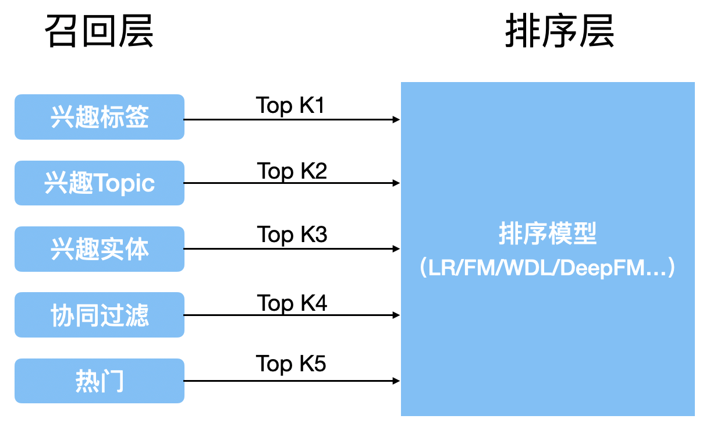

# 概览

[LLM+Embedding构建问答系统的局限性及优化方案 - 知乎 (zhihu.com)](https://zhuanlan.zhihu.com/p/641132245)

[大模型+知识库/数据库问答的若干问题（三） - 知乎 (zhihu.com)](https://zhuanlan.zhihu.com/p/642125832)


# 一、意图识别

对于长文本，直接将query向量与文本切片向量进行相似度搜索效率低下，精准度低下。且浪费token。

## 1 方式一：关键词/主题词提取 + 基于多个关键词向量搜索


无监督关键词提取方法主要有三类：

**基于统计特征的关键词提取** （TF,TF-IDF）；

* 基于统计特征的关键词提取算法的思想是利用文档中词语的统计信息抽取文档的关键词：**噪音很大**

**基于词图模型的关键词提取** (PageRank,TextRank)；

* 基于词图模型的关键词提取首先要构建文档的语言网络图，然后对语言进行网络图分析，在这个图上寻找具有重要作用的词或者短语，这些短语就是文档的关键词；

**基于主题模型的关键词提取** (LDA)

* 基于主题关键词提取算法主要利用的是主题模型中关于主题分布的性质进行关键词提取；

**基于LLM的关键词提取：**

* 优点是对输入没什么限制，缺点是受到LLM能力限制，而且多轮交互效率下降。

> 对知识库使用**关键词向量**代替原始文本向量：
>
> 单个关键词对应一段文本可能太冗余，应该更适合小切片，例如1-2句话的切片，每个切片对应1-2个关键词，降低冗余存取。
>
> 但小切片可能导致上下文信息丢失。


基于多个关键词的搜索（对query提取关键词）可以看作吸取多路召回的思想



从问题的不同角度、层级去进行搜索并获取不同的topk结果。

**关于query的关键词提取+意图补充：**

通过对句子进行 词性标记、成分句法分析，查找

* 主体：并列关系 [张指导, 姚主席]
* 客体：[三分能力]，三分和能力是修饰关系
* 客体还存在三个并列的领事关系（所属关系）：[詹姆斯, 约基奇, 张伯伦]
* 语义关系

随后将主客体和并列的领事关系叉乘平铺后，扩大query关键词。

例子：张指导和姚主席如何评价詹姆斯、约基奇和张柏伦的三分及抢断能力：

词性标注+成分句法分析：


叉乘：


速度上要比LLM快很多，可用于对query的处理。

## 2 方式二：中心化大模型做语义识别

通过深度学习、统计学习，甚至 LLM ，理解用户问题提取语义槽中需要的内容。

例如：通过 System Role 告知LLM 需要提取槽位信息，让 LLM通过多轮对话引导用户给出所有槽位信息。

还是以游戏攻略为例，玩家咨询球员的打法，那么必须提供：球员姓名，年代（比如2020/2022 年），比赛模式。对应的语义槽可以定义为：

```text
"球员打法" : {
        "球员名称" : ____,
        "年代" : ____,
        "比赛模式": ____,
    }
```

通过LLM，还可以完成对用户输入的补充、消歧、引导

* 引导能力，槽位补充能力
  * 用户：我想查一下电量；Bot: 好的，请问您想查的时间范围、空间范围，和分项是？用户：查上个月的整个园区的吧；Bot:好的，那请问是要查照明、空调、动力的还是其他类型的耗电量？用户：就查询各个分项的，和总体的都查询。Bot:好的，那我复述一下，您希望查询，"照明、空调、动力的还是其他类型的耗电量，以及总体耗电量，时间范围是上个月，空间范围是整体园区"，请问是吗？用户：是的/没问题/对。
  * 引导用户表述完整，查询要素，指标、维度、范围
  * 槽位修复能力

    * 比如：“好的，查询目标设置为查询温度，请问查询哪个空间的温度？”
* 指代消除，解析能力
  * 澄清，它、这等指代词的具体含义
* 改写
  * 改写模块其实非常关键，数据库的存储有特定的形式，但是用户不会按照你的底层数据结构去写，例如，用户不见得会输入和平精英，而是吃鸡，数据库里可不见得会存吃鸡
