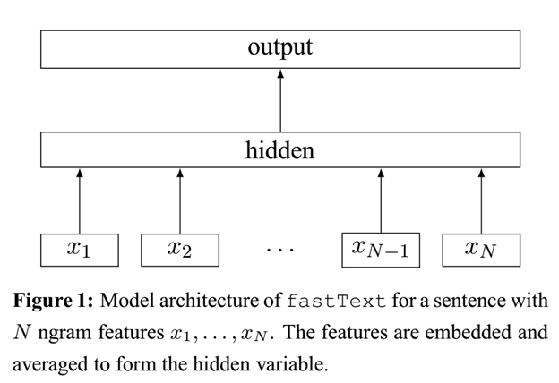
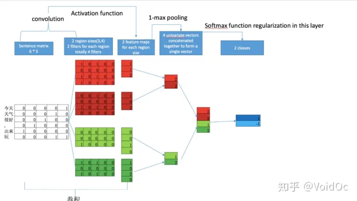
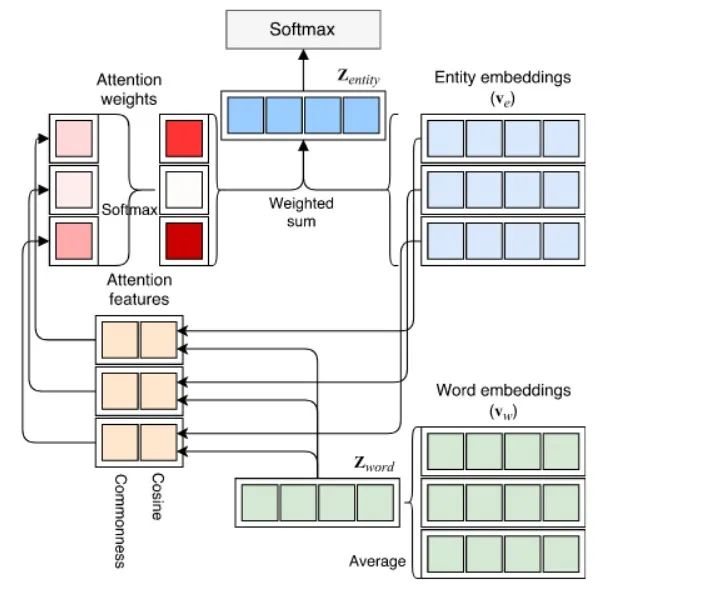

# 数据处理

#### 去除无用字符

1. pattern1='[a-zA-Z0-9]'
2. pattern2 = re.compile(u'[^\s1234567890:：' + '\u4e00-\u9fa5]+')
3. pattern3='[’!"#$%&\'()*+,-./:;<=>?@[\\]^_`{|}~]+'

#### 分词（中文）

使用jieba分词

#### 去除停用词

什么是停用词：

> 在特定的NLP任务中，一些词语不能提供有价值的信息作用、可以忽略。在信息检索领域，大家称可以忽略的词语为停用词(stopword)。

现有的停用词表：

[goto456/stopwords: 中文常用停用词表（哈工大停用词表、百度停用词表等） (github.com)](https://github.com/goto456/stopwords/)

```
def rm_stop_word(wordList):
    filtered_words = [word for word in wordList if word not in stopWords]
    return filtered_words
```

##### （可选）去除低频词

对数据进行统计后，祛除出现频率小于n的词语。

##### 转化词向量

1。tf-idf词向量；

tf：词在单个文档中出现的频率；

idf：词在文档之间出现的频率；

2。word2vec词向量；

3。bert词向量；

# 分类模型

### 传统模型

参见机器学习相关文件。

### 深度学习模型

#### fasttext

w2v的输入。



附带产物是词向量。

#### TextCNN

输入依旧是w2v等词向量。在纵向方向上进行卷积，因为存在滑动窗口，因此也有n-gram的思想，可以学习到上下文信息。



基于RNN，LSTM的

基于Transformer的

#### **NABoE**（2019）


