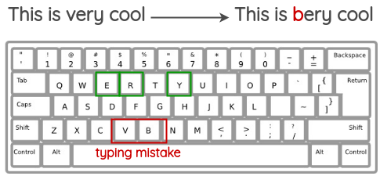
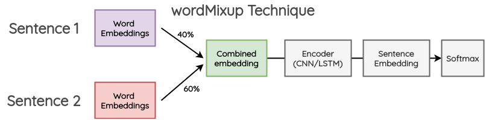
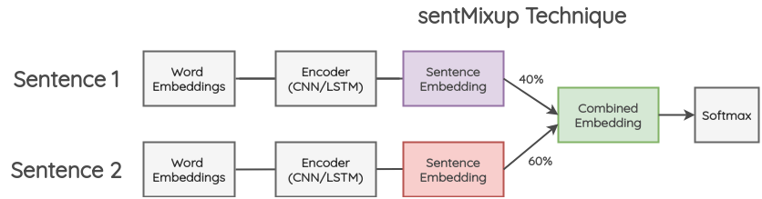
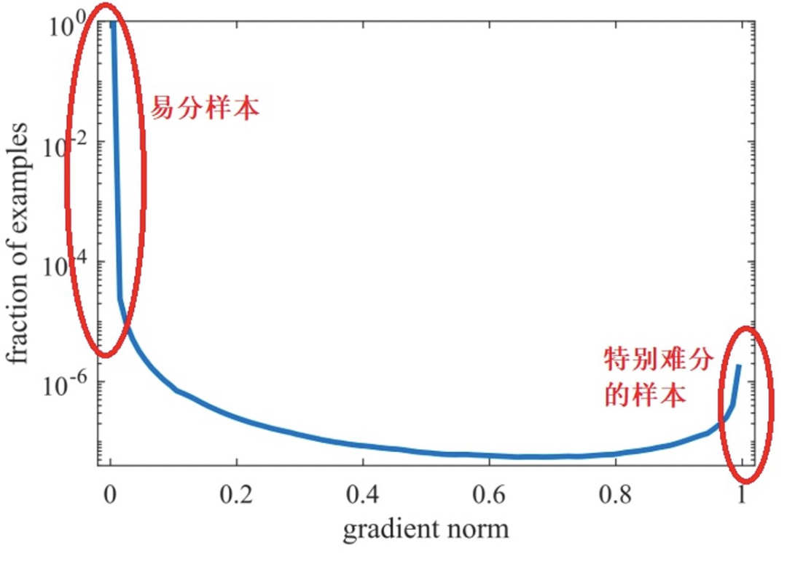

# 数据处理

#### 去除无用字符

1. pattern1='[a-zA-Z0-9]'
2. pattern2 = re.compile(u'[^\s1234567890:：' + '\u4e00-\u9fa5]+')
3. pattern3='[’!"#$%&\'()*+,-./:;<=>?@[\\]^_`{|}~]+'

#### 分词（中文）

使用jieba分词

#### 去除停用词

什么是停用词：

> 在特定的NLP任务中，一些词语不能提供有价值的信息作用、可以忽略。在信息检索领域，大家称可以忽略的词语为停用词(stopword)。

现有的停用词表：

[goto456/stopwords: 中文常用停用词表（哈工大停用词表、百度停用词表等） (github.com)](https://github.com/goto456/stopwords/)

```
def rm_stop_word(wordList):
    filtered_words = [word for word in wordList if word not in stopWords]
    return filtered_words
```

##### （可选）去除低频词

对数据进行统计后，祛除出现频率小于n的词语。

##### 转化词向量

1。tf-idf词向量；

tf：词在单个文档中出现的频率；

idf：词在文档之间出现的频率；

2。word2vec词向量；

3。bert词向量；

# 数据/文本增强

### 词汇替换

这一类的工作，简单来说，就是去替换原始文本中的某一部分，而不改变句子本身的意思。

* **基于同义词典的替换**

在这种方法中，我们从句子中随机取出一个单词，将其替换为对应的同义词。例如，我们可以使用英语的 [WordNet](https://link.zhihu.com/?target=https%3A//wordnet.princeton.edu/) 数据库来查找同义词，然后进行替换。[WordNet](https://link.zhihu.com/?target=https%3A//wordnet.princeton.edu/) 是一个人工维护的数据库，其中包含单词之间的关系。

* **基于 Word-Embeddings 的替换**

在这种方法中，我们采用预先训练好的词向量，如 Word2Vec、GloVe、FastText，用向量空间中距离最近的单词替换原始句子中的单词。和之前的方法相比，这种方法生成的文本在语法上更加通顺，因为模型在进行预测的时候考虑了上下文信息。

* **基于 Masked Language Model 的替换**

Masked Language Modeling 同样可以用来做文本的数据增强。例如，我们可以使用一个预先训练好的 BERT 模型，然后对文本的某些部分进行 Mask，让 BERT 模型预测被 Mask 的词语。这种方法的一个需要注意的地方是如何确定要 Mask 文本的哪一部分，一般需要使用启发式（经验）的方法来决定 Mask 的地方，否则生成的文本可能无法保留原句的含义。

* **基于 TF-IDF 的替换**

TF-IDF 分数较低的单词不能提供信息，因此可以在不影响句子的基本真值标签的情况下替换它们。

### 回译Back Translation

在这种方法中，我们使用机器翻译的方法来复述生成一段新的文本。

使用机器翻译来回译的具体流程如下：

* 找一些句子(如英语)，翻译成另一种语言，如法语
* 把法语句子翻译成英语句子
* 检查新句子是否与原来的句子不同。如果是，那么我们使用这个新句子作为原始文本的补充版本。

### 随机噪声Random Noise Injection

这些方法的思想是在文本中注入噪声，来生成新的文本，最后使得训练的模型对扰动具有鲁棒性。

* **Spelling error injection**

在这种方法中，我们在句子中添加一些随机单词的拼写错误。可以通过编程方式或使用常见拼写错误的映射来添加这些拼写错误。

* **QWERTY Keyboard Error Injection**

这种方法试图模拟在 QWERTY 键盘布局上打字时由于键之间非常接近而发生的常见错误。这种错误通常是在通过键盘输入文本时发生的。



* **Unigram Noising**

其思想是使用从 unigram 频率分布中采样的单词进行替换。**这个频率基本上就是每个单词在训练语料库中出现的次数。**

* **Random Insertion**

我们首先从句子中随机选择一个不是停止词的词。然后，我们找到它对应的同义词，并将其插入到句子中的一个随机位置。

* **Random Swap**
* **Random Deletion**
* **Instance Crossover Augmentation**

在该方法中，一条 tweet 被分成两半，然后两个相同情绪类别（正/负）的 tweets 各自交换一半的内容。这么做的假设是，即使结果在语法和语义上不健全，新的文本仍将保留原来的情绪类别。


### 语序转换

其思想是解析并生成原始句子的依赖树，使用规则对其进行转换来对原句子做复述生成。

例如，一个不会改变句子意思的转换是句子的主动语态和被动语态的转换。


### 文本合成 MixUp for Text

Mixup 是 [Zhang](https://link.zhihu.com/?target=https%3A//arxiv.org/abs/1710.09412) 等人在 2017 年提出的一种简单有效的图像增强方法。其思想是将两个随机图像按一定比例组合成，以生成用于训练的合成数据。为了把这个想法带到 NLP 中，[Guo](https://link.zhihu.com/?target=https%3A//arxiv.org/abs/1905.08941) 等人修改了 Mixup 来处理文本。他们提出了两种将 Mixup 应用于文本的方法:

* **wordMixup**

在这种方法中，在一个小批中取两个随机的句子，它们被填充成相同的长度；然后，他们的 word embeddings 按一定比例组合，产生新的 word embeddings 然后传递下游的文本分类流程，**交叉熵损失是根据原始文本的两个标签按一定比例计算得到的。**



* **sentMixup**

在这种方法中，两个句子首先也是被填充到相同的长度；然后，通过 LSTM/CNN 编码器传递他们的 word embeddings，我们把最后的隐藏状态作为 sentence embedding。这些 embeddings 按一定的比例组合，然后传递到最终的分类层。交叉熵损失是根据原始文本的两个标签按一定比例计算得到的。



### 生成式方法

这一类的工作尝试在生成额外的训练数据的同时保留原始类别的标签。

首先，在训练数据中预先加入类别标签，如下图所示。


然后，在这个修改过的训练数据上 finetune 一个大型的预训练语言模型 (BERT/GPT2/BART) 。对于 GPT2，目标是去做生成任务；而对于 BERT，目标是要去预测被 Mask 的词语。

最后，使用经过 finetune 的语言模型，可以使用**类标签和几个初始单词作为模型的提示词**来生成新的数据。例如使用每条训练数据的前 3 个初始词来为训练数据做数据增强。


**nlpaug 和 textattack 等第三方 Python 库提供了简单易用的 API，可以轻松使用上面介绍的 NLP 数据增强方法。**


# 算法策略

### 算法设计

算法策略主要包括规则挖掘和模型化方法，基本原则应是：

1. **规则兜底** ：高频case和hard case优先进入规则模块，防止因模型的更新迭代，而使针对重要case的处理不够健壮。规则挖掘主要包括重要case缓存、模式挖掘、关键词+规则设置等。此外，规则也可以跟在分类模型后面进行兜底处理。
2. **模型泛化** ：模型化方法适合处理无法命中规则的case，具备泛化性。还有另一种处理逻辑是：如果case命中了规则，但模型对于规则预测的结果给出了很低的置信度（也就是模型认为另一种类别的置信度更高），这时我们可以选择相信模型，以模型输出为准。

### 长尾问题（不平衡问题）

**不平衡问题不仅仅是分类标签下样本数量的不平衡，其本质上更是难易样本的不平衡** ：即使样本数量是平衡的，有的hard example还是很难学习。类似，对那些数量较少的类别进行学习，在不做数据补充的情况下，也可看作是一个hard example问题。

解决不平衡问题的通常思路有两种： **重采样（re-sampling）**和**重加权（re-weighting）** ：

#### （1）**重采样（re-sampling）**

常用的重采样方法有：

* **欠采样&过采样&SMOTE**
* * 欠采样：抛弃大量case，可能导致偏差加大；
  * 过采样：可能会导致过拟合；
  * SMOTE：一种近邻插值，降低过拟合风险，但不能直接应用于NLP任务的离散空间插值。
* **数据增强** ：文本增强技术更适合于替代上述过采样和SMOTE。
* **解耦特征和标签分布** ： **不平衡问题的再平衡本质应只是分类器的再平衡过程，类别标签分布不应影响特征空间的分布** 。基于此，可以解耦类别标签分布和特征空间分布：
* * 首先不做任何再平衡，直接对原始数据训练一个base_model。
  * 将base_model的特征提取器freeze，通过类别平衡采样（对尾部类别重采样）只调整分类器。
  * 分类器权重模||w||与类别数量呈正相关，因此还需将||w||做归一化处理。
* **Curriculum Learning（课程学习）** ：课程学习是一种模拟人类学习过程的训练策略，从易到难进行学习：
* * Sampling Scheduler：调整训练集的数据分布，逐步将采样数据集的样本分布从原先的不平衡调整到后期的平衡状态
  * Loss Scheduler：开始倾向于拉大不同类目之间特征的距离，后期再倾向于对特征做分类。

#### （2）**重加权（re-weighting）**

重加权就是改变分类loss。相较于重采样，重加权loss更加灵活和方便。

* **loss类别加权** ：通常根据类别数量进行加权，加权系数与类别数量成反比。
* **Focal Loss** ：上述**loss类别加权**主要关注正负样本数量的不平衡，并没有关注难易不平衡。Focal Loss主要关注难易样本的不平衡问题，可根据对高置信度样本进行降权。
* **GHM Loss** ：GHM(gradient harmonizing mechanism) 是一种梯度调和机制。Focal Loss虽然强调对hard example的学习，但不是所有的hard example都值得关注，有的hard example很可能是离群点，过分关注不是错上加错了吗？GHM定义了梯度模长**g:**

$$
g=|p-p^*|=
\begin{cases}
	1-p, \quad if \ p^*=1 \\
 	p,\quad if \ p^*=0 
\end{cases}
$$

    其中p是置信度。梯度模长**g**接近于0的样本数量最多，随着梯度模长的增长，样本数量迅速减少，但		是在梯度模长接近于1时，样本数量也挺多。



因此，GHM的出发点是：既不要关注那些容易学的样本，也不要关注那些离群点特别难分的样本。

* **对logit调整权重** ：实际上是将类别概率 引入loss中，并对logit调整权重，本质上是一种通过互信息思想来缓解类别不平衡问题

# 分类模型

### 传统模型

参见机器学习相关文件。

### 深度学习模型

#### fasttext

w2v的输入。


附带产物是词向量。

#### TextCNN

输入依旧是w2v等词向量。在纵向方向上进行卷积，因为存在滑动窗口，因此也有n-gram的思想，可以学习到上下文信息。


基于RNN，LSTM的

基于Transformer的

#### **NABoE**（2019）


