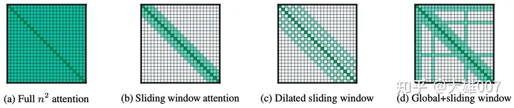

# Longformer

传统的Self-Attention机制的时空复杂度与文本的序列长度呈**平方**的关系，这在很大程度上限制了模型的输入不能太长，因此需要将过长的文档进行截断传入模型进行处理，例如BERT中能够接受的最大序列长度为512。

**长文本导致自注意力矩阵过大的问题。**

## new self-attention

图a是经典self-attention，bcd可以用稀疏矩阵存储（也许

### Sliding Window Attention

如**图1b**所示，对于某个token，经典的Self-Attention能够看到并融合所有其他的token，但Sliding window attention设定了一个窗口w ，它规定序列中的每个token只能看到 w 个token，其左右两侧能看到 0.5w 个token，因此它的时间复杂度是 O(n×w) 。

不需要担心这种设定无法建立整个序列的语义信息，因为transformer模型结构本身是层层叠加的结构，模型高层相比底层具有更宽广的感受野，自然能够能够看到更多的信息，因此它有能力去建模融合全部序列信息的全局表示，就行CNN那样。一个拥有$m$层的transformer，它在最上层的感受野尺寸为 m×w 。

### Dilated Sliding Window

在对一个token进行Self-Attention操作时，普通的Sliding Window Attention只能考虑到长度为 w 的上下文，在不增加计算符合的情况下，Longformer提出了Dilated Sliding Window，如**图1c**所示。在进行Self-Attention的两个相邻token之间会存在大小为$d$的间隙，这样序列中的每个token的感受野范围可扩展到 d×w 。在第$m$层，感受野的范围将是 m×d×w 。

有些dilationCNN的意思。

### Global Attention

以上两种Attention机制还不能完全适应task-specific的任务，因此Global+Sliding Window的Attention机制被提出来，如**图1d**所示。它设定某些位置的token能够看见全部的token，同时其他的所有token也能看见这些位置的token，相当于是将这些位置的token"暴露"在最外面。

这些位置的确定和**具体的任务**有关。例如对于分类任务，这个带有全局视角的token是"CLS"；对于QA任务，这些带有全局视角的token是Question对应的这些token。

[【精选】longformer代码结构解读_唐僧爱吃唐僧肉的博客-CSDN博客](https://blog.csdn.net/znevegiveup1/article/details/122881845)
