# 模型的蒸馏剪枝和量化

## 知识蒸馏

知识蒸馏是一种机器学习模型压缩方法，它用于将大型模型（教师模型）的知识迁移到较小的模型（学生模型）中。

知识蒸馏（KD），也被称为教师-学生神经网络学习算法，是一种有价值的机器学习技术，旨在提高模型性能和泛化能力。通过将知识从复杂的模型（称为教师模型）转移到更简单的模型（称为学生模型）来实现这一点。

蒸馏这个概念之所以work，核心思想是因为 **好模型的目标不是拟合训练数据，而是学习如何泛化到新的数据** 。所以蒸馏的目标是让学生模型学习到教师模型的泛化能力，理论上得到的结果会比单纯拟合训练数据的学生模型要好。

**模型蒸馏本质是函数逼近** 。针对具体任务，笔者认为只要Student Model的复杂度能够满足问题的复杂度，那么Student Model可以与Teacher Model完全不同。

损失函数：输出与标签之间可以使用CEloss，学生与老师之间可以使用CEloss也可以使用KL散度

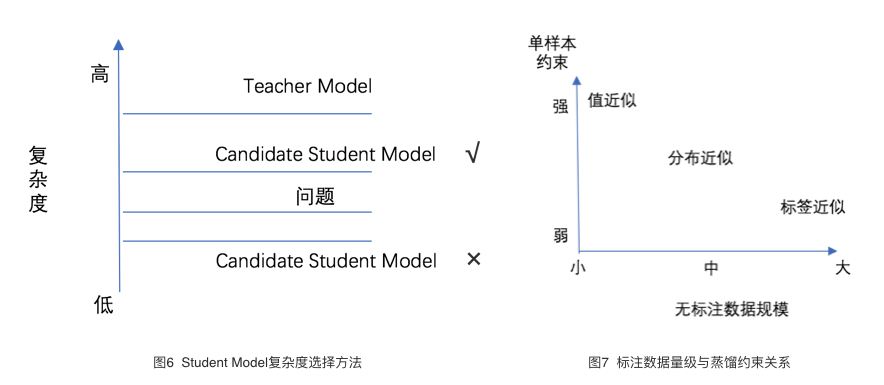

### 输出蒸馏

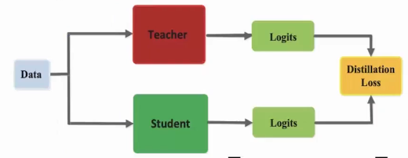

### 中间层蒸馏

既然模型有那么多层，是不是可以蒸馏中间层的知识，让学生模型更好地拟合呢？

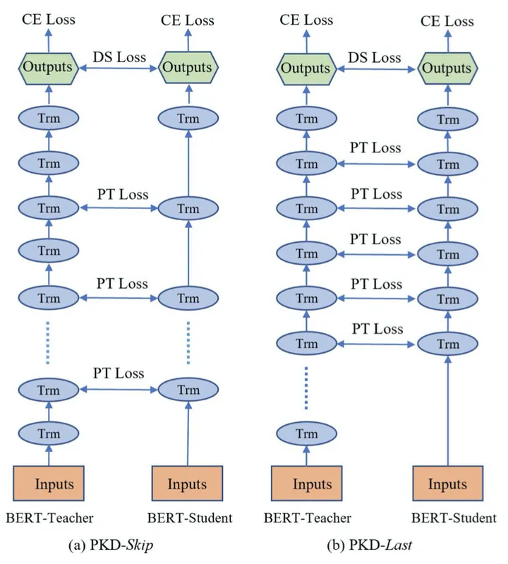

### 预训练蒸馏

之前的工作都是对精调后的BERT进行蒸馏，学生模型学到的都是任务相关的知识。HuggingFace则提出了DistillBERT **[4]** ，在预训练阶段进行蒸馏。将尺寸减小了40%，速度提升60%，效果好于BERT-PKD，为教师模型的97%。

### 双阶段Attention蒸馏

TinyBERT **[5]** 就提出了two-stage learning框架，分别在预训练和精调阶段蒸馏教师模型，得到了参数量减少7.5倍，速度提升9.4倍的4层BERT，效果可以达到教师模型的96.8%，同时这种方法训出的6层模型甚至接近BERT-base，超过了BERT-PKD和DistillBERT。作者参考其他研究的结论，即注意力矩阵可以捕获到丰富的知识，提出了注意力矩阵的蒸馏，采用教师-学生注意力矩阵logits的MSE作为损失函数。作者还对embedding进行了蒸馏。

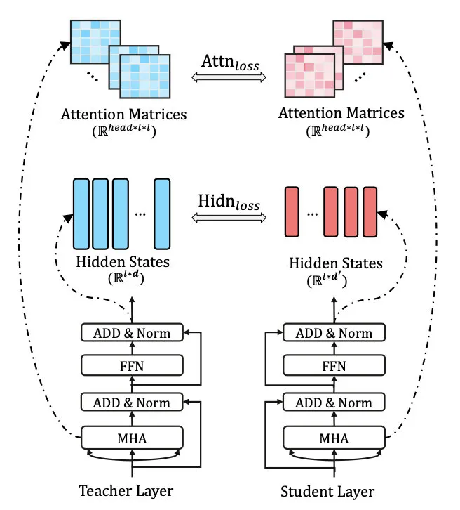

### Value矩阵蒸馏

之前的各种模型基本上把BERT里面能蒸馏的都蒸了个遍，但MiniLM **[7]** 还是找到了新的蓝海——蒸馏Value-Value矩阵。Value-Relation Transfer可以让学生模型更深入地模仿教师模型，实验表明可以带来1-2个点的提升。同时作者考虑到学生模型的层数、维度都可能和教师模型不同，在实验中只蒸馏最后一层，并且 **只蒸馏这两个矩阵的KL散度** 。

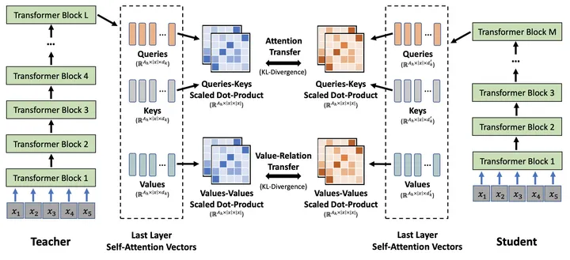

作者还引入了 **助教机制** 。当学生模型的层数、维度都小很多时，先用一个维度小但层数和教师模型一致的助教模型蒸馏，之后再把助教的知识传递给学生。

### 基于涌现能力的知识蒸馏

pytorch 模型蒸馏小工具：TextBrewer

## 模型剪枝

深度学习网络模型从卷积层到全连接层存在着大量冗余的参数，大量神经元激活值趋近于0，将这些神经元去除后可以表现出同样的模型表达能力，这种情况被称为过参数化，而对应的技术则被称为模型剪枝。

当然，模型剪枝不仅仅只有对神经元的剪枝和对权重连接的剪枝，根据粒度的不同，至少可以粗分为4个粒度。

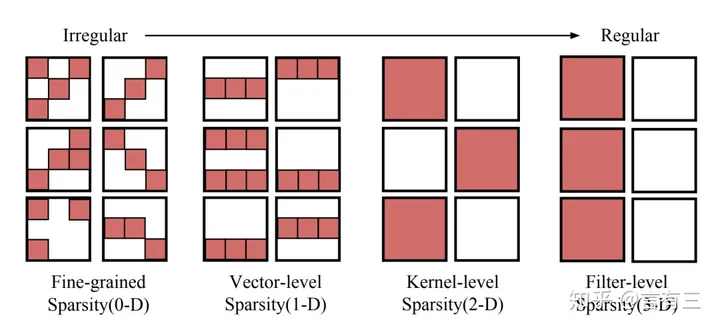

其中细粒度剪枝就是一种非结构化剪枝，但在大模型上的表现并不好。因此大模型一般采用结构化剪枝。

### 一般流程

(1) 发现阶段：这一步聚焦于识别LLM内部相互依赖的结构，这些相互依赖的结构需要被同时移除已确保剪枝后结构的正确性。

(2) 估计阶段：一旦耦合结构被分组，第二步就包含估计每个组对模型总体性能的贡献，并决定要剪枝的组。

(3) 恢复阶段：这一步涉及到快速的后训练，用于缓解由于结构删除而可能引起的性能降级。

#### 发现阶段

依赖性在网络剪枝中的重要性在于，如果当前神经元（例如，Nj ）仅依赖于另一个神经元（例如， Ni ），且神经元 Ni被剪枝，则神经元Nj也必须被剪枝。此时如果不裁剪 Nj ,那么网络结构中的维度就会不匹配。

利用神经元的出入度计算依赖性。

利用递归搜索快速在图中寻找到耦合结构。

#### 估计阶段

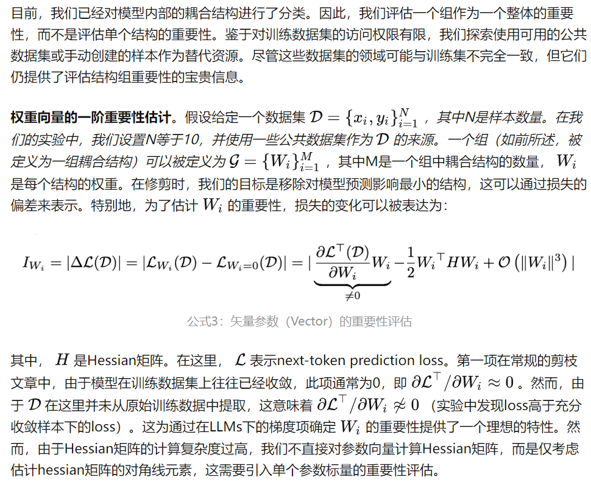

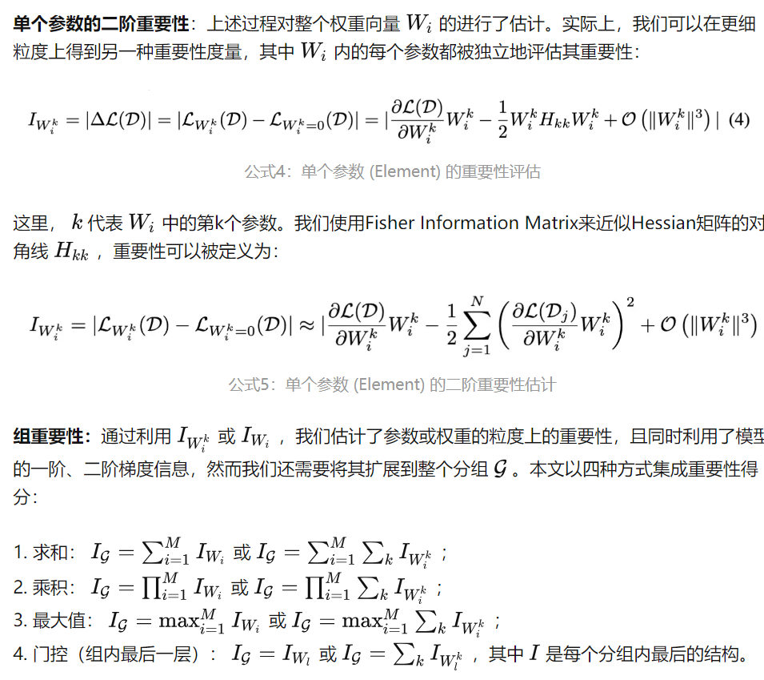

在评估每个组的重要性之后，我们根据预定义的修剪比例对每个组的重要性进行排序，并修剪重要性较低的组。

#### 恢复阶段

为了加速模型的恢复过程并在有限数据下提高其效率，采用低秩近似LoRA对剪枝后的模型进行后训练。仅训练P和Q减少了整体训练复杂性，从而减少了对大规模训练数据的需求。此外，额外的参数P和Q可以被重新参数化为 ΔW，这不会在最终压缩模型中造成额外的参数。

## 模型量化

在训练时，为保证精度，主权重始终为 FP32。而在推理时，FP16 权重通常能提供与 FP32 相似的精度，这意味着在推理时使用 FP16 权重，仅需一半 GPU 显存就能获得相同的结果。那么是否还能进一步减少显存消耗呢？答案就是使用量化技术，最常见的就是 INT8 量化。

#### INT8

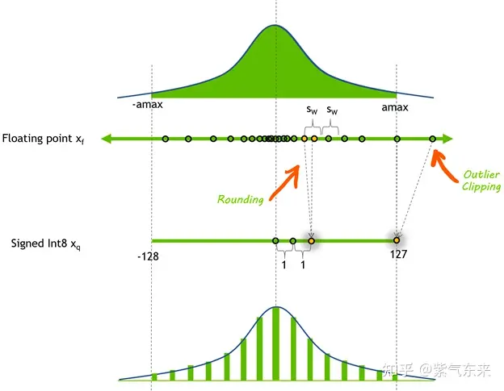

简单来说， INT8 量化即将浮点数xf 通过缩放因子sclaer映射到范围在[-128, 127] 内的 8bit 表示 xq 。

* 处理离群值：如果我们在保留 离群值的情况下对向量做量化和反量化，大部分信息在处理后都丢失了。

工具：`bitsandbytes` 是基于 CUDA 的主要用于支持 LLM.int8() 的库。

新建fp16网络保存模型参数后转化为int8：

```text
from bitsandbytes.nn import Linear8bitLt
int8_model = nn.Sequential(
    Linear8bitLt(64, 64, has_fp16_weights=False),
    Linear8bitLt(64, 64, has_fp16_weights=False)
)

int8_model.load_state_dict(torch.load("model.pt"))
```

也可以对预训练好的模型直接调用：

```text
from transformers import LlamaForCausalLM
model = LlamaForCausalLM.from_pretrained(args.base_model, 
                                         load_in_8bit=args.load_8bit,
                                         torch_dtype=torch.float16, 
                                         device_map={"auto"}, )
```

#### SmoothQuant

当模型规模更大时，单个token的值变化范围较大，难以量化，相比之下 weight 的变化范围较小，即 weight 较易量化，而 activation 较难量化。基于此，SmoothQuant 核心思想是引入一个超参，减小激活值的变化范围，增大权重的变化范围，从而均衡两者的量化难度。

从下图可以看出，量化前的 activation 矩阵在某些 channel 的数值较大，weight 矩阵相对平缓，经过 SmoothQuant 之后，activation 张量中数值较大的 channel 相对减小，对应 weight 张量的 channel 处数值增大，达到均衡二者量化难度的目的。

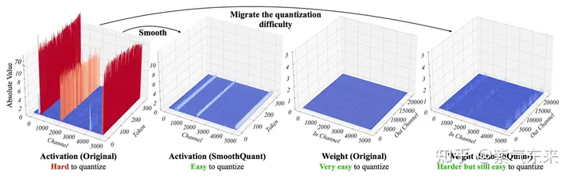

工具库：smoothquant

使用 SmoothQuant 将模型矩阵乘部分转为W8A8（weight使用INT8，activation使用INT8）并评估：

```text
def quantize_model(model, weight_quant='per_tensor', act_quant='per_tensor', quantize_bmm_input=True):
    for name, m in model.model.named_modules():
        if isinstance(m, LlamaDecoderLayer):
            m.mlp.gate_proj = W8A8Linear.from_float(m.mlp.gate_proj, weight_quant=weight_quant, act_quant=act_quant)
            m.mlp.up_proj = W8A8Linear.from_float(m.mlp.up_proj, weight_quant=weight_quant, act_quant=act_quant)
            m.mlp.down_proj = W8A8Linear.from_float(m.mlp.down_proj, weight_quant=weight_quant, act_quant=act_quant)
        elif isinstance(m, LlamaAttention):
            # Her we simulate quantizing BMM inputs by quantizing the output of q_proj, k_proj, v_proj
            m.q_proj = W8A8Linear.from_float(
                m.q_proj, weight_quant=weight_quant, act_quant=act_quant, quantize_output=quantize_bmm_input)
            m.k_proj = W8A8Linear.from_float(
                m.k_proj, weight_quant=weight_quant, act_quant=act_quant, quantize_output=quantize_bmm_input)
            m.v_proj = W8A8Linear.from_float(
                m.v_proj, weight_quant=weight_quant, act_quant=act_quant, quantize_output=quantize_bmm_input)
            m.o_proj = W8A8Linear.from_float(m.o_proj, weight_quant=weight_quant, act_quant=act_quant)
    return model

model_w8a8 = quantize_model(model_fp16)
```

#### GPTQ

GPTQ 的核心思想是逐一量化模型的各个层，对于每个层寻找可以满足下式的量化结果：

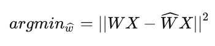

即对于每个需要被量化的层(对应参数 W )，希望量化前后该层输出变化尽量小。

GPTQ的核心原理来自于OBQ(Optimal Brain Quantization)， 而OBQ的思路主要来自于OBS(Optimal Brain Surgeon)。

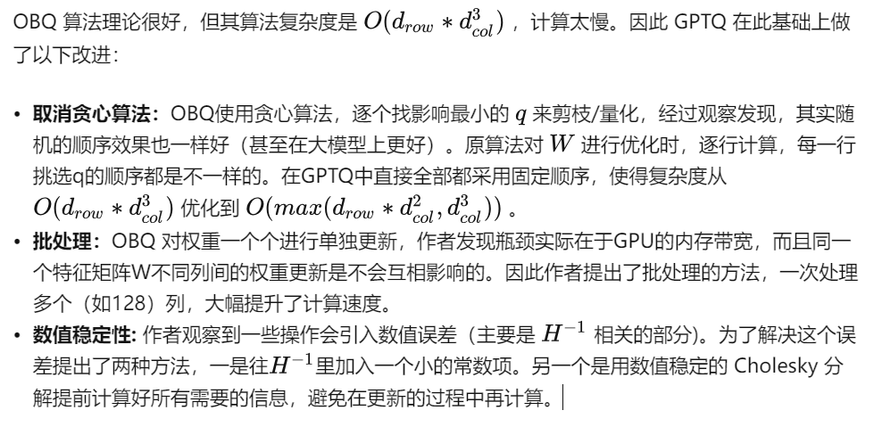

实例：https://link.zhihu.com/?target=https%3A//github.com/qwopqwop200/GPTQ-for-LLaMa/tree/triton

## 其他量化方法

1。参数共享：代表性ALBERT

2。矩阵低秩分解：对特定任务来说，其输入矩阵是低秩可分解的，DRONE

3。结构搜索：优化结构，降低参数量。google的结果：QKV后面跟一个卷积，relue后面跟一个平方。

## bf16和fp16的区别

BF16 是对FP32单精度浮点数截断数据，即用8bit 表示指数，7bit 表示小数。
FP16半精度浮点数，用5bit 表示指数，10bit 表示小数
与32位相比，采用BF16/FP16吞吐量可以翻倍，内存需求可以减半。但是这两者精度上差异不一样，BF16 可表示的整数范围更广泛，但是尾数精度较小；FP16 表示整数范围较小，但是尾数精度较高。

## bf16，fp16半精度训练的优缺点

使用FP16训练神经网络，相对比使用FP32带来的优点有：

* 减少内存占用：FP16的位宽是FP32的一半，因此权重等参数所占用的内存也是原来的一半，节省下来的内存可以放更大的网络模型或者使用更多的数据进行训练。
* 加快通讯效率：针对分布式训练，特别是在大模型训练的过程中，通讯的开销制约了网络模型训练的整体性能，通讯的位宽少了意味着可以提升通讯性能，减少等待时间，加快数据的流通。
* 计算效率更高：在特殊的AI加速芯片如华为Ascend 910和310系列，或者NVIDIA VOTAL架构的Titan V and
  Tesla V100的GPU上，使用FP16的执行运算性能比FP32更加快。

但是使用FP16同样会带来一些问题，其中最重要的是 精度溢出 和 舍入误差。

* 数据溢出：数据溢出比较好理解，FP16的有效数据表示范围为[-65504 - 66504]，FP16相比FP32的有效范围要窄很多，使用FP16替换FP32会出现上溢（Overflow）和下溢（Underflow）的情况。而在深度学习中，需要计算网络模型中权重的梯度（一阶导数），因此梯度会比权重值更加小，往往容易出现下溢情况。
* 舍入误差：Rounding Error指示是当网络模型的反向梯度很小，一般FP32能够表示，但是转换到FP16会小于当前区间内的最小间隔，会导致数据溢出。如0.00006666666在FP32中能正常表示，转换到FP16后会表示成为0.000067，不满足FP16最小间隔的数会强制舍入。

为了想让深度学习训练可以使用FP16的好处，又要避免精度溢出和舍入误差。于是可以通过FP16和FP32的 **混合精度训练（Mixed-Precision）** ，混合精度训练过程中可以引入权重备份（Weight Backup）、损失放大（Loss Scaling）、精度累加（Precision Accumulated）三种相关的技术。
