# 科大讯飞实习

#### 1 地址识别优化

##### 项目目标

利用孪生网络与规则匹配对LLM修改提取的真实地址进行识别，loss低于阈值的会被认为是修改错误，由规则匹配和重点地址数据库校准，无法自动的校准的则人工审核。

##### 孪生网络

孪生网络主要用来衡量两个输入的相似程度。孪生神经网络有两个输入（Input1 and Input2）,将两个输入feed进入两个神经网络（Network1 and Network2），这两个神经网络分别将输入映射到新的空间，形成输入在新的空间中的表示（Representation）。通过Loss的计算，评价两个输入的相似度。

###### **孪生网络的loss有多种选择**：

* Contrastive Loss（传统的Siamese使用）；

  > 对整体来说：目标是让同类样本的特征相互靠近，不同类样本的特征相互远离。
  >
* > 计算loss使用的是两个输入样本经过网络的输出，和标签Y
  >
* ```
  classContrastiveLoss(torch.nn.Module):
      """
      Contrastive loss function.
      Based on: http://yann.lecun.com/exdb/publis/pdf/hadsell-chopra-lecun-06.pdf
      """ 
  def__init__(self, margin=2.0):
          super(ContrastiveLoss, self).init()
          self.margin = margin  
  def forward(self, output1, output2, label):
          euclidean_distance = F.pairwise_distance(output1, output2, keepdim = True)
          loss_contrastive = torch.mean((1-label) * torch.pow(euclidean_distance, 2) +
                                        (label) * torch.pow(torch.clamp(self.margin - euclidean_distance, min=0.0), 2))  
  	return loss_contrastive
  ```
* Triplet loss（详见 [Deep metric learning using Triplet network](https://arxiv.org/abs/1412.6622)）；
* Softmax loss：将问题转换成二分类问题，即将两个输出的绝对差值映射到一个结点上；

###### 模型架构

这里也可以把bilstm换成bert

由于修改前后的地址长度不一样，因此采用BILSTM作为模型架构。

利用BILSTM也能够学习到地址省略时在语义上的相似性。

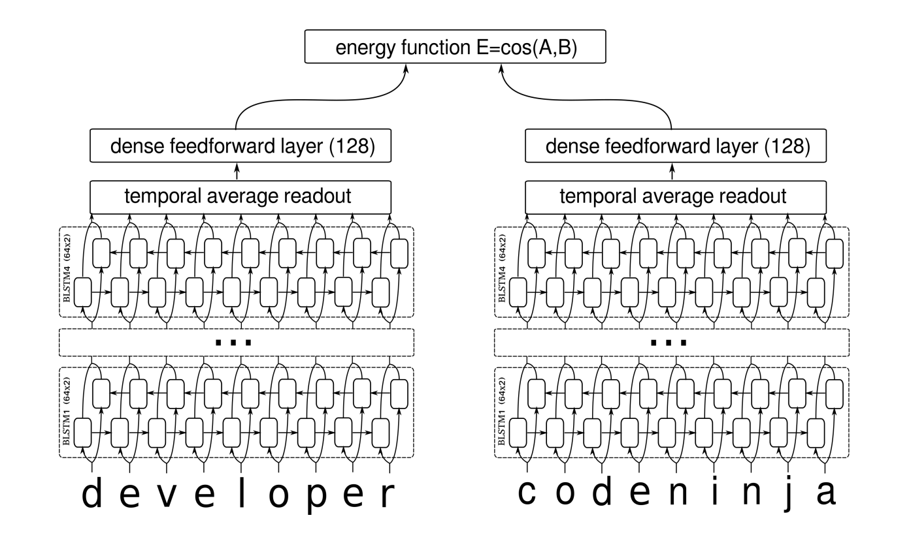

###### **训练**

训练数据：（<类别1，类别1>，1）；（<类别1，类别2>，0）；（<类别1，部分缺省的类别1>，1）

相似数据放在同一个集合中，随机采样的方式与其他数据组合成为数据集

###### 调优：贝叶斯超参优化方法

> 简单来说通过几个观测点拟合prediction跟随参数变化的函数，得到最优解。
>
> 它要求已经存在几个样本点（同样存在冷启动问题，后面介绍解决方案），并且通过高斯过程回归（假设超参数间符合联合高斯分布）计算前面n个点的后验概率分布，得到每一个超参数在每一个取值点的期望均值和方差，其中均值代表这个点最终的期望效果，均值越大表示模型最终指标越大，方差表示这个点的效果不确定性，方差越大表示这个点不确定是否可能取得最大值非常值得去探索。
>
> 库：bayesian-optimization
>
> 算法步骤：
>
> 1. 我们首先选择一个代理模型来对真实函数f建模并定义其 **先验** 。
> 2. 给定一组 **观察值** （函数评估），请使用贝叶斯规则获取 **后验** 。
> 3. 使用采集函数α（x），它是后验的一个函数，来确定下一个采样点：$x_t=argmax_x \alpha(x)$
> 4. 将新采样的数据添加到观测值集中，然后执行步骤2，直到收敛或用尽预算。

##### 规则匹配

1. （补充缺省部分发生错误）对于模型修改可能错误的结果，先对提取的原始地址进行分词，然后映射到地址库中，命中最多的地址条目为最终修改结果，送入孪生网络再次评估；

#### 2 传染病预测算法

##### 数据

病历经过KIE提取后的包括主要症状、血压、脉搏等。

##### catboost

###### 1. 简单介绍Catboost？

CatBoost是一种以对称决策树 为基学习器的GBDT框架，主要为例合理地 **处理类别型特征** ，CatBoost是由Categorical和Boosting组成。CatBoost还解决了**梯度偏差**以及**预测偏移**的问题，从而减少过拟合的发生，进而提高算法的准确性和泛化能力。

###### 2. 相比于XGBoost、LightGBM，CatBoost的创新点有哪些？

* 自动将类别型特征处理为数值型特征。
* Catboost对 **类别特征进行组合** ，极大的丰富了特征维度。
* 采用**排序提升**的方法对抗训练集中的噪声点，从而避免梯度估计的偏差，进而解决预测偏移的问题。
* 采用了**完全对称树**作为基模型。

###### 3. Catboost是如何处理类别特征的？

* 基数比较低的类别型特征
  利用One-hot编码方法将特征转为数值型
* 基数比较高的类别型特征
  * 首先会计算一些数据的statistics。计算某个category出现的频率，加上超参数，生成新的numerical features。这一策略要求同一标签数据不能排列在一起（即先全是之后全是这种方式），训练之前需要打乱数据集。
  * 第二，使用数据的不同排列（实际上是个）。在每一轮建立树之前，先扔一轮骰子，决定使用哪个排列来生成树。
  * 第三，考虑使用categorical features的不同组合。例如颜色和种类组合起来，可以构成类似于blue dog这样的特征。当需要组合的categorical features变多时，CatBoost只考虑一部分combinations。在选择第一个节点时，只考虑选择一个特征，例如A。在生成第二个节点时，考虑A和任意一个categorical feature的组合，选择其中最好的。就这样使用贪心算法生成combinations。
  * 第四，除非向gender这种维数很小的情况，不建议自己生成One-hot编码向量，最好交给算法来处理。

###### 4. Catboost如何避免梯度偏差

经典梯度提升算法每个步骤中使用的梯度由当前模型中的相同的数据点(节点)来估计，这导致估计梯度在特征空间的任何域中的分布与该域中梯度的真实分布相比发生了偏移，从而导致过拟合。catboost使用改进的ordered boosting来避免问题。

**ordered boosting**：对于训练数据，排序提升先生成一个随机排列，随机配列用于之后的模型训练，即在训练第n个模型时，使用排列中前n-1个样本进行训练。在迭代过程中，为得到第个样本的残差估计值，使用第个模型进行估计。以此来对x进行无偏估计。

###### 5. Catboost如何避免预测偏移？

预测偏移是由梯度偏差造成的。在GDBT的每一步迭代中, 损失函数使用相同的数据集求得当前模型的梯度, 然后训练得到基学习器, 但这会导致梯度估计偏差, 进而导致模型产生过拟合的问题。CatBoost通过采用**排序提升** 的方式替换传统算法中梯度估计方法，进而减轻梯度估计的偏差。

###### 6. 解释一下排序提升

在传统的GBDT框架当中，构建下一棵树分为两个阶段：选择树结构和在树结构固定后计算叶子节点的值。CatBoost主要在第一阶段进行优化。在建树的阶段，CatBoost有两种提升模式，Ordered和Plain。Plain模式是采用内建的ordered TS对类别型特征进行转化后的标准GBDT算法。Ordered则是对Ordered boosting算法的优化。

###### 7. Catboost为什么要使用对称树？

* 对称树是平衡的，不容易过拟合
* 统一层使用相同的分割准则
* 每个叶子节点的索引可以被编码为长度等于树深度的二进制向量
  首先将所有浮点特征、统计信息和独热编码特征进行二值化，然后使用二进制特征来计算模型预测值

###### 8. Ordered 和 Plain的区别

Plain模式是采用内建的ordered TS对类别型特征进行转化后的标准GBDT算法。

Ordered则是对Ordered boosting算法的优化。

###### 9.CatBoost的优缺点

###### **优点：**

* **性能卓越：** 在性能方面可以匹敌任何先进的机器学习算法；
* **鲁棒性/强健性：** 它减少了对很多超参数调优的需求，并降低了过度拟合的机会，这也使得模型变得更加具有通用性；
* **实用：** 可以处理类别型、数值型特征；
* **可扩展：** 支持自定义损失函数；

###### **缺点：**

* 对于类别型特征的处理需要大量的内存和时间；
* 不同随机数的设定对于模型预测结果有一定的影响；

##### optuna优化框架

代码示例：

```python
param = {
	# 损失函数
        "loss_function": trial.suggest_categorical("loss_function", ["RMSE", "MAE"]),
	# 学习率
        "learning_rate": trial.suggest_loguniform("learning_rate", 1e-5, 1e0),
	# L2正则化参数
        "l2_leaf_reg": trial.suggest_loguniform("l2_leaf_reg", 1e-2, 1e0),
	# 
        "colsample_bylevel": trial.suggest_float("colsample_bylevel", 0.01, 0.1),
	# 树深
        "depth": trial.suggest_int("depth", 1, 10),
	# 增压方案-偏差修正法方案
        "boosting_type": trial.suggest_categorical("boosting_type", ["Ordered", "Plain"]),
	# 权重计算逻辑
        "bootstrap_type": trial.suggest_categorical("bootstrap_type", ["Bayesian", "Bernoulli", "MVS"]),
	# 每个叶节点最少的数据量
        "min_data_in_leaf": trial.suggest_int("min_data_in_leaf", 2, 20),
	# 离散特征最大值，超出范围则转化为float
        "one_hot_max_size": trial.suggest_int("one_hot_max_size", 2, 20),
    }
```

参数 `trial`是**optuna**的一个特殊**Trial**对象，它对每个超参数进行优化。

其中，它有一种 `suggest_float`方法，该方法采用超参数的名称和范围来寻找其最佳值。

采样器参数：

* `GridSampler`: 与Sklearn 的 `GridSearch`采样方式相同。使用此方法时建议不要设定太大的范围。
* `RandomSampler`: 与Sklearn 的 `RandomizedGridSearch`采样方式相同。
* `TPESampler`: 全名Tree-structured Parzen Estimator sampler。预设采样方式。
* `CmaEsSampler`: 基于CMA ES 演算算法的采样器(不支援类别型的超参数).

剪枝算法
自动在训练的早期（也就是自动化的 early-stopping）终止无望的 trial

* optuna.pruners.SuccessiveHalvingPruner 实现的 Asynchronous Successive Halving 算法。
* optuna.pruners.HyperbandPruner 实现的 Hyperband 算法。
* optuna.pruners.MedianPruner 实现的中位数剪枝算法
* optuna.pruners.ThresholdPruner 实现的阈值剪枝算法

### 3 疾病负担建模

##### 数据处理

* 针对病例结构化信息中的症状描述部分，进行标准化映射，从不同的表述映射到标准描述上，标准描述由医生提供，由医生协助进行500条人工标注数据，然后通过LoRA+指令微调LLM，对后续描述进行标化；
* 标化描述映射到症候群
* 通过随机森林对不同的症状描述进行建模，最后输出症状涉及的症候群，并给出是否轻重症的概率
* 分级建设，从症状到症候群、再到病症，逐层分级建设。

##### 随机森林

！！重要的：随机森林是基于bagging思想的决策树

随机森林是一种基于决策树的模型，它由多个独立的决策树组成。每个决策树在训练过程中都会根据训练数据生成，并且在训练过程中会随机选择特征和样本。这种随机性有助于减少过拟合，因为它会使模型在训练集和测试集之间产生更稳定的性能。

##### Loss

基尼系数：

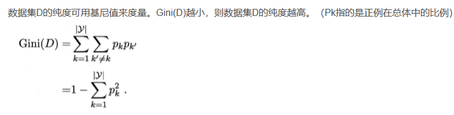

或信息增益比：

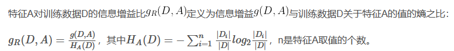

#### 随机森林的训练过程

【随机的体现：样本抽样+随机选择特征】

随机森林的训练过程包括以下步骤：

1. 从训练数据中随机抽取一个子集，作为当前决策树的训练数据。
2. 为当前决策树选择一个随机的根节点特征，并根据该特征对训练数据进行划分。
3. 对于每个新创建的节点，重复步骤1和步骤2，直到满足停止条件(如节点中的样本数量达到阈值或所有特征已经被尝试过)。
4. 重复步骤1到步骤3，直到生成指定数量的决策树。

#### 随机森林的停止条件

随机森林的停止条件可以包括以下几点：

1. 节点中的样本数量达到阈值。
2. 所有特征已经被尝试过。
3. 树的深度达到最大深度。

#### 随机森林缓解过拟合

1. 特征选择，删去重要性低的特征
2. early stopping
3. 限制树的数量和树的深度
4. 多折交叉验证

##### 随机森林参数

1. n_estimators: 决定森林中树的数量。
2. max_features: 决定每棵树在拆分节点时考虑的特征数量。较小的值有助于减少模型的方差，较大的值可以提高模型的多样性。
3. max_depth: 决定树的最大深度。较小的值有助于减少过拟合，但可能导致欠拟合。
4. min_samples_split: 决定拆分内部节点所需的最小样本数。
5. min_samples_leaf: 决定叶节点所需的最小样本数。
6. bootstrap: 决定是否使用自助采样。如果设置为True，则每个树的训练集是通过有放回地从原始训练集中抽样得到的，否则每个树的训练集是通过无放回地抽样得到的。通常情况下，设置为True即可。

##### 随机森林为什么不能用全样本取训练m棵决策树？

随机森林的基学习器是同构的，如果用全样本去训练m棵决策树的话，基模型之间的多样性减少，互相相关的程度增加，不能够有效起到减少方差的作用，对于模型的泛化能力是有害的。随机森林思想就是取一组高方差、低偏差的决策树，并将它们转换成低方差、低偏差的新模型。

# 相关政策推荐：

### 召回

DSSM双塔召回

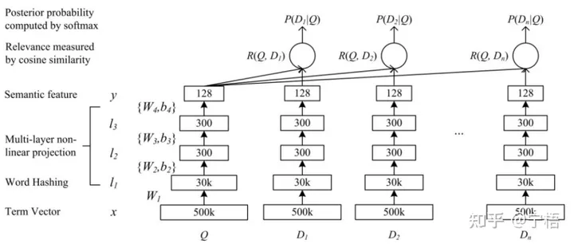

将query和doc分别映射到相同维度的向量上。最后用向量计算相似度。

样本准备：对每个历史政策所指向的疾控突发事件提取关键词，该关键词组和历史政策组成正样本对；而该关键词组对任意其他政策组成负样本对。

### 排序

中科大 何向南 老师团队：TallRec

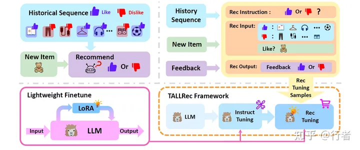

针对任意事件关键词组，历史相关政策数据表示为 [𝑖1,𝑖2,⋯,𝑖𝑛]，用户对历史数据的相似度评分表示为 [𝑟1,𝑟2,⋯,𝑟𝑛]，

对于任意评分𝑟𝑖∈{0,1} （implicit feedback），其中 𝑖∈[1,𝑛] 表示标号。

LLM 模型表示为 𝑀，作者使用 𝑀 建造得到 LRLM 模型 𝑀𝑟𝑒𝑐，用于预测 𝑖𝑛+1 的得分。微调具体步骤分配如下（可参考Architecture图）：

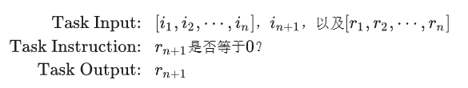

第一轮： Instruction Tuning，使用了 [Alpaca](https://link.zhihu.com/?target=https%3A//github.com/alpacahq) 提供的数据进行模型精调（这里不是太清楚Alpaca的使用）。

第二轮：Rec Tuning，即针对推荐的fine-tuning。具体就是把历史数据分别分成 Like 和 Dislike， 结合预测目标物体构成 Rec Input；“用户是否会 Like 𝑖𝑛+1” 作为 Rec Instruction；对应到 𝑟𝑛+1 的 “Yes/No” 构成 Rec Output。

# 医疗实体识别

#### 难点：

1、数据少，训练数据少，难以找到外部可用数据；

2、实体标注数据不平衡；

3、长文本；

4、重叠实体；

5、分类太多（23类）；

#### 一些解决方案

1、将任务拆为实体抽取和文本分类两个任务；

2、分级标签任务，总共有1个ner模型+6个文本分类模型；

3、token pair NER方法；

4、添加对抗训练防止过拟合；

5、使用WWM任务对预测文本进行预训练；

6、使用医疗领域词典提高分词效果；

# Agent金融问答

以“通义千问金融大模型”为核心，通过指今精调显著强化了模型的意图识别和自然语言生成SQL(NL2SQL)的能力，并设计开发了金融文档抽取与清洗算法、基于语义和稀疏的双路检索召回算法、精细化的排序算法、幻觉校验修正算法。通过综合应用这些算法模型，构建了一套精准、泛化、通用、幻觉可控的智能金融问答系统，该系统能够处理金融文本与数据中的专业术语和复杂知识，用AI实现专家级别的查询与分析。

### 1 任务点

#### 难点

* pdf及pdf中的表格处理；
* 文本切分细度；
* 数据库清洗、处理；
* 相近问题意图识别（尤其是文档检索和db检索）；
* 问题处理，意图补全；
* 处理多表之间的复杂关联，如理解基金股票持仓明细与A股日行情表的连接，并确保查询的高准确性；
* 处理长文本的复杂结构，确保信息完整性。对超长文本，需合理分块，并从文档分块中准确提炼答案；
* 对于模型不稳定输出格式的处理；

#### 需求点

* LLM模型SQL语句生成
* LLM可控输出
* 文本定位
* 文本理解

### 2 总体思路

##### 2-1 数据处理、文档清洗

**PDF：**

* 先将pdf与txt文件整理为内容完整的自然句和md格式的表格。
* 按句子与自然段划分。一句一行，空行作为自然段划分。
* 基于**pdfplumnber的有限状态机**，针对无竖线、无侧线的表格提取。
* 按照自然段划分存储

因为使用灵积api调用qwen大模型，因此采用较小的文本块（长度500，overlap 10%），采用向量数据库存储。使用章节标题等建立文档树。

对于每个文本块，要清洗其中可能存在的乱码字符、无用22 符号（\/\等），多余换行符等可能影响语义的符号。

对于每个pdf的内容，选择TF-IDF算法或BM25算法抽取pdf关键词以及公司名称等重要信息（从文件名或封面页提取），并维护关键词库。考虑到关键词抽取效果以及存储查询开销，只针对每个pdf文档而并非针对切分后的文本块进行关键词对应。也可以使用大模型进行关键词抽取，但需要考虑数据隐私以及处理效率的问题。

对于pdf中的表格，抽取后单独存储。由于多余制表符会影响向量相似度计算，因此使用提示和简单方式来表示表格（下面是一个表格：\n表头：xxxx\n ;\n），复杂表格先由工具提取，然后再处理，包括null值填充等。

**数据：**

* 表格：pdf文件名-txt文件名-公司名-公司名2-公司名n
* 向量数据库：每个文件对应单独库，库内以自然段为切片
* 

**数据库：**

对于数据库表，抽取其主要信息。包括：表名，每个表中的字段名称以及数据类型，所有主键和外键；该信息将会作为prompt的一部分。

对一些字段内容进行处理，例如时间信息，20220101(TEXT)格式无法被数据库时间处理函数(例如STRFTIME)识别，因此需要对其进行转换，2022-01-01(TEXT)。

##### 2-2 问题处理

###### 整体思路

由于问题分为数据查询和文本理解两种，因此这里可以看做一个与NER相关的二分类任务，其中能够抽取出公司名称信息的，即为文本理解类任务，反之为数据库查询任务。

首先意图补全：对于用户问题，可能要使用专业词汇来替换用户问题中的口语化表述；中文数字替换阿拉伯数字等

**NER任务精度：** 利用指令微调+lora的方式提高qwen7B的精度。

> 指令微调的意义：使得LLM小任务上的表现更为集中，提高精度的同时控制输出。

**指令微调loss：**CrossEntropyLoss，且需要设置ignore_index，避免对非output部分计算梯度

此时lable的promot的部分被-100（或其他类别号）填充

```python
指令e.g.
{
  "instruction":"请提取下列句子中的公司名称和关键词。",
  "input":"等等的点点滴滴",
  "output":"{"公司":"xxxxx有限公司","关键词":"木材产量"}"
}
{
  "instruction":"请将句子中的中文数字替换为阿拉伯数字。",
  "input":"等等的点点滴滴",
  "output":"顶顶顶顶的点点滴滴"
}
```

* 这里利用gpt4生成300条数据，随后用训练后的模型再生成500条数据，利用gpt3.5和正则匹配等方法去掉低质量的数据，重新混合成为数据集训练一个新的lora模型，以此类推，直至标注1000+条数据。

子任务识别：对于多个问题并列的情况，需要进行子任务分解，讲问题分解为多步骤、多任务，依次进行回答

##### 2-2 知识库问答

**难点：高召回、高精度**

* 召回

召回最小单位：句子；召回返回整个自然段。

基于Elasticsearch、稀疏检索、BM25的三路召回

* Elasticsearch：内核是BM25算法，使用api进行检索（需要在丰富一下）
* 稀疏检索（LSH思想）：

> 稀疏检索模型通常基于bag-of-words，简而言之就是将query和document都表示为它们包含的单词的序列，然后进行序列之间的相似度匹配。
>
> 首先，预处理，对于每个document的每一个切片，利用jieba分词切分（使用了金融名词词典），形成一个词库，去除常见中文停用词。大小在4000+。
>
> 然后打乱词表，对每一个切片，计算切片包含的词在词表里出现的位置（也去掉停用词），使用uint16独热向量存储。(4000+,40)（恐怕不止40）
>
> 用20个不同的种子，对1-4000+的顺序序列进行打乱，得到稠密矩阵，用uint16存储。(20,4000+)
>
> 上述两个矩阵相乘，计算每个文档的签名(40,20)
>
> 按5的大小对签名进行分块，然后计算hash值（(wx+b)%l就可），每个子块命中的桶都保存doc的索引序号。
>
> 对query用计算词表的位置，因为query是一个个输入的，这里只保存索引，稀疏存储。
>
> 计算query的签名，同样切片，命中，找碰撞的桶内的切片，用jaccard相似度计算出桶内topk。

* BM25检索

> BM25的核心思想是基于词频(TF)和逆文档频率(IDF)来,同时还引入了文档的长度信息来计算文档D和查询Q之间的相关性。
>
> 
>
> 1. **词频 (f(qi, D))** : 这是查询中的词 q_i在文档 D 中出现的频率。词频是衡量一个词在文档中重要性的基本指标。词频越高，这个词在文档中的重要性通常越大。
> 2. **逆文档频率 (IDF(qi))** : 逆文档频率是衡量一个词对于整个文档集合的独特性或信息量的指标。它是由整个文档集合中包含该词的文档数量决定的。一个词在很多文档中出现，其IDF值就会低，反之则高。这意味着罕见的词通常有更高的IDF值，从而在相关性评分中拥有更大的权重。
> 3. **文档长度 (|D|)** : 这是文档D 中的词汇数量。文档长度用于调整词频的影响，因为较长的文档可能仅因为它们的长度就有更高的词频。
> 4. **平均文档长度 (avgdl)** : 这是整个文档集合中所有文档长度的平均值。它用于标准化不同文档的长度，以便可以公平比较不同长度的文档。
>
> 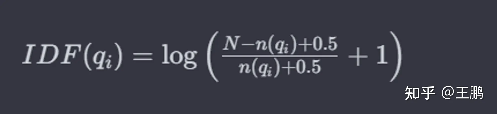
>
> * *N* 是文档集合中的文档总数
> * n(q1)是包含词q1的文档数量

topk召回

* **精排**

> 相似度排序：1.余弦相似度+mlp；2.孪生网络 <query,doc>loss差值
>
> listwise+lora+指令微调：RecRanker，但是数据集不好做，没有找到现有的 `<query,doc>数据集`

取top 1-2 进行合并，小于最小文本长度则继续合并

> 小限定，一次差达到2倍则放弃合并，即(Sd1 - Sd2) > 2(Sd2-Sd3)

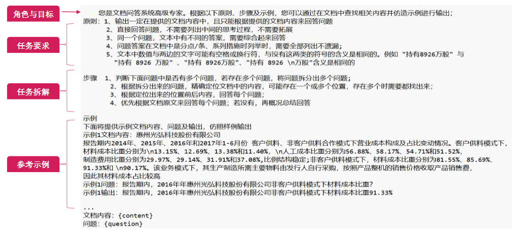

问题关键词提取：由于问题一般较短，使用TF-IDF等词频算法并不合适，因此采用填充模版（公司名称，时间等等）+LLM的方法，提取需要的关键词；

关键词检索：A.对公司名称等关键词首先通过向量相似度检索，检索相关文档，这一步根据问题类型，如果针对单个公司，则top1，如果是统计类问题，则取大于阈值的所有检索结果；B.使用问题需求的关键词查询文档树，多路回召得到结果。

知识问答：将多路召回的文本块去掉头尾不完整句子（避免出现幻觉），分别填充prompt得到一些答案，最后答案汇总再次填充prompt得到最终答案。

##### 2-3 数据库查询

###### 主要思路

通过指令微调、结合RLHF思想

NL2SQL：

* 指令微调+lora，使用[NL2SQL天池大赛](https://tianchi.aliyun.com/competition/entrance/231716/information)数据集作为辅助训练数据集。所有的线性layer都装配上lora。
* promot生成；
* ```python
  promot关键
  """
  1.任务说明
  2.示例
  3.相关数据库表名
  4.相关表中字段说明
  5.问询
  """
  ```
* 基于DPO的lora微调：使用trl库的DPOtrainer
* trl的源码流程：
* ```python
  1. 计算refmodel和model的输出的.logits。即每个token上对下一个token的预测值
  2. 用logits计算对于label的平均log概率或加和log概率，即logπ(y|x)的部分，分别计算出model和refmodel对chosen和reject的logp
  3. 按下面公式进行计算，实际上就是β*作差
  4. 根据选择使用一次激活函数，包括logsigmoid、relu、ipo（(loss-1/2β)^2）、kto（KL散度+sigmoid）
  5. 返回losses 和 rewards（下面公式的βlog部分，左边是chosen rewards 右边是rejected rewards）

  ```

> 收集运行过程中执行错误sql语句+人工随机替换一些错误sql语句，组成正负对
>
> 构造dpo训练数据集{"prompt":"xxxxxx","chosen":"xxxxxx","rejected":"xxxxxxxxx"}
>
> 步骤：
>
> 1.定义policy模型(策略模型)和reference模型(参考模型),Policy模型是需要训练的对话生成模型,reference模型是给定的预训练模型或人工构建的模型。
>
> 2.对于给定prompt,计算两模型对正样本和负样本的概率,正样本是人类选择的回复,负样本是被拒绝的回复。
>
> 3.通过两个模型概率的差值构建DPO损失函数，惩罚policy模型对正样本概率的下降和负样本概率的上升。通过最小化DPO损失进行模型训练。
>
> 损失函数：
>
> 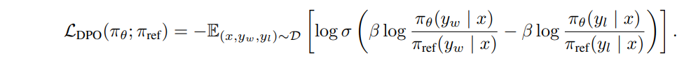

* 表名，列名对齐检查

> **PPO与DPO的比较：**
>
> **近端策略优化（PPO）** 是一种强化学习算法，用于训练语言模型和其他机器学习模型。它旨在优化代理（在本例中为语言模型）的策略函数，以最大化其在给定环境中的预期累积奖励。
>
> 1. **稳定性和样品效率** ： PPO因其稳定性和样品效率而受到青睐。与其他一些强化学习算法相比，它往往提供更平滑的策略更新，使其适合训练文本生成质量至关重要的语言模型。
> 2. 因为有训练好的Reward模型，所以对数据本身质量依赖性不高（reward模型比较好的情况下）
>
> **直接偏好优化 (DPO)** 是一种微调大型语言模型 (**LLM**)以符合人类偏好的新颖方法。与涉及来自人类反馈的复杂强化学习 (RLHF) 的传统方法不同， DPO简化了流程。它的工作原理是创建人类偏好对的数据集，每个偏好对都包含一个提示和两种可能的完成方式——一种是首选，一种是不受欢迎。然后进行微调，以最大限度地提高生成首选完成的可能性，并最大限度地减少生成不受欢迎的完成的可能性。
>
> DPO 具有多项优势：
>
> * 简单性： DPO更容易实施和培训，使其更易于使用。
> * 稳定性： 不易陷入局部最优，保证训练过程更加可靠。
> * 效率：与 RLHF 相比， DPO 需要更少的计算资源和数据，使其计算量轻。
> * 有效性： 实验结果表明，DPO在情感控制、摘要和对话生成等任务中可以优于 RLHF 。

Text to SQL：提高prompt的信噪比，去掉信息熵较低的词语，如stopword(的地得、请）、“保留小数”。容易查询错误的关键词，如公司名词，可以在prompt中着重强调。问题存在计算的话，不应包含在SQL语句生成里，要分解子任务。

SQL纠错：为了提高稳定性，可以对生成的SQL语句再次送入LLM勘误，但是容易没错硬改，因此还是采用p-tuning或in context learning等方法提高生成准确性比较好。纠错可以放在SQL语句执行出错时处理错误。

SQL模版：对于简单查询问题，可以使用SQL模版来提高LLM输出的稳定性。（不知道怎么实现目前）

查询结果：将查询结果与问题组成自然语言进行返回，有助于后续处理。

##### 2-4 关键词提取

规则匹配+LLM。对年份、主体、客体等着重提取。

对并列主体或客体的情况，需要将其拆分、展开并扁平化。

对于一些隐含计算的术语，例如，增长率，比值等，应该维护相应的自然语言形式的计算公式。

# PLL检测

## R-Dropout

首先，引入一个可接受的理念，即同样的输入，同样的模型，分别走过两个 Dropout 得到的将是两个不同的分布，近似将这两个路径网络看作两个不同的模型网络.

### loss函数

Loss分为两个部分即交叉熵部分，跟**KL散度**部分，而KL散度的作用是希望不同Dropout的模型输出尽可能一致

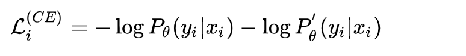

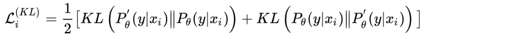

最后两部分进行加权和。

在训练过程中， **为了节省训练时间，并不是将同一个输入输入两次，而是将输入句子复制一遍** ，然后拼接到一起， ，这样就相当于将batch size扩大了一倍，这个可以**节省大量的训练时间**
